```python
import numpy as np
import pandas as pd

data = pd.read_csv("/Users/rahmi/Desktop/KDD/KaggleV2-May-2016.csv")
data.head(5)
```


<div>
<style>
    .dataframe thead tr:only-child th {
        text-align: right;
    }

    .dataframe thead th {
        text-align: left;
    }

    .dataframe tbody tr th {
        vertical-align: top;
    }
</style>
<table border="1" class="dataframe">
  <thead>
    <tr style="text-align: right;">
      <th></th>
      <th>PatientId</th>
      <th>AppointmentID</th>
      <th>Gender</th>
      <th>ScheduledDay</th>
      <th>AppointmentDay</th>
      <th>Age</th>
      <th>Neighbourhood</th>
      <th>Scholarship</th>
      <th>Hipertension</th>
      <th>Diabetes</th>
      <th>Alcoholism</th>
      <th>Handcap</th>
      <th>SMS_received</th>
      <th>No-show</th>
    </tr>
  </thead>
  <tbody>
    <tr>
      <th>0</th>
      <td>2.987250e+13</td>
      <td>5642903</td>
      <td>F</td>
      <td>2016-04-29T18:38:08Z</td>
      <td>2016-04-29T00:00:00Z</td>
      <td>62</td>
      <td>JARDIM DA PENHA</td>
      <td>0</td>
      <td>1</td>
      <td>0</td>
      <td>0</td>
      <td>0</td>
      <td>0</td>
      <td>No</td>
    </tr>
    <tr>
      <th>1</th>
      <td>5.589978e+14</td>
      <td>5642503</td>
      <td>M</td>
      <td>2016-04-29T16:08:27Z</td>
      <td>2016-04-29T00:00:00Z</td>
      <td>56</td>
      <td>JARDIM DA PENHA</td>
      <td>0</td>
      <td>0</td>
      <td>0</td>
      <td>0</td>
      <td>0</td>
      <td>0</td>
      <td>No</td>
    </tr>
    <tr>
      <th>2</th>
      <td>4.262962e+12</td>
      <td>5642549</td>
      <td>F</td>
      <td>2016-04-29T16:19:04Z</td>
      <td>2016-04-29T00:00:00Z</td>
      <td>62</td>
      <td>MATA DA PRAIA</td>
      <td>0</td>
      <td>0</td>
      <td>0</td>
      <td>0</td>
      <td>0</td>
      <td>0</td>
      <td>No</td>
    </tr>
    <tr>
      <th>3</th>
      <td>8.679512e+11</td>
      <td>5642828</td>
      <td>F</td>
      <td>2016-04-29T17:29:31Z</td>
      <td>2016-04-29T00:00:00Z</td>
      <td>8</td>
      <td>PONTAL DE CAMBURI</td>
      <td>0</td>
      <td>0</td>
      <td>0</td>
      <td>0</td>
      <td>0</td>
      <td>0</td>
      <td>No</td>
    </tr>
    <tr>
      <th>4</th>
      <td>8.841186e+12</td>
      <td>5642494</td>
      <td>F</td>
      <td>2016-04-29T16:07:23Z</td>
      <td>2016-04-29T00:00:00Z</td>
      <td>56</td>
      <td>JARDIM DA PENHA</td>
      <td>0</td>
      <td>1</td>
      <td>1</td>
      <td>0</td>
      <td>0</td>
      <td>0</td>
      <td>No</td>
    </tr>
  </tbody>
</table>
</div>


```python
data.shape
```


    (110527, 14)


```python
data.info()
```

    <class 'pandas.core.frame.DataFrame'>
    RangeIndex: 110527 entries, 0 to 110526
    Data columns (total 14 columns):
    PatientId         110527 non-null float64
    AppointmentID     110527 non-null int64
    Gender            110527 non-null object
    ScheduledDay      110527 non-null object
    AppointmentDay    110527 non-null object
    Age               110527 non-null int64
    Neighbourhood     110527 non-null object
    Scholarship       110527 non-null int64
    Hipertension      110527 non-null int64
    Diabetes          110527 non-null int64
    Alcoholism        110527 non-null int64
    Handcap           110527 non-null int64
    SMS_received      110527 non-null int64
    No-show           110527 non-null object
    dtypes: float64(1), int64(8), object(5)
    memory usage: 11.8+ MB


```python
data.PatientId.value_counts()
```


    8.221459e+14    88
    9.963767e+10    84
    2.688613e+13    70
    3.353478e+13    65
    2.584244e+11    62
    7.579746e+13    62
    8.713749e+14    62
    6.264199e+12    62
    6.684488e+13    57
    8.722785e+11    55
    8.923969e+13    54
    8.435224e+09    51
    8.534397e+14    50
    1.447997e+13    46
    6.543360e+13    46
    8.189452e+13    42
    9.452745e+12    42
    1.882323e+14    40
    9.496197e+12    38
    2.271580e+12    38
    1.336493e+13    37
    1.484143e+12    35
    8.883500e+13    34
    9.861628e+14    34
    7.124589e+14    33
    4.167557e+14    30
    6.128878e+12    30
    8.121397e+13    29
    8.634164e+12    24
    3.699499e+13    23
                    ..
    6.375629e+12     1
    9.369127e+12     1
    5.375556e+14     1
    1.662184e+11     1
    7.234615e+13     1
    9.649990e+12     1
    6.912783e+10     1
    1.954265e+13     1
    2.736377e+10     1
    5.532694e+11     1
    7.149583e+12     1
    8.676752e+13     1
    7.838359e+13     1
    5.962625e+11     1
    4.919862e+13     1
    3.477350e+14     1
    1.626595e+13     1
    7.794917e+12     1
    1.161950e+13     1
    5.615364e+14     1
    4.355592e+11     1
    1.321328e+12     1
    1.751987e+13     1
    4.262579e+13     1
    3.115681e+13     1
    1.222828e+13     1
    6.821231e+11     1
    7.163981e+14     1
    9.798964e+14     1
    2.724571e+11     1
    Name: PatientId, Length: 62299, dtype: int64


This shows that many people have scheduled an appointment more than once with the doctor.This might be due to their health issues


```python
data["Gender"].value_counts()
```


    F    71840
    M    38687
    Name: Gender, dtype: int64


```python
import seaborn as sns
%matplotlib inline
import matplotlib.pyplot as plt

table_count = data['Gender'].value_counts()
type_index = table_count.index
type_values = table_count.values

fig,ax = plt.subplots(figsize=(6,6))
sns.barplot(x = type_index,y=type_values,ax=ax)
plt.title('Appointments scheduled based on Gender')
plt.xlabel('Gender')
plt.ylabel('Counter')
```

    /Users/rahmi/anaconda/lib/python3.6/site-packages/IPython/html.py:14: ShimWarning: The `IPython.html` package has been deprecated since IPython 4.0. You should import from `notebook` instead. `IPython.html.widgets` has moved to `ipywidgets`.
      "`IPython.html.widgets` has moved to `ipywidgets`.", ShimWarning)


    <matplotlib.text.Text at 0x1a1913f0b8>


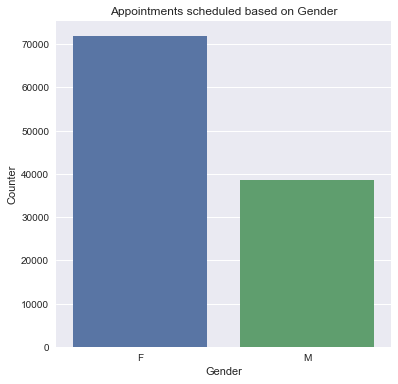


This shows that more number of females are scheduling an appointment. This might be because of two reasons
1. There are very health conscious and go for regular health checkups
2. There immune power is low and are prone to getting diseases.


```python
#data[(data.PatientId.value_counts() > 1) & (data.Gender == "F")].sum()
```


```python
 data['year'], data['month'], data['date'] = zip(*data['ScheduledDay'].map(lambda x: x.split('-')))
```


```python
data
```


<div>
<style>
    .dataframe thead tr:only-child th {
        text-align: right;
    }

    .dataframe thead th {
        text-align: left;
    }

    .dataframe tbody tr th {
        vertical-align: top;
    }
</style>
<table border="1" class="dataframe">
  <thead>
    <tr style="text-align: right;">
      <th></th>
      <th>PatientId</th>
      <th>AppointmentID</th>
      <th>Gender</th>
      <th>ScheduledDay</th>
      <th>AppointmentDay</th>
      <th>Age</th>
      <th>Neighbourhood</th>
      <th>Scholarship</th>
      <th>Hipertension</th>
      <th>Diabetes</th>
      <th>Alcoholism</th>
      <th>Handcap</th>
      <th>SMS_received</th>
      <th>No-show</th>
      <th>year</th>
      <th>month</th>
      <th>date</th>
    </tr>
  </thead>
  <tbody>
    <tr>
      <th>0</th>
      <td>2.987250e+13</td>
      <td>5642903</td>
      <td>F</td>
      <td>2016-04-29T18:38:08Z</td>
      <td>2016-04-29T00:00:00Z</td>
      <td>62</td>
      <td>JARDIM DA PENHA</td>
      <td>0</td>
      <td>1</td>
      <td>0</td>
      <td>0</td>
      <td>0</td>
      <td>0</td>
      <td>No</td>
      <td>2016</td>
      <td>04</td>
      <td>29T18:38:08Z</td>
    </tr>
    <tr>
      <th>1</th>
      <td>5.589978e+14</td>
      <td>5642503</td>
      <td>M</td>
      <td>2016-04-29T16:08:27Z</td>
      <td>2016-04-29T00:00:00Z</td>
      <td>56</td>
      <td>JARDIM DA PENHA</td>
      <td>0</td>
      <td>0</td>
      <td>0</td>
      <td>0</td>
      <td>0</td>
      <td>0</td>
      <td>No</td>
      <td>2016</td>
      <td>04</td>
      <td>29T16:08:27Z</td>
    </tr>
    <tr>
      <th>2</th>
      <td>4.262962e+12</td>
      <td>5642549</td>
      <td>F</td>
      <td>2016-04-29T16:19:04Z</td>
      <td>2016-04-29T00:00:00Z</td>
      <td>62</td>
      <td>MATA DA PRAIA</td>
      <td>0</td>
      <td>0</td>
      <td>0</td>
      <td>0</td>
      <td>0</td>
      <td>0</td>
      <td>No</td>
      <td>2016</td>
      <td>04</td>
      <td>29T16:19:04Z</td>
    </tr>
    <tr>
      <th>3</th>
      <td>8.679512e+11</td>
      <td>5642828</td>
      <td>F</td>
      <td>2016-04-29T17:29:31Z</td>
      <td>2016-04-29T00:00:00Z</td>
      <td>8</td>
      <td>PONTAL DE CAMBURI</td>
      <td>0</td>
      <td>0</td>
      <td>0</td>
      <td>0</td>
      <td>0</td>
      <td>0</td>
      <td>No</td>
      <td>2016</td>
      <td>04</td>
      <td>29T17:29:31Z</td>
    </tr>
    <tr>
      <th>4</th>
      <td>8.841186e+12</td>
      <td>5642494</td>
      <td>F</td>
      <td>2016-04-29T16:07:23Z</td>
      <td>2016-04-29T00:00:00Z</td>
      <td>56</td>
      <td>JARDIM DA PENHA</td>
      <td>0</td>
      <td>1</td>
      <td>1</td>
      <td>0</td>
      <td>0</td>
      <td>0</td>
      <td>No</td>
      <td>2016</td>
      <td>04</td>
      <td>29T16:07:23Z</td>
    </tr>
    <tr>
      <th>5</th>
      <td>9.598513e+13</td>
      <td>5626772</td>
      <td>F</td>
      <td>2016-04-27T08:36:51Z</td>
      <td>2016-04-29T00:00:00Z</td>
      <td>76</td>
      <td>REPÚBLICA</td>
      <td>0</td>
      <td>1</td>
      <td>0</td>
      <td>0</td>
      <td>0</td>
      <td>0</td>
      <td>No</td>
      <td>2016</td>
      <td>04</td>
      <td>27T08:36:51Z</td>
    </tr>
    <tr>
      <th>6</th>
      <td>7.336882e+14</td>
      <td>5630279</td>
      <td>F</td>
      <td>2016-04-27T15:05:12Z</td>
      <td>2016-04-29T00:00:00Z</td>
      <td>23</td>
      <td>GOIABEIRAS</td>
      <td>0</td>
      <td>0</td>
      <td>0</td>
      <td>0</td>
      <td>0</td>
      <td>0</td>
      <td>Yes</td>
      <td>2016</td>
      <td>04</td>
      <td>27T15:05:12Z</td>
    </tr>
    <tr>
      <th>7</th>
      <td>3.449833e+12</td>
      <td>5630575</td>
      <td>F</td>
      <td>2016-04-27T15:39:58Z</td>
      <td>2016-04-29T00:00:00Z</td>
      <td>39</td>
      <td>GOIABEIRAS</td>
      <td>0</td>
      <td>0</td>
      <td>0</td>
      <td>0</td>
      <td>0</td>
      <td>0</td>
      <td>Yes</td>
      <td>2016</td>
      <td>04</td>
      <td>27T15:39:58Z</td>
    </tr>
    <tr>
      <th>8</th>
      <td>5.639473e+13</td>
      <td>5638447</td>
      <td>F</td>
      <td>2016-04-29T08:02:16Z</td>
      <td>2016-04-29T00:00:00Z</td>
      <td>21</td>
      <td>ANDORINHAS</td>
      <td>0</td>
      <td>0</td>
      <td>0</td>
      <td>0</td>
      <td>0</td>
      <td>0</td>
      <td>No</td>
      <td>2016</td>
      <td>04</td>
      <td>29T08:02:16Z</td>
    </tr>
    <tr>
      <th>9</th>
      <td>7.812456e+13</td>
      <td>5629123</td>
      <td>F</td>
      <td>2016-04-27T12:48:25Z</td>
      <td>2016-04-29T00:00:00Z</td>
      <td>19</td>
      <td>CONQUISTA</td>
      <td>0</td>
      <td>0</td>
      <td>0</td>
      <td>0</td>
      <td>0</td>
      <td>0</td>
      <td>No</td>
      <td>2016</td>
      <td>04</td>
      <td>27T12:48:25Z</td>
    </tr>
    <tr>
      <th>10</th>
      <td>7.345362e+14</td>
      <td>5630213</td>
      <td>F</td>
      <td>2016-04-27T14:58:11Z</td>
      <td>2016-04-29T00:00:00Z</td>
      <td>30</td>
      <td>NOVA PALESTINA</td>
      <td>0</td>
      <td>0</td>
      <td>0</td>
      <td>0</td>
      <td>0</td>
      <td>0</td>
      <td>No</td>
      <td>2016</td>
      <td>04</td>
      <td>27T14:58:11Z</td>
    </tr>
    <tr>
      <th>11</th>
      <td>7.542951e+12</td>
      <td>5620163</td>
      <td>M</td>
      <td>2016-04-26T08:44:12Z</td>
      <td>2016-04-29T00:00:00Z</td>
      <td>29</td>
      <td>NOVA PALESTINA</td>
      <td>0</td>
      <td>0</td>
      <td>0</td>
      <td>0</td>
      <td>0</td>
      <td>1</td>
      <td>Yes</td>
      <td>2016</td>
      <td>04</td>
      <td>26T08:44:12Z</td>
    </tr>
    <tr>
      <th>12</th>
      <td>5.666548e+14</td>
      <td>5634718</td>
      <td>F</td>
      <td>2016-04-28T11:33:51Z</td>
      <td>2016-04-29T00:00:00Z</td>
      <td>22</td>
      <td>NOVA PALESTINA</td>
      <td>1</td>
      <td>0</td>
      <td>0</td>
      <td>0</td>
      <td>0</td>
      <td>0</td>
      <td>No</td>
      <td>2016</td>
      <td>04</td>
      <td>28T11:33:51Z</td>
    </tr>
    <tr>
      <th>13</th>
      <td>9.113946e+14</td>
      <td>5636249</td>
      <td>M</td>
      <td>2016-04-28T14:52:07Z</td>
      <td>2016-04-29T00:00:00Z</td>
      <td>28</td>
      <td>NOVA PALESTINA</td>
      <td>0</td>
      <td>0</td>
      <td>0</td>
      <td>0</td>
      <td>0</td>
      <td>0</td>
      <td>No</td>
      <td>2016</td>
      <td>04</td>
      <td>28T14:52:07Z</td>
    </tr>
    <tr>
      <th>14</th>
      <td>9.988472e+13</td>
      <td>5633951</td>
      <td>F</td>
      <td>2016-04-28T10:06:24Z</td>
      <td>2016-04-29T00:00:00Z</td>
      <td>54</td>
      <td>NOVA PALESTINA</td>
      <td>0</td>
      <td>0</td>
      <td>0</td>
      <td>0</td>
      <td>0</td>
      <td>0</td>
      <td>No</td>
      <td>2016</td>
      <td>04</td>
      <td>28T10:06:24Z</td>
    </tr>
    <tr>
      <th>15</th>
      <td>9.994839e+10</td>
      <td>5620206</td>
      <td>F</td>
      <td>2016-04-26T08:47:27Z</td>
      <td>2016-04-29T00:00:00Z</td>
      <td>15</td>
      <td>NOVA PALESTINA</td>
      <td>0</td>
      <td>0</td>
      <td>0</td>
      <td>0</td>
      <td>0</td>
      <td>1</td>
      <td>No</td>
      <td>2016</td>
      <td>04</td>
      <td>26T08:47:27Z</td>
    </tr>
    <tr>
      <th>16</th>
      <td>8.457439e+13</td>
      <td>5633121</td>
      <td>M</td>
      <td>2016-04-28T08:51:47Z</td>
      <td>2016-04-29T00:00:00Z</td>
      <td>50</td>
      <td>NOVA PALESTINA</td>
      <td>0</td>
      <td>0</td>
      <td>0</td>
      <td>0</td>
      <td>0</td>
      <td>0</td>
      <td>No</td>
      <td>2016</td>
      <td>04</td>
      <td>28T08:51:47Z</td>
    </tr>
    <tr>
      <th>17</th>
      <td>1.479497e+13</td>
      <td>5633460</td>
      <td>F</td>
      <td>2016-04-28T09:28:57Z</td>
      <td>2016-04-29T00:00:00Z</td>
      <td>40</td>
      <td>CONQUISTA</td>
      <td>1</td>
      <td>0</td>
      <td>0</td>
      <td>0</td>
      <td>0</td>
      <td>0</td>
      <td>Yes</td>
      <td>2016</td>
      <td>04</td>
      <td>28T09:28:57Z</td>
    </tr>
    <tr>
      <th>18</th>
      <td>1.713538e+13</td>
      <td>5621836</td>
      <td>F</td>
      <td>2016-04-26T10:54:18Z</td>
      <td>2016-04-29T00:00:00Z</td>
      <td>30</td>
      <td>NOVA PALESTINA</td>
      <td>1</td>
      <td>0</td>
      <td>0</td>
      <td>0</td>
      <td>0</td>
      <td>1</td>
      <td>No</td>
      <td>2016</td>
      <td>04</td>
      <td>26T10:54:18Z</td>
    </tr>
    <tr>
      <th>19</th>
      <td>7.223289e+12</td>
      <td>5640433</td>
      <td>F</td>
      <td>2016-04-29T10:43:14Z</td>
      <td>2016-04-29T00:00:00Z</td>
      <td>46</td>
      <td>DA PENHA</td>
      <td>0</td>
      <td>0</td>
      <td>0</td>
      <td>0</td>
      <td>0</td>
      <td>0</td>
      <td>No</td>
      <td>2016</td>
      <td>04</td>
      <td>29T10:43:14Z</td>
    </tr>
    <tr>
      <th>20</th>
      <td>6.222575e+14</td>
      <td>5626083</td>
      <td>F</td>
      <td>2016-04-27T07:51:14Z</td>
      <td>2016-04-29T00:00:00Z</td>
      <td>30</td>
      <td>NOVA PALESTINA</td>
      <td>0</td>
      <td>0</td>
      <td>0</td>
      <td>0</td>
      <td>0</td>
      <td>0</td>
      <td>Yes</td>
      <td>2016</td>
      <td>04</td>
      <td>27T07:51:14Z</td>
    </tr>
    <tr>
      <th>21</th>
      <td>1.215484e+13</td>
      <td>5628338</td>
      <td>F</td>
      <td>2016-04-27T10:50:45Z</td>
      <td>2016-04-29T00:00:00Z</td>
      <td>4</td>
      <td>CONQUISTA</td>
      <td>0</td>
      <td>0</td>
      <td>0</td>
      <td>0</td>
      <td>0</td>
      <td>0</td>
      <td>Yes</td>
      <td>2016</td>
      <td>04</td>
      <td>27T10:50:45Z</td>
    </tr>
    <tr>
      <th>22</th>
      <td>8.632298e+14</td>
      <td>5616091</td>
      <td>M</td>
      <td>2016-04-25T13:29:16Z</td>
      <td>2016-04-29T00:00:00Z</td>
      <td>13</td>
      <td>CONQUISTA</td>
      <td>0</td>
      <td>0</td>
      <td>0</td>
      <td>0</td>
      <td>0</td>
      <td>1</td>
      <td>Yes</td>
      <td>2016</td>
      <td>04</td>
      <td>25T13:29:16Z</td>
    </tr>
    <tr>
      <th>23</th>
      <td>2.137540e+14</td>
      <td>5634142</td>
      <td>F</td>
      <td>2016-04-28T10:27:05Z</td>
      <td>2016-04-29T00:00:00Z</td>
      <td>46</td>
      <td>CONQUISTA</td>
      <td>0</td>
      <td>0</td>
      <td>0</td>
      <td>0</td>
      <td>0</td>
      <td>0</td>
      <td>No</td>
      <td>2016</td>
      <td>04</td>
      <td>28T10:27:05Z</td>
    </tr>
    <tr>
      <th>24</th>
      <td>8.734858e+12</td>
      <td>5641780</td>
      <td>F</td>
      <td>2016-04-29T14:19:19Z</td>
      <td>2016-04-29T00:00:00Z</td>
      <td>65</td>
      <td>TABUAZEIRO</td>
      <td>0</td>
      <td>0</td>
      <td>0</td>
      <td>0</td>
      <td>0</td>
      <td>0</td>
      <td>No</td>
      <td>2016</td>
      <td>04</td>
      <td>29T14:19:19Z</td>
    </tr>
    <tr>
      <th>25</th>
      <td>5.819370e+12</td>
      <td>5624020</td>
      <td>M</td>
      <td>2016-04-26T15:04:17Z</td>
      <td>2016-04-29T00:00:00Z</td>
      <td>46</td>
      <td>CONQUISTA</td>
      <td>0</td>
      <td>1</td>
      <td>0</td>
      <td>0</td>
      <td>0</td>
      <td>1</td>
      <td>No</td>
      <td>2016</td>
      <td>04</td>
      <td>26T15:04:17Z</td>
    </tr>
    <tr>
      <th>26</th>
      <td>2.578785e+10</td>
      <td>5641781</td>
      <td>F</td>
      <td>2016-04-29T14:19:42Z</td>
      <td>2016-04-29T00:00:00Z</td>
      <td>45</td>
      <td>BENTO FERREIRA</td>
      <td>0</td>
      <td>1</td>
      <td>0</td>
      <td>0</td>
      <td>0</td>
      <td>0</td>
      <td>No</td>
      <td>2016</td>
      <td>04</td>
      <td>29T14:19:42Z</td>
    </tr>
    <tr>
      <th>27</th>
      <td>1.215484e+13</td>
      <td>5628345</td>
      <td>F</td>
      <td>2016-04-27T10:51:45Z</td>
      <td>2016-04-29T00:00:00Z</td>
      <td>4</td>
      <td>CONQUISTA</td>
      <td>0</td>
      <td>0</td>
      <td>0</td>
      <td>0</td>
      <td>0</td>
      <td>0</td>
      <td>No</td>
      <td>2016</td>
      <td>04</td>
      <td>27T10:51:45Z</td>
    </tr>
    <tr>
      <th>28</th>
      <td>5.926172e+12</td>
      <td>5642400</td>
      <td>M</td>
      <td>2016-04-29T15:48:02Z</td>
      <td>2016-04-29T00:00:00Z</td>
      <td>51</td>
      <td>SÃO PEDRO</td>
      <td>0</td>
      <td>0</td>
      <td>0</td>
      <td>0</td>
      <td>0</td>
      <td>0</td>
      <td>No</td>
      <td>2016</td>
      <td>04</td>
      <td>29T15:48:02Z</td>
    </tr>
    <tr>
      <th>29</th>
      <td>1.225776e+12</td>
      <td>5642186</td>
      <td>F</td>
      <td>2016-04-29T15:16:29Z</td>
      <td>2016-04-29T00:00:00Z</td>
      <td>32</td>
      <td>SANTA MARTHA</td>
      <td>0</td>
      <td>0</td>
      <td>0</td>
      <td>0</td>
      <td>0</td>
      <td>0</td>
      <td>No</td>
      <td>2016</td>
      <td>04</td>
      <td>29T15:16:29Z</td>
    </tr>
    <tr>
      <th>...</th>
      <td>...</td>
      <td>...</td>
      <td>...</td>
      <td>...</td>
      <td>...</td>
      <td>...</td>
      <td>...</td>
      <td>...</td>
      <td>...</td>
      <td>...</td>
      <td>...</td>
      <td>...</td>
      <td>...</td>
      <td>...</td>
      <td>...</td>
      <td>...</td>
      <td>...</td>
    </tr>
    <tr>
      <th>110497</th>
      <td>7.935892e+14</td>
      <td>5757745</td>
      <td>M</td>
      <td>2016-06-01T09:46:33Z</td>
      <td>2016-06-01T00:00:00Z</td>
      <td>76</td>
      <td>MARIA ORTIZ</td>
      <td>0</td>
      <td>0</td>
      <td>0</td>
      <td>0</td>
      <td>0</td>
      <td>0</td>
      <td>No</td>
      <td>2016</td>
      <td>06</td>
      <td>01T09:46:33Z</td>
    </tr>
    <tr>
      <th>110498</th>
      <td>9.433654e+13</td>
      <td>5787655</td>
      <td>F</td>
      <td>2016-06-08T10:21:14Z</td>
      <td>2016-06-08T00:00:00Z</td>
      <td>59</td>
      <td>MARIA ORTIZ</td>
      <td>0</td>
      <td>0</td>
      <td>0</td>
      <td>0</td>
      <td>0</td>
      <td>0</td>
      <td>No</td>
      <td>2016</td>
      <td>06</td>
      <td>08T10:21:14Z</td>
    </tr>
    <tr>
      <th>110499</th>
      <td>8.219692e+14</td>
      <td>5757697</td>
      <td>F</td>
      <td>2016-06-01T09:42:56Z</td>
      <td>2016-06-01T00:00:00Z</td>
      <td>66</td>
      <td>MARIA ORTIZ</td>
      <td>0</td>
      <td>1</td>
      <td>1</td>
      <td>0</td>
      <td>0</td>
      <td>0</td>
      <td>No</td>
      <td>2016</td>
      <td>06</td>
      <td>01T09:42:56Z</td>
    </tr>
    <tr>
      <th>110500</th>
      <td>4.434384e+14</td>
      <td>5787233</td>
      <td>F</td>
      <td>2016-06-08T09:35:13Z</td>
      <td>2016-06-08T00:00:00Z</td>
      <td>59</td>
      <td>MARIA ORTIZ</td>
      <td>0</td>
      <td>0</td>
      <td>0</td>
      <td>0</td>
      <td>0</td>
      <td>0</td>
      <td>No</td>
      <td>2016</td>
      <td>06</td>
      <td>08T09:35:13Z</td>
    </tr>
    <tr>
      <th>110501</th>
      <td>4.544252e+11</td>
      <td>5758133</td>
      <td>M</td>
      <td>2016-06-01T10:19:12Z</td>
      <td>2016-06-01T00:00:00Z</td>
      <td>44</td>
      <td>MARIA ORTIZ</td>
      <td>0</td>
      <td>0</td>
      <td>0</td>
      <td>0</td>
      <td>0</td>
      <td>0</td>
      <td>No</td>
      <td>2016</td>
      <td>06</td>
      <td>01T10:19:12Z</td>
    </tr>
    <tr>
      <th>110502</th>
      <td>7.316229e+14</td>
      <td>5787937</td>
      <td>F</td>
      <td>2016-06-08T10:50:42Z</td>
      <td>2016-06-08T00:00:00Z</td>
      <td>22</td>
      <td>GOIABEIRAS</td>
      <td>0</td>
      <td>0</td>
      <td>0</td>
      <td>0</td>
      <td>0</td>
      <td>0</td>
      <td>No</td>
      <td>2016</td>
      <td>06</td>
      <td>08T10:50:42Z</td>
    </tr>
    <tr>
      <th>110503</th>
      <td>2.362182e+13</td>
      <td>5759473</td>
      <td>F</td>
      <td>2016-06-01T13:00:36Z</td>
      <td>2016-06-01T00:00:00Z</td>
      <td>64</td>
      <td>SOLON BORGES</td>
      <td>0</td>
      <td>0</td>
      <td>0</td>
      <td>0</td>
      <td>0</td>
      <td>0</td>
      <td>No</td>
      <td>2016</td>
      <td>06</td>
      <td>01T13:00:36Z</td>
    </tr>
    <tr>
      <th>110504</th>
      <td>9.947983e+12</td>
      <td>5788052</td>
      <td>F</td>
      <td>2016-06-08T11:06:21Z</td>
      <td>2016-06-08T00:00:00Z</td>
      <td>4</td>
      <td>MARIA ORTIZ</td>
      <td>0</td>
      <td>0</td>
      <td>0</td>
      <td>0</td>
      <td>0</td>
      <td>0</td>
      <td>No</td>
      <td>2016</td>
      <td>06</td>
      <td>08T11:06:21Z</td>
    </tr>
    <tr>
      <th>110505</th>
      <td>5.667344e+13</td>
      <td>5758455</td>
      <td>F</td>
      <td>2016-06-01T10:45:50Z</td>
      <td>2016-06-01T00:00:00Z</td>
      <td>55</td>
      <td>MARIA ORTIZ</td>
      <td>0</td>
      <td>0</td>
      <td>0</td>
      <td>0</td>
      <td>0</td>
      <td>0</td>
      <td>No</td>
      <td>2016</td>
      <td>06</td>
      <td>01T10:45:50Z</td>
    </tr>
    <tr>
      <th>110506</th>
      <td>8.973883e+11</td>
      <td>5758779</td>
      <td>M</td>
      <td>2016-06-01T11:09:20Z</td>
      <td>2016-06-01T00:00:00Z</td>
      <td>5</td>
      <td>MARIA ORTIZ</td>
      <td>0</td>
      <td>0</td>
      <td>0</td>
      <td>0</td>
      <td>0</td>
      <td>0</td>
      <td>No</td>
      <td>2016</td>
      <td>06</td>
      <td>01T11:09:20Z</td>
    </tr>
    <tr>
      <th>110507</th>
      <td>4.769462e+14</td>
      <td>5786918</td>
      <td>F</td>
      <td>2016-06-08T09:04:18Z</td>
      <td>2016-06-08T00:00:00Z</td>
      <td>0</td>
      <td>MARIA ORTIZ</td>
      <td>0</td>
      <td>0</td>
      <td>0</td>
      <td>0</td>
      <td>0</td>
      <td>0</td>
      <td>No</td>
      <td>2016</td>
      <td>06</td>
      <td>08T09:04:18Z</td>
    </tr>
    <tr>
      <th>110508</th>
      <td>9.433654e+13</td>
      <td>5757656</td>
      <td>F</td>
      <td>2016-06-01T09:41:00Z</td>
      <td>2016-06-01T00:00:00Z</td>
      <td>59</td>
      <td>MARIA ORTIZ</td>
      <td>0</td>
      <td>0</td>
      <td>0</td>
      <td>0</td>
      <td>0</td>
      <td>0</td>
      <td>No</td>
      <td>2016</td>
      <td>06</td>
      <td>01T09:41:00Z</td>
    </tr>
    <tr>
      <th>110509</th>
      <td>4.952968e+14</td>
      <td>5786750</td>
      <td>M</td>
      <td>2016-06-08T08:50:51Z</td>
      <td>2016-06-08T00:00:00Z</td>
      <td>33</td>
      <td>MARIA ORTIZ</td>
      <td>0</td>
      <td>0</td>
      <td>0</td>
      <td>0</td>
      <td>0</td>
      <td>0</td>
      <td>No</td>
      <td>2016</td>
      <td>06</td>
      <td>08T08:50:51Z</td>
    </tr>
    <tr>
      <th>110510</th>
      <td>2.362182e+13</td>
      <td>5757587</td>
      <td>F</td>
      <td>2016-06-01T09:35:48Z</td>
      <td>2016-06-01T00:00:00Z</td>
      <td>64</td>
      <td>SOLON BORGES</td>
      <td>0</td>
      <td>0</td>
      <td>0</td>
      <td>0</td>
      <td>0</td>
      <td>0</td>
      <td>No</td>
      <td>2016</td>
      <td>06</td>
      <td>01T09:35:48Z</td>
    </tr>
    <tr>
      <th>110511</th>
      <td>8.235996e+11</td>
      <td>5786742</td>
      <td>F</td>
      <td>2016-06-08T08:50:20Z</td>
      <td>2016-06-08T00:00:00Z</td>
      <td>14</td>
      <td>MARIA ORTIZ</td>
      <td>0</td>
      <td>0</td>
      <td>0</td>
      <td>0</td>
      <td>0</td>
      <td>0</td>
      <td>No</td>
      <td>2016</td>
      <td>06</td>
      <td>08T08:50:20Z</td>
    </tr>
    <tr>
      <th>110512</th>
      <td>9.876246e+13</td>
      <td>5786368</td>
      <td>F</td>
      <td>2016-06-08T08:20:01Z</td>
      <td>2016-06-08T00:00:00Z</td>
      <td>41</td>
      <td>MARIA ORTIZ</td>
      <td>0</td>
      <td>0</td>
      <td>0</td>
      <td>0</td>
      <td>0</td>
      <td>0</td>
      <td>No</td>
      <td>2016</td>
      <td>06</td>
      <td>08T08:20:01Z</td>
    </tr>
    <tr>
      <th>110513</th>
      <td>8.674778e+13</td>
      <td>5785964</td>
      <td>M</td>
      <td>2016-06-08T07:52:55Z</td>
      <td>2016-06-08T00:00:00Z</td>
      <td>2</td>
      <td>ANTÔNIO HONÓRIO</td>
      <td>0</td>
      <td>0</td>
      <td>0</td>
      <td>0</td>
      <td>0</td>
      <td>0</td>
      <td>No</td>
      <td>2016</td>
      <td>06</td>
      <td>08T07:52:55Z</td>
    </tr>
    <tr>
      <th>110514</th>
      <td>2.695685e+12</td>
      <td>5786567</td>
      <td>F</td>
      <td>2016-06-08T08:35:31Z</td>
      <td>2016-06-08T00:00:00Z</td>
      <td>58</td>
      <td>MARIA ORTIZ</td>
      <td>0</td>
      <td>0</td>
      <td>0</td>
      <td>0</td>
      <td>0</td>
      <td>0</td>
      <td>No</td>
      <td>2016</td>
      <td>06</td>
      <td>08T08:35:31Z</td>
    </tr>
    <tr>
      <th>110515</th>
      <td>6.456342e+14</td>
      <td>5778621</td>
      <td>M</td>
      <td>2016-06-06T15:58:05Z</td>
      <td>2016-06-08T00:00:00Z</td>
      <td>33</td>
      <td>MARIA ORTIZ</td>
      <td>0</td>
      <td>1</td>
      <td>0</td>
      <td>0</td>
      <td>0</td>
      <td>0</td>
      <td>Yes</td>
      <td>2016</td>
      <td>06</td>
      <td>06T15:58:05Z</td>
    </tr>
    <tr>
      <th>110516</th>
      <td>6.923772e+13</td>
      <td>5780205</td>
      <td>F</td>
      <td>2016-06-07T07:45:16Z</td>
      <td>2016-06-08T00:00:00Z</td>
      <td>37</td>
      <td>MARIA ORTIZ</td>
      <td>0</td>
      <td>0</td>
      <td>0</td>
      <td>0</td>
      <td>0</td>
      <td>0</td>
      <td>Yes</td>
      <td>2016</td>
      <td>06</td>
      <td>07T07:45:16Z</td>
    </tr>
    <tr>
      <th>110517</th>
      <td>5.574942e+12</td>
      <td>5780122</td>
      <td>F</td>
      <td>2016-06-07T07:38:34Z</td>
      <td>2016-06-07T00:00:00Z</td>
      <td>19</td>
      <td>MARIA ORTIZ</td>
      <td>0</td>
      <td>0</td>
      <td>0</td>
      <td>0</td>
      <td>0</td>
      <td>0</td>
      <td>No</td>
      <td>2016</td>
      <td>06</td>
      <td>07T07:38:34Z</td>
    </tr>
    <tr>
      <th>110518</th>
      <td>7.263315e+13</td>
      <td>5630375</td>
      <td>F</td>
      <td>2016-04-27T15:15:06Z</td>
      <td>2016-06-07T00:00:00Z</td>
      <td>50</td>
      <td>MARIA ORTIZ</td>
      <td>0</td>
      <td>0</td>
      <td>0</td>
      <td>0</td>
      <td>0</td>
      <td>1</td>
      <td>No</td>
      <td>2016</td>
      <td>04</td>
      <td>27T15:15:06Z</td>
    </tr>
    <tr>
      <th>110519</th>
      <td>6.542388e+13</td>
      <td>5630447</td>
      <td>F</td>
      <td>2016-04-27T15:23:14Z</td>
      <td>2016-06-07T00:00:00Z</td>
      <td>22</td>
      <td>MARIA ORTIZ</td>
      <td>0</td>
      <td>0</td>
      <td>0</td>
      <td>0</td>
      <td>0</td>
      <td>1</td>
      <td>No</td>
      <td>2016</td>
      <td>04</td>
      <td>27T15:23:14Z</td>
    </tr>
    <tr>
      <th>110520</th>
      <td>9.969977e+14</td>
      <td>5650534</td>
      <td>F</td>
      <td>2016-05-03T07:51:47Z</td>
      <td>2016-06-07T00:00:00Z</td>
      <td>42</td>
      <td>MARIA ORTIZ</td>
      <td>0</td>
      <td>0</td>
      <td>0</td>
      <td>0</td>
      <td>0</td>
      <td>1</td>
      <td>No</td>
      <td>2016</td>
      <td>05</td>
      <td>03T07:51:47Z</td>
    </tr>
    <tr>
      <th>110521</th>
      <td>3.635534e+13</td>
      <td>5651072</td>
      <td>F</td>
      <td>2016-05-03T08:23:40Z</td>
      <td>2016-06-07T00:00:00Z</td>
      <td>53</td>
      <td>MARIA ORTIZ</td>
      <td>0</td>
      <td>0</td>
      <td>0</td>
      <td>0</td>
      <td>0</td>
      <td>1</td>
      <td>No</td>
      <td>2016</td>
      <td>05</td>
      <td>03T08:23:40Z</td>
    </tr>
    <tr>
      <th>110522</th>
      <td>2.572134e+12</td>
      <td>5651768</td>
      <td>F</td>
      <td>2016-05-03T09:15:35Z</td>
      <td>2016-06-07T00:00:00Z</td>
      <td>56</td>
      <td>MARIA ORTIZ</td>
      <td>0</td>
      <td>0</td>
      <td>0</td>
      <td>0</td>
      <td>0</td>
      <td>1</td>
      <td>No</td>
      <td>2016</td>
      <td>05</td>
      <td>03T09:15:35Z</td>
    </tr>
    <tr>
      <th>110523</th>
      <td>3.596266e+12</td>
      <td>5650093</td>
      <td>F</td>
      <td>2016-05-03T07:27:33Z</td>
      <td>2016-06-07T00:00:00Z</td>
      <td>51</td>
      <td>MARIA ORTIZ</td>
      <td>0</td>
      <td>0</td>
      <td>0</td>
      <td>0</td>
      <td>0</td>
      <td>1</td>
      <td>No</td>
      <td>2016</td>
      <td>05</td>
      <td>03T07:27:33Z</td>
    </tr>
    <tr>
      <th>110524</th>
      <td>1.557663e+13</td>
      <td>5630692</td>
      <td>F</td>
      <td>2016-04-27T16:03:52Z</td>
      <td>2016-06-07T00:00:00Z</td>
      <td>21</td>
      <td>MARIA ORTIZ</td>
      <td>0</td>
      <td>0</td>
      <td>0</td>
      <td>0</td>
      <td>0</td>
      <td>1</td>
      <td>No</td>
      <td>2016</td>
      <td>04</td>
      <td>27T16:03:52Z</td>
    </tr>
    <tr>
      <th>110525</th>
      <td>9.213493e+13</td>
      <td>5630323</td>
      <td>F</td>
      <td>2016-04-27T15:09:23Z</td>
      <td>2016-06-07T00:00:00Z</td>
      <td>38</td>
      <td>MARIA ORTIZ</td>
      <td>0</td>
      <td>0</td>
      <td>0</td>
      <td>0</td>
      <td>0</td>
      <td>1</td>
      <td>No</td>
      <td>2016</td>
      <td>04</td>
      <td>27T15:09:23Z</td>
    </tr>
    <tr>
      <th>110526</th>
      <td>3.775115e+14</td>
      <td>5629448</td>
      <td>F</td>
      <td>2016-04-27T13:30:56Z</td>
      <td>2016-06-07T00:00:00Z</td>
      <td>54</td>
      <td>MARIA ORTIZ</td>
      <td>0</td>
      <td>0</td>
      <td>0</td>
      <td>0</td>
      <td>0</td>
      <td>1</td>
      <td>No</td>
      <td>2016</td>
      <td>04</td>
      <td>27T13:30:56Z</td>
    </tr>
  </tbody>
</table>
<p>110527 rows × 17 columns</p>
</div>


```python
data.info()
```

    <class 'pandas.core.frame.DataFrame'>
    RangeIndex: 110527 entries, 0 to 110526
    Data columns (total 17 columns):
    PatientId         110527 non-null float64
    AppointmentID     110527 non-null int64
    Gender            110527 non-null object
    ScheduledDay      110527 non-null object
    AppointmentDay    110527 non-null object
    Age               110527 non-null int64
    Neighbourhood     110527 non-null object
    Scholarship       110527 non-null int64
    Hipertension      110527 non-null int64
    Diabetes          110527 non-null int64
    Alcoholism        110527 non-null int64
    Handcap           110527 non-null int64
    SMS_received      110527 non-null int64
    No-show           110527 non-null object
    year              110527 non-null object
    month             110527 non-null object
    date              110527 non-null object
    dtypes: float64(1), int64(8), object(8)
    memory usage: 14.3+ MB


```python
table_count = data['year'].value_counts()
type_index = table_count.index
type_values = table_count.values

fig,ax = plt.subplots(figsize=(11,11))
sns.barplot(x = type_index,y=type_values,ax=ax)
plt.title('Appointments scheduled per year')
plt.xlabel('Year')
plt.ylabel('Counter')
```


    <matplotlib.text.Text at 0x1a1b7db550>


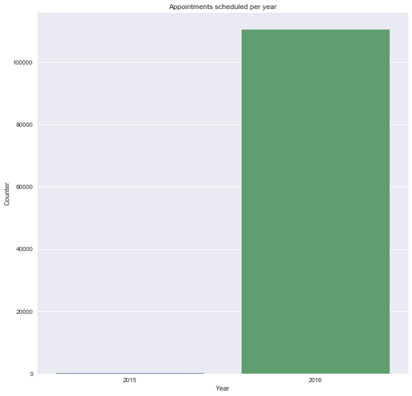


Most of the appointments were made in the year 2016


```python
table_count = data['month'].value_counts()
type_index = table_count.index
type_values = table_count.values

fig,ax = plt.subplots(figsize=(6,6))
sns.barplot(x = type_index,y=type_values,ax=ax)
plt.title('Appointments scheduled per month')
plt.xlabel('month')
plt.ylabel('Counter')
```


    <matplotlib.text.Text at 0x1a1b863b00>


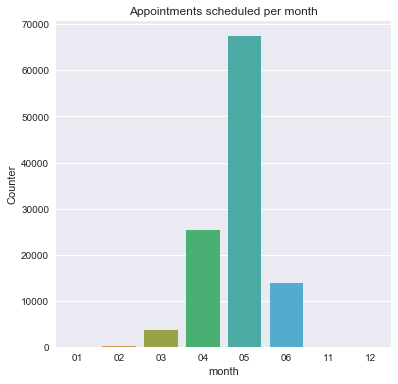


```python
data.month.value_counts()
```


    05    67421
    04    25339
    06    13750
    03     3614
    02      281
    12       61
    01       60
    11        1
    Name: month, dtype: int64


We can see that in the month of May the appointments are made more. Is it because the spread of diseases more during that season?


```python
data.date[1]
```


    '29T16:08:27Z'


```python
 data['day'], data['time'] = zip(*data['date'].map(lambda x: x.split('T')))
```


```python
data
```


<div>
<style>
    .dataframe thead tr:only-child th {
        text-align: right;
    }

    .dataframe thead th {
        text-align: left;
    }

    .dataframe tbody tr th {
        vertical-align: top;
    }
</style>
<table border="1" class="dataframe">
  <thead>
    <tr style="text-align: right;">
      <th></th>
      <th>PatientId</th>
      <th>AppointmentID</th>
      <th>Gender</th>
      <th>ScheduledDay</th>
      <th>AppointmentDay</th>
      <th>Age</th>
      <th>Neighbourhood</th>
      <th>Scholarship</th>
      <th>Hipertension</th>
      <th>Diabetes</th>
      <th>Alcoholism</th>
      <th>Handcap</th>
      <th>SMS_received</th>
      <th>No-show</th>
      <th>year</th>
      <th>month</th>
      <th>date</th>
      <th>day</th>
      <th>time</th>
    </tr>
  </thead>
  <tbody>
    <tr>
      <th>0</th>
      <td>2.987250e+13</td>
      <td>5642903</td>
      <td>F</td>
      <td>2016-04-29T18:38:08Z</td>
      <td>2016-04-29T00:00:00Z</td>
      <td>62</td>
      <td>JARDIM DA PENHA</td>
      <td>0</td>
      <td>1</td>
      <td>0</td>
      <td>0</td>
      <td>0</td>
      <td>0</td>
      <td>No</td>
      <td>2016</td>
      <td>04</td>
      <td>29T18:38:08Z</td>
      <td>29</td>
      <td>18:38:08Z</td>
    </tr>
    <tr>
      <th>1</th>
      <td>5.589978e+14</td>
      <td>5642503</td>
      <td>M</td>
      <td>2016-04-29T16:08:27Z</td>
      <td>2016-04-29T00:00:00Z</td>
      <td>56</td>
      <td>JARDIM DA PENHA</td>
      <td>0</td>
      <td>0</td>
      <td>0</td>
      <td>0</td>
      <td>0</td>
      <td>0</td>
      <td>No</td>
      <td>2016</td>
      <td>04</td>
      <td>29T16:08:27Z</td>
      <td>29</td>
      <td>16:08:27Z</td>
    </tr>
    <tr>
      <th>2</th>
      <td>4.262962e+12</td>
      <td>5642549</td>
      <td>F</td>
      <td>2016-04-29T16:19:04Z</td>
      <td>2016-04-29T00:00:00Z</td>
      <td>62</td>
      <td>MATA DA PRAIA</td>
      <td>0</td>
      <td>0</td>
      <td>0</td>
      <td>0</td>
      <td>0</td>
      <td>0</td>
      <td>No</td>
      <td>2016</td>
      <td>04</td>
      <td>29T16:19:04Z</td>
      <td>29</td>
      <td>16:19:04Z</td>
    </tr>
    <tr>
      <th>3</th>
      <td>8.679512e+11</td>
      <td>5642828</td>
      <td>F</td>
      <td>2016-04-29T17:29:31Z</td>
      <td>2016-04-29T00:00:00Z</td>
      <td>8</td>
      <td>PONTAL DE CAMBURI</td>
      <td>0</td>
      <td>0</td>
      <td>0</td>
      <td>0</td>
      <td>0</td>
      <td>0</td>
      <td>No</td>
      <td>2016</td>
      <td>04</td>
      <td>29T17:29:31Z</td>
      <td>29</td>
      <td>17:29:31Z</td>
    </tr>
    <tr>
      <th>4</th>
      <td>8.841186e+12</td>
      <td>5642494</td>
      <td>F</td>
      <td>2016-04-29T16:07:23Z</td>
      <td>2016-04-29T00:00:00Z</td>
      <td>56</td>
      <td>JARDIM DA PENHA</td>
      <td>0</td>
      <td>1</td>
      <td>1</td>
      <td>0</td>
      <td>0</td>
      <td>0</td>
      <td>No</td>
      <td>2016</td>
      <td>04</td>
      <td>29T16:07:23Z</td>
      <td>29</td>
      <td>16:07:23Z</td>
    </tr>
    <tr>
      <th>5</th>
      <td>9.598513e+13</td>
      <td>5626772</td>
      <td>F</td>
      <td>2016-04-27T08:36:51Z</td>
      <td>2016-04-29T00:00:00Z</td>
      <td>76</td>
      <td>REPÚBLICA</td>
      <td>0</td>
      <td>1</td>
      <td>0</td>
      <td>0</td>
      <td>0</td>
      <td>0</td>
      <td>No</td>
      <td>2016</td>
      <td>04</td>
      <td>27T08:36:51Z</td>
      <td>27</td>
      <td>08:36:51Z</td>
    </tr>
    <tr>
      <th>6</th>
      <td>7.336882e+14</td>
      <td>5630279</td>
      <td>F</td>
      <td>2016-04-27T15:05:12Z</td>
      <td>2016-04-29T00:00:00Z</td>
      <td>23</td>
      <td>GOIABEIRAS</td>
      <td>0</td>
      <td>0</td>
      <td>0</td>
      <td>0</td>
      <td>0</td>
      <td>0</td>
      <td>Yes</td>
      <td>2016</td>
      <td>04</td>
      <td>27T15:05:12Z</td>
      <td>27</td>
      <td>15:05:12Z</td>
    </tr>
    <tr>
      <th>7</th>
      <td>3.449833e+12</td>
      <td>5630575</td>
      <td>F</td>
      <td>2016-04-27T15:39:58Z</td>
      <td>2016-04-29T00:00:00Z</td>
      <td>39</td>
      <td>GOIABEIRAS</td>
      <td>0</td>
      <td>0</td>
      <td>0</td>
      <td>0</td>
      <td>0</td>
      <td>0</td>
      <td>Yes</td>
      <td>2016</td>
      <td>04</td>
      <td>27T15:39:58Z</td>
      <td>27</td>
      <td>15:39:58Z</td>
    </tr>
    <tr>
      <th>8</th>
      <td>5.639473e+13</td>
      <td>5638447</td>
      <td>F</td>
      <td>2016-04-29T08:02:16Z</td>
      <td>2016-04-29T00:00:00Z</td>
      <td>21</td>
      <td>ANDORINHAS</td>
      <td>0</td>
      <td>0</td>
      <td>0</td>
      <td>0</td>
      <td>0</td>
      <td>0</td>
      <td>No</td>
      <td>2016</td>
      <td>04</td>
      <td>29T08:02:16Z</td>
      <td>29</td>
      <td>08:02:16Z</td>
    </tr>
    <tr>
      <th>9</th>
      <td>7.812456e+13</td>
      <td>5629123</td>
      <td>F</td>
      <td>2016-04-27T12:48:25Z</td>
      <td>2016-04-29T00:00:00Z</td>
      <td>19</td>
      <td>CONQUISTA</td>
      <td>0</td>
      <td>0</td>
      <td>0</td>
      <td>0</td>
      <td>0</td>
      <td>0</td>
      <td>No</td>
      <td>2016</td>
      <td>04</td>
      <td>27T12:48:25Z</td>
      <td>27</td>
      <td>12:48:25Z</td>
    </tr>
    <tr>
      <th>10</th>
      <td>7.345362e+14</td>
      <td>5630213</td>
      <td>F</td>
      <td>2016-04-27T14:58:11Z</td>
      <td>2016-04-29T00:00:00Z</td>
      <td>30</td>
      <td>NOVA PALESTINA</td>
      <td>0</td>
      <td>0</td>
      <td>0</td>
      <td>0</td>
      <td>0</td>
      <td>0</td>
      <td>No</td>
      <td>2016</td>
      <td>04</td>
      <td>27T14:58:11Z</td>
      <td>27</td>
      <td>14:58:11Z</td>
    </tr>
    <tr>
      <th>11</th>
      <td>7.542951e+12</td>
      <td>5620163</td>
      <td>M</td>
      <td>2016-04-26T08:44:12Z</td>
      <td>2016-04-29T00:00:00Z</td>
      <td>29</td>
      <td>NOVA PALESTINA</td>
      <td>0</td>
      <td>0</td>
      <td>0</td>
      <td>0</td>
      <td>0</td>
      <td>1</td>
      <td>Yes</td>
      <td>2016</td>
      <td>04</td>
      <td>26T08:44:12Z</td>
      <td>26</td>
      <td>08:44:12Z</td>
    </tr>
    <tr>
      <th>12</th>
      <td>5.666548e+14</td>
      <td>5634718</td>
      <td>F</td>
      <td>2016-04-28T11:33:51Z</td>
      <td>2016-04-29T00:00:00Z</td>
      <td>22</td>
      <td>NOVA PALESTINA</td>
      <td>1</td>
      <td>0</td>
      <td>0</td>
      <td>0</td>
      <td>0</td>
      <td>0</td>
      <td>No</td>
      <td>2016</td>
      <td>04</td>
      <td>28T11:33:51Z</td>
      <td>28</td>
      <td>11:33:51Z</td>
    </tr>
    <tr>
      <th>13</th>
      <td>9.113946e+14</td>
      <td>5636249</td>
      <td>M</td>
      <td>2016-04-28T14:52:07Z</td>
      <td>2016-04-29T00:00:00Z</td>
      <td>28</td>
      <td>NOVA PALESTINA</td>
      <td>0</td>
      <td>0</td>
      <td>0</td>
      <td>0</td>
      <td>0</td>
      <td>0</td>
      <td>No</td>
      <td>2016</td>
      <td>04</td>
      <td>28T14:52:07Z</td>
      <td>28</td>
      <td>14:52:07Z</td>
    </tr>
    <tr>
      <th>14</th>
      <td>9.988472e+13</td>
      <td>5633951</td>
      <td>F</td>
      <td>2016-04-28T10:06:24Z</td>
      <td>2016-04-29T00:00:00Z</td>
      <td>54</td>
      <td>NOVA PALESTINA</td>
      <td>0</td>
      <td>0</td>
      <td>0</td>
      <td>0</td>
      <td>0</td>
      <td>0</td>
      <td>No</td>
      <td>2016</td>
      <td>04</td>
      <td>28T10:06:24Z</td>
      <td>28</td>
      <td>10:06:24Z</td>
    </tr>
    <tr>
      <th>15</th>
      <td>9.994839e+10</td>
      <td>5620206</td>
      <td>F</td>
      <td>2016-04-26T08:47:27Z</td>
      <td>2016-04-29T00:00:00Z</td>
      <td>15</td>
      <td>NOVA PALESTINA</td>
      <td>0</td>
      <td>0</td>
      <td>0</td>
      <td>0</td>
      <td>0</td>
      <td>1</td>
      <td>No</td>
      <td>2016</td>
      <td>04</td>
      <td>26T08:47:27Z</td>
      <td>26</td>
      <td>08:47:27Z</td>
    </tr>
    <tr>
      <th>16</th>
      <td>8.457439e+13</td>
      <td>5633121</td>
      <td>M</td>
      <td>2016-04-28T08:51:47Z</td>
      <td>2016-04-29T00:00:00Z</td>
      <td>50</td>
      <td>NOVA PALESTINA</td>
      <td>0</td>
      <td>0</td>
      <td>0</td>
      <td>0</td>
      <td>0</td>
      <td>0</td>
      <td>No</td>
      <td>2016</td>
      <td>04</td>
      <td>28T08:51:47Z</td>
      <td>28</td>
      <td>08:51:47Z</td>
    </tr>
    <tr>
      <th>17</th>
      <td>1.479497e+13</td>
      <td>5633460</td>
      <td>F</td>
      <td>2016-04-28T09:28:57Z</td>
      <td>2016-04-29T00:00:00Z</td>
      <td>40</td>
      <td>CONQUISTA</td>
      <td>1</td>
      <td>0</td>
      <td>0</td>
      <td>0</td>
      <td>0</td>
      <td>0</td>
      <td>Yes</td>
      <td>2016</td>
      <td>04</td>
      <td>28T09:28:57Z</td>
      <td>28</td>
      <td>09:28:57Z</td>
    </tr>
    <tr>
      <th>18</th>
      <td>1.713538e+13</td>
      <td>5621836</td>
      <td>F</td>
      <td>2016-04-26T10:54:18Z</td>
      <td>2016-04-29T00:00:00Z</td>
      <td>30</td>
      <td>NOVA PALESTINA</td>
      <td>1</td>
      <td>0</td>
      <td>0</td>
      <td>0</td>
      <td>0</td>
      <td>1</td>
      <td>No</td>
      <td>2016</td>
      <td>04</td>
      <td>26T10:54:18Z</td>
      <td>26</td>
      <td>10:54:18Z</td>
    </tr>
    <tr>
      <th>19</th>
      <td>7.223289e+12</td>
      <td>5640433</td>
      <td>F</td>
      <td>2016-04-29T10:43:14Z</td>
      <td>2016-04-29T00:00:00Z</td>
      <td>46</td>
      <td>DA PENHA</td>
      <td>0</td>
      <td>0</td>
      <td>0</td>
      <td>0</td>
      <td>0</td>
      <td>0</td>
      <td>No</td>
      <td>2016</td>
      <td>04</td>
      <td>29T10:43:14Z</td>
      <td>29</td>
      <td>10:43:14Z</td>
    </tr>
    <tr>
      <th>20</th>
      <td>6.222575e+14</td>
      <td>5626083</td>
      <td>F</td>
      <td>2016-04-27T07:51:14Z</td>
      <td>2016-04-29T00:00:00Z</td>
      <td>30</td>
      <td>NOVA PALESTINA</td>
      <td>0</td>
      <td>0</td>
      <td>0</td>
      <td>0</td>
      <td>0</td>
      <td>0</td>
      <td>Yes</td>
      <td>2016</td>
      <td>04</td>
      <td>27T07:51:14Z</td>
      <td>27</td>
      <td>07:51:14Z</td>
    </tr>
    <tr>
      <th>21</th>
      <td>1.215484e+13</td>
      <td>5628338</td>
      <td>F</td>
      <td>2016-04-27T10:50:45Z</td>
      <td>2016-04-29T00:00:00Z</td>
      <td>4</td>
      <td>CONQUISTA</td>
      <td>0</td>
      <td>0</td>
      <td>0</td>
      <td>0</td>
      <td>0</td>
      <td>0</td>
      <td>Yes</td>
      <td>2016</td>
      <td>04</td>
      <td>27T10:50:45Z</td>
      <td>27</td>
      <td>10:50:45Z</td>
    </tr>
    <tr>
      <th>22</th>
      <td>8.632298e+14</td>
      <td>5616091</td>
      <td>M</td>
      <td>2016-04-25T13:29:16Z</td>
      <td>2016-04-29T00:00:00Z</td>
      <td>13</td>
      <td>CONQUISTA</td>
      <td>0</td>
      <td>0</td>
      <td>0</td>
      <td>0</td>
      <td>0</td>
      <td>1</td>
      <td>Yes</td>
      <td>2016</td>
      <td>04</td>
      <td>25T13:29:16Z</td>
      <td>25</td>
      <td>13:29:16Z</td>
    </tr>
    <tr>
      <th>23</th>
      <td>2.137540e+14</td>
      <td>5634142</td>
      <td>F</td>
      <td>2016-04-28T10:27:05Z</td>
      <td>2016-04-29T00:00:00Z</td>
      <td>46</td>
      <td>CONQUISTA</td>
      <td>0</td>
      <td>0</td>
      <td>0</td>
      <td>0</td>
      <td>0</td>
      <td>0</td>
      <td>No</td>
      <td>2016</td>
      <td>04</td>
      <td>28T10:27:05Z</td>
      <td>28</td>
      <td>10:27:05Z</td>
    </tr>
    <tr>
      <th>24</th>
      <td>8.734858e+12</td>
      <td>5641780</td>
      <td>F</td>
      <td>2016-04-29T14:19:19Z</td>
      <td>2016-04-29T00:00:00Z</td>
      <td>65</td>
      <td>TABUAZEIRO</td>
      <td>0</td>
      <td>0</td>
      <td>0</td>
      <td>0</td>
      <td>0</td>
      <td>0</td>
      <td>No</td>
      <td>2016</td>
      <td>04</td>
      <td>29T14:19:19Z</td>
      <td>29</td>
      <td>14:19:19Z</td>
    </tr>
    <tr>
      <th>25</th>
      <td>5.819370e+12</td>
      <td>5624020</td>
      <td>M</td>
      <td>2016-04-26T15:04:17Z</td>
      <td>2016-04-29T00:00:00Z</td>
      <td>46</td>
      <td>CONQUISTA</td>
      <td>0</td>
      <td>1</td>
      <td>0</td>
      <td>0</td>
      <td>0</td>
      <td>1</td>
      <td>No</td>
      <td>2016</td>
      <td>04</td>
      <td>26T15:04:17Z</td>
      <td>26</td>
      <td>15:04:17Z</td>
    </tr>
    <tr>
      <th>26</th>
      <td>2.578785e+10</td>
      <td>5641781</td>
      <td>F</td>
      <td>2016-04-29T14:19:42Z</td>
      <td>2016-04-29T00:00:00Z</td>
      <td>45</td>
      <td>BENTO FERREIRA</td>
      <td>0</td>
      <td>1</td>
      <td>0</td>
      <td>0</td>
      <td>0</td>
      <td>0</td>
      <td>No</td>
      <td>2016</td>
      <td>04</td>
      <td>29T14:19:42Z</td>
      <td>29</td>
      <td>14:19:42Z</td>
    </tr>
    <tr>
      <th>27</th>
      <td>1.215484e+13</td>
      <td>5628345</td>
      <td>F</td>
      <td>2016-04-27T10:51:45Z</td>
      <td>2016-04-29T00:00:00Z</td>
      <td>4</td>
      <td>CONQUISTA</td>
      <td>0</td>
      <td>0</td>
      <td>0</td>
      <td>0</td>
      <td>0</td>
      <td>0</td>
      <td>No</td>
      <td>2016</td>
      <td>04</td>
      <td>27T10:51:45Z</td>
      <td>27</td>
      <td>10:51:45Z</td>
    </tr>
    <tr>
      <th>28</th>
      <td>5.926172e+12</td>
      <td>5642400</td>
      <td>M</td>
      <td>2016-04-29T15:48:02Z</td>
      <td>2016-04-29T00:00:00Z</td>
      <td>51</td>
      <td>SÃO PEDRO</td>
      <td>0</td>
      <td>0</td>
      <td>0</td>
      <td>0</td>
      <td>0</td>
      <td>0</td>
      <td>No</td>
      <td>2016</td>
      <td>04</td>
      <td>29T15:48:02Z</td>
      <td>29</td>
      <td>15:48:02Z</td>
    </tr>
    <tr>
      <th>29</th>
      <td>1.225776e+12</td>
      <td>5642186</td>
      <td>F</td>
      <td>2016-04-29T15:16:29Z</td>
      <td>2016-04-29T00:00:00Z</td>
      <td>32</td>
      <td>SANTA MARTHA</td>
      <td>0</td>
      <td>0</td>
      <td>0</td>
      <td>0</td>
      <td>0</td>
      <td>0</td>
      <td>No</td>
      <td>2016</td>
      <td>04</td>
      <td>29T15:16:29Z</td>
      <td>29</td>
      <td>15:16:29Z</td>
    </tr>
    <tr>
      <th>...</th>
      <td>...</td>
      <td>...</td>
      <td>...</td>
      <td>...</td>
      <td>...</td>
      <td>...</td>
      <td>...</td>
      <td>...</td>
      <td>...</td>
      <td>...</td>
      <td>...</td>
      <td>...</td>
      <td>...</td>
      <td>...</td>
      <td>...</td>
      <td>...</td>
      <td>...</td>
      <td>...</td>
      <td>...</td>
    </tr>
    <tr>
      <th>110497</th>
      <td>7.935892e+14</td>
      <td>5757745</td>
      <td>M</td>
      <td>2016-06-01T09:46:33Z</td>
      <td>2016-06-01T00:00:00Z</td>
      <td>76</td>
      <td>MARIA ORTIZ</td>
      <td>0</td>
      <td>0</td>
      <td>0</td>
      <td>0</td>
      <td>0</td>
      <td>0</td>
      <td>No</td>
      <td>2016</td>
      <td>06</td>
      <td>01T09:46:33Z</td>
      <td>01</td>
      <td>09:46:33Z</td>
    </tr>
    <tr>
      <th>110498</th>
      <td>9.433654e+13</td>
      <td>5787655</td>
      <td>F</td>
      <td>2016-06-08T10:21:14Z</td>
      <td>2016-06-08T00:00:00Z</td>
      <td>59</td>
      <td>MARIA ORTIZ</td>
      <td>0</td>
      <td>0</td>
      <td>0</td>
      <td>0</td>
      <td>0</td>
      <td>0</td>
      <td>No</td>
      <td>2016</td>
      <td>06</td>
      <td>08T10:21:14Z</td>
      <td>08</td>
      <td>10:21:14Z</td>
    </tr>
    <tr>
      <th>110499</th>
      <td>8.219692e+14</td>
      <td>5757697</td>
      <td>F</td>
      <td>2016-06-01T09:42:56Z</td>
      <td>2016-06-01T00:00:00Z</td>
      <td>66</td>
      <td>MARIA ORTIZ</td>
      <td>0</td>
      <td>1</td>
      <td>1</td>
      <td>0</td>
      <td>0</td>
      <td>0</td>
      <td>No</td>
      <td>2016</td>
      <td>06</td>
      <td>01T09:42:56Z</td>
      <td>01</td>
      <td>09:42:56Z</td>
    </tr>
    <tr>
      <th>110500</th>
      <td>4.434384e+14</td>
      <td>5787233</td>
      <td>F</td>
      <td>2016-06-08T09:35:13Z</td>
      <td>2016-06-08T00:00:00Z</td>
      <td>59</td>
      <td>MARIA ORTIZ</td>
      <td>0</td>
      <td>0</td>
      <td>0</td>
      <td>0</td>
      <td>0</td>
      <td>0</td>
      <td>No</td>
      <td>2016</td>
      <td>06</td>
      <td>08T09:35:13Z</td>
      <td>08</td>
      <td>09:35:13Z</td>
    </tr>
    <tr>
      <th>110501</th>
      <td>4.544252e+11</td>
      <td>5758133</td>
      <td>M</td>
      <td>2016-06-01T10:19:12Z</td>
      <td>2016-06-01T00:00:00Z</td>
      <td>44</td>
      <td>MARIA ORTIZ</td>
      <td>0</td>
      <td>0</td>
      <td>0</td>
      <td>0</td>
      <td>0</td>
      <td>0</td>
      <td>No</td>
      <td>2016</td>
      <td>06</td>
      <td>01T10:19:12Z</td>
      <td>01</td>
      <td>10:19:12Z</td>
    </tr>
    <tr>
      <th>110502</th>
      <td>7.316229e+14</td>
      <td>5787937</td>
      <td>F</td>
      <td>2016-06-08T10:50:42Z</td>
      <td>2016-06-08T00:00:00Z</td>
      <td>22</td>
      <td>GOIABEIRAS</td>
      <td>0</td>
      <td>0</td>
      <td>0</td>
      <td>0</td>
      <td>0</td>
      <td>0</td>
      <td>No</td>
      <td>2016</td>
      <td>06</td>
      <td>08T10:50:42Z</td>
      <td>08</td>
      <td>10:50:42Z</td>
    </tr>
    <tr>
      <th>110503</th>
      <td>2.362182e+13</td>
      <td>5759473</td>
      <td>F</td>
      <td>2016-06-01T13:00:36Z</td>
      <td>2016-06-01T00:00:00Z</td>
      <td>64</td>
      <td>SOLON BORGES</td>
      <td>0</td>
      <td>0</td>
      <td>0</td>
      <td>0</td>
      <td>0</td>
      <td>0</td>
      <td>No</td>
      <td>2016</td>
      <td>06</td>
      <td>01T13:00:36Z</td>
      <td>01</td>
      <td>13:00:36Z</td>
    </tr>
    <tr>
      <th>110504</th>
      <td>9.947983e+12</td>
      <td>5788052</td>
      <td>F</td>
      <td>2016-06-08T11:06:21Z</td>
      <td>2016-06-08T00:00:00Z</td>
      <td>4</td>
      <td>MARIA ORTIZ</td>
      <td>0</td>
      <td>0</td>
      <td>0</td>
      <td>0</td>
      <td>0</td>
      <td>0</td>
      <td>No</td>
      <td>2016</td>
      <td>06</td>
      <td>08T11:06:21Z</td>
      <td>08</td>
      <td>11:06:21Z</td>
    </tr>
    <tr>
      <th>110505</th>
      <td>5.667344e+13</td>
      <td>5758455</td>
      <td>F</td>
      <td>2016-06-01T10:45:50Z</td>
      <td>2016-06-01T00:00:00Z</td>
      <td>55</td>
      <td>MARIA ORTIZ</td>
      <td>0</td>
      <td>0</td>
      <td>0</td>
      <td>0</td>
      <td>0</td>
      <td>0</td>
      <td>No</td>
      <td>2016</td>
      <td>06</td>
      <td>01T10:45:50Z</td>
      <td>01</td>
      <td>10:45:50Z</td>
    </tr>
    <tr>
      <th>110506</th>
      <td>8.973883e+11</td>
      <td>5758779</td>
      <td>M</td>
      <td>2016-06-01T11:09:20Z</td>
      <td>2016-06-01T00:00:00Z</td>
      <td>5</td>
      <td>MARIA ORTIZ</td>
      <td>0</td>
      <td>0</td>
      <td>0</td>
      <td>0</td>
      <td>0</td>
      <td>0</td>
      <td>No</td>
      <td>2016</td>
      <td>06</td>
      <td>01T11:09:20Z</td>
      <td>01</td>
      <td>11:09:20Z</td>
    </tr>
    <tr>
      <th>110507</th>
      <td>4.769462e+14</td>
      <td>5786918</td>
      <td>F</td>
      <td>2016-06-08T09:04:18Z</td>
      <td>2016-06-08T00:00:00Z</td>
      <td>0</td>
      <td>MARIA ORTIZ</td>
      <td>0</td>
      <td>0</td>
      <td>0</td>
      <td>0</td>
      <td>0</td>
      <td>0</td>
      <td>No</td>
      <td>2016</td>
      <td>06</td>
      <td>08T09:04:18Z</td>
      <td>08</td>
      <td>09:04:18Z</td>
    </tr>
    <tr>
      <th>110508</th>
      <td>9.433654e+13</td>
      <td>5757656</td>
      <td>F</td>
      <td>2016-06-01T09:41:00Z</td>
      <td>2016-06-01T00:00:00Z</td>
      <td>59</td>
      <td>MARIA ORTIZ</td>
      <td>0</td>
      <td>0</td>
      <td>0</td>
      <td>0</td>
      <td>0</td>
      <td>0</td>
      <td>No</td>
      <td>2016</td>
      <td>06</td>
      <td>01T09:41:00Z</td>
      <td>01</td>
      <td>09:41:00Z</td>
    </tr>
    <tr>
      <th>110509</th>
      <td>4.952968e+14</td>
      <td>5786750</td>
      <td>M</td>
      <td>2016-06-08T08:50:51Z</td>
      <td>2016-06-08T00:00:00Z</td>
      <td>33</td>
      <td>MARIA ORTIZ</td>
      <td>0</td>
      <td>0</td>
      <td>0</td>
      <td>0</td>
      <td>0</td>
      <td>0</td>
      <td>No</td>
      <td>2016</td>
      <td>06</td>
      <td>08T08:50:51Z</td>
      <td>08</td>
      <td>08:50:51Z</td>
    </tr>
    <tr>
      <th>110510</th>
      <td>2.362182e+13</td>
      <td>5757587</td>
      <td>F</td>
      <td>2016-06-01T09:35:48Z</td>
      <td>2016-06-01T00:00:00Z</td>
      <td>64</td>
      <td>SOLON BORGES</td>
      <td>0</td>
      <td>0</td>
      <td>0</td>
      <td>0</td>
      <td>0</td>
      <td>0</td>
      <td>No</td>
      <td>2016</td>
      <td>06</td>
      <td>01T09:35:48Z</td>
      <td>01</td>
      <td>09:35:48Z</td>
    </tr>
    <tr>
      <th>110511</th>
      <td>8.235996e+11</td>
      <td>5786742</td>
      <td>F</td>
      <td>2016-06-08T08:50:20Z</td>
      <td>2016-06-08T00:00:00Z</td>
      <td>14</td>
      <td>MARIA ORTIZ</td>
      <td>0</td>
      <td>0</td>
      <td>0</td>
      <td>0</td>
      <td>0</td>
      <td>0</td>
      <td>No</td>
      <td>2016</td>
      <td>06</td>
      <td>08T08:50:20Z</td>
      <td>08</td>
      <td>08:50:20Z</td>
    </tr>
    <tr>
      <th>110512</th>
      <td>9.876246e+13</td>
      <td>5786368</td>
      <td>F</td>
      <td>2016-06-08T08:20:01Z</td>
      <td>2016-06-08T00:00:00Z</td>
      <td>41</td>
      <td>MARIA ORTIZ</td>
      <td>0</td>
      <td>0</td>
      <td>0</td>
      <td>0</td>
      <td>0</td>
      <td>0</td>
      <td>No</td>
      <td>2016</td>
      <td>06</td>
      <td>08T08:20:01Z</td>
      <td>08</td>
      <td>08:20:01Z</td>
    </tr>
    <tr>
      <th>110513</th>
      <td>8.674778e+13</td>
      <td>5785964</td>
      <td>M</td>
      <td>2016-06-08T07:52:55Z</td>
      <td>2016-06-08T00:00:00Z</td>
      <td>2</td>
      <td>ANTÔNIO HONÓRIO</td>
      <td>0</td>
      <td>0</td>
      <td>0</td>
      <td>0</td>
      <td>0</td>
      <td>0</td>
      <td>No</td>
      <td>2016</td>
      <td>06</td>
      <td>08T07:52:55Z</td>
      <td>08</td>
      <td>07:52:55Z</td>
    </tr>
    <tr>
      <th>110514</th>
      <td>2.695685e+12</td>
      <td>5786567</td>
      <td>F</td>
      <td>2016-06-08T08:35:31Z</td>
      <td>2016-06-08T00:00:00Z</td>
      <td>58</td>
      <td>MARIA ORTIZ</td>
      <td>0</td>
      <td>0</td>
      <td>0</td>
      <td>0</td>
      <td>0</td>
      <td>0</td>
      <td>No</td>
      <td>2016</td>
      <td>06</td>
      <td>08T08:35:31Z</td>
      <td>08</td>
      <td>08:35:31Z</td>
    </tr>
    <tr>
      <th>110515</th>
      <td>6.456342e+14</td>
      <td>5778621</td>
      <td>M</td>
      <td>2016-06-06T15:58:05Z</td>
      <td>2016-06-08T00:00:00Z</td>
      <td>33</td>
      <td>MARIA ORTIZ</td>
      <td>0</td>
      <td>1</td>
      <td>0</td>
      <td>0</td>
      <td>0</td>
      <td>0</td>
      <td>Yes</td>
      <td>2016</td>
      <td>06</td>
      <td>06T15:58:05Z</td>
      <td>06</td>
      <td>15:58:05Z</td>
    </tr>
    <tr>
      <th>110516</th>
      <td>6.923772e+13</td>
      <td>5780205</td>
      <td>F</td>
      <td>2016-06-07T07:45:16Z</td>
      <td>2016-06-08T00:00:00Z</td>
      <td>37</td>
      <td>MARIA ORTIZ</td>
      <td>0</td>
      <td>0</td>
      <td>0</td>
      <td>0</td>
      <td>0</td>
      <td>0</td>
      <td>Yes</td>
      <td>2016</td>
      <td>06</td>
      <td>07T07:45:16Z</td>
      <td>07</td>
      <td>07:45:16Z</td>
    </tr>
    <tr>
      <th>110517</th>
      <td>5.574942e+12</td>
      <td>5780122</td>
      <td>F</td>
      <td>2016-06-07T07:38:34Z</td>
      <td>2016-06-07T00:00:00Z</td>
      <td>19</td>
      <td>MARIA ORTIZ</td>
      <td>0</td>
      <td>0</td>
      <td>0</td>
      <td>0</td>
      <td>0</td>
      <td>0</td>
      <td>No</td>
      <td>2016</td>
      <td>06</td>
      <td>07T07:38:34Z</td>
      <td>07</td>
      <td>07:38:34Z</td>
    </tr>
    <tr>
      <th>110518</th>
      <td>7.263315e+13</td>
      <td>5630375</td>
      <td>F</td>
      <td>2016-04-27T15:15:06Z</td>
      <td>2016-06-07T00:00:00Z</td>
      <td>50</td>
      <td>MARIA ORTIZ</td>
      <td>0</td>
      <td>0</td>
      <td>0</td>
      <td>0</td>
      <td>0</td>
      <td>1</td>
      <td>No</td>
      <td>2016</td>
      <td>04</td>
      <td>27T15:15:06Z</td>
      <td>27</td>
      <td>15:15:06Z</td>
    </tr>
    <tr>
      <th>110519</th>
      <td>6.542388e+13</td>
      <td>5630447</td>
      <td>F</td>
      <td>2016-04-27T15:23:14Z</td>
      <td>2016-06-07T00:00:00Z</td>
      <td>22</td>
      <td>MARIA ORTIZ</td>
      <td>0</td>
      <td>0</td>
      <td>0</td>
      <td>0</td>
      <td>0</td>
      <td>1</td>
      <td>No</td>
      <td>2016</td>
      <td>04</td>
      <td>27T15:23:14Z</td>
      <td>27</td>
      <td>15:23:14Z</td>
    </tr>
    <tr>
      <th>110520</th>
      <td>9.969977e+14</td>
      <td>5650534</td>
      <td>F</td>
      <td>2016-05-03T07:51:47Z</td>
      <td>2016-06-07T00:00:00Z</td>
      <td>42</td>
      <td>MARIA ORTIZ</td>
      <td>0</td>
      <td>0</td>
      <td>0</td>
      <td>0</td>
      <td>0</td>
      <td>1</td>
      <td>No</td>
      <td>2016</td>
      <td>05</td>
      <td>03T07:51:47Z</td>
      <td>03</td>
      <td>07:51:47Z</td>
    </tr>
    <tr>
      <th>110521</th>
      <td>3.635534e+13</td>
      <td>5651072</td>
      <td>F</td>
      <td>2016-05-03T08:23:40Z</td>
      <td>2016-06-07T00:00:00Z</td>
      <td>53</td>
      <td>MARIA ORTIZ</td>
      <td>0</td>
      <td>0</td>
      <td>0</td>
      <td>0</td>
      <td>0</td>
      <td>1</td>
      <td>No</td>
      <td>2016</td>
      <td>05</td>
      <td>03T08:23:40Z</td>
      <td>03</td>
      <td>08:23:40Z</td>
    </tr>
    <tr>
      <th>110522</th>
      <td>2.572134e+12</td>
      <td>5651768</td>
      <td>F</td>
      <td>2016-05-03T09:15:35Z</td>
      <td>2016-06-07T00:00:00Z</td>
      <td>56</td>
      <td>MARIA ORTIZ</td>
      <td>0</td>
      <td>0</td>
      <td>0</td>
      <td>0</td>
      <td>0</td>
      <td>1</td>
      <td>No</td>
      <td>2016</td>
      <td>05</td>
      <td>03T09:15:35Z</td>
      <td>03</td>
      <td>09:15:35Z</td>
    </tr>
    <tr>
      <th>110523</th>
      <td>3.596266e+12</td>
      <td>5650093</td>
      <td>F</td>
      <td>2016-05-03T07:27:33Z</td>
      <td>2016-06-07T00:00:00Z</td>
      <td>51</td>
      <td>MARIA ORTIZ</td>
      <td>0</td>
      <td>0</td>
      <td>0</td>
      <td>0</td>
      <td>0</td>
      <td>1</td>
      <td>No</td>
      <td>2016</td>
      <td>05</td>
      <td>03T07:27:33Z</td>
      <td>03</td>
      <td>07:27:33Z</td>
    </tr>
    <tr>
      <th>110524</th>
      <td>1.557663e+13</td>
      <td>5630692</td>
      <td>F</td>
      <td>2016-04-27T16:03:52Z</td>
      <td>2016-06-07T00:00:00Z</td>
      <td>21</td>
      <td>MARIA ORTIZ</td>
      <td>0</td>
      <td>0</td>
      <td>0</td>
      <td>0</td>
      <td>0</td>
      <td>1</td>
      <td>No</td>
      <td>2016</td>
      <td>04</td>
      <td>27T16:03:52Z</td>
      <td>27</td>
      <td>16:03:52Z</td>
    </tr>
    <tr>
      <th>110525</th>
      <td>9.213493e+13</td>
      <td>5630323</td>
      <td>F</td>
      <td>2016-04-27T15:09:23Z</td>
      <td>2016-06-07T00:00:00Z</td>
      <td>38</td>
      <td>MARIA ORTIZ</td>
      <td>0</td>
      <td>0</td>
      <td>0</td>
      <td>0</td>
      <td>0</td>
      <td>1</td>
      <td>No</td>
      <td>2016</td>
      <td>04</td>
      <td>27T15:09:23Z</td>
      <td>27</td>
      <td>15:09:23Z</td>
    </tr>
    <tr>
      <th>110526</th>
      <td>3.775115e+14</td>
      <td>5629448</td>
      <td>F</td>
      <td>2016-04-27T13:30:56Z</td>
      <td>2016-06-07T00:00:00Z</td>
      <td>54</td>
      <td>MARIA ORTIZ</td>
      <td>0</td>
      <td>0</td>
      <td>0</td>
      <td>0</td>
      <td>0</td>
      <td>1</td>
      <td>No</td>
      <td>2016</td>
      <td>04</td>
      <td>27T13:30:56Z</td>
      <td>27</td>
      <td>13:30:56Z</td>
    </tr>
  </tbody>
</table>
<p>110527 rows × 19 columns</p>
</div>


```python
table_count = data['day'].value_counts()
type_index = table_count.index
type_values = table_count.values

fig,ax = plt.subplots(figsize=(11,11))
sns.barplot(x = type_index,y=type_values,ax=ax)
plt.title('Appointments scheduled per day')
plt.xlabel('day')
plt.ylabel('Counter')
```


    <matplotlib.text.Text at 0x1a1b667550>


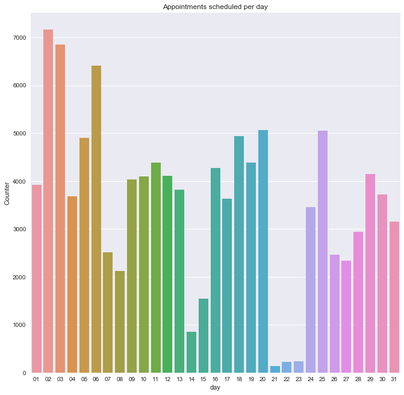


```python
data.day.value_counts()
```


    02    7160
    03    6846
    06    6415
    20    5061
    25    5055
    18    4939
    05    4902
    19    4387
    11    4382
    16    4269
    29    4144
    12    4111
    10    4100
    09    4029
    01    3916
    13    3823
    30    3719
    04    3676
    17    3627
    24    3451
    31    3149
    28    2938
    07    2507
    26    2466
    27    2331
    08    2127
    15    1550
    14     847
    23     233
    22     226
    21     141
    Name: day, dtype: int64


The plot shows that starting of the month many people are making appointments


```python
data['hour'], data['minutes'], data['seconds'] = zip(*data['time'].map(lambda x: x.split(':')))
```


```python
table_count = data['hour'].value_counts()
type_index = table_count.index
type_values = table_count.values

fig,ax = plt.subplots(figsize=(11,11))
sns.barplot(x = type_index,y=type_values,ax=ax)
plt.title('Appointments scheduled per day')
plt.xlabel('hour of the day')
plt.ylabel('Counter')
```


    <matplotlib.text.Text at 0x1a1ef54b70>


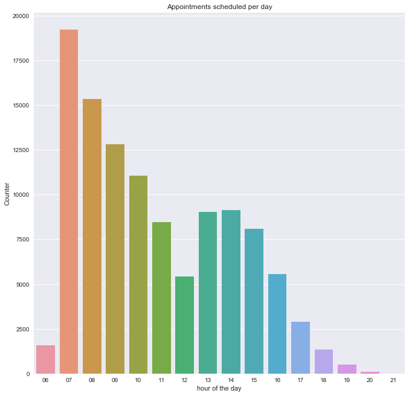


Mostly during early morning people are preferring to consult the doctor


```python
data.Age.value_counts()
```


     0      3539
     1      2273
     52     1746
     49     1652
     53     1651
     56     1635
     38     1629
     59     1624
     2      1618
     50     1613
     57     1603
     36     1580
     51     1567
     19     1545
     39     1536
     37     1533
     54     1530
     34     1526
     33     1524
     30     1521
     6      1521
     3      1513
     17     1509
     32     1505
     5      1489
     44     1487
     18     1487
     58     1469
     46     1460
     45     1453
            ... 
     74      602
     76      571
     75      544
     78      541
     77      527
     80      511
     81      434
     82      392
     79      390
     84      311
     83      280
     85      275
     86      260
     87      184
     89      173
     88      126
     90      109
     92       86
     91       66
     93       53
     94       33
     95       24
     96       17
     97       11
     98        6
     115       5
     100       4
     102       2
     99        1
    -1         1
    Name: Age, Length: 104, dtype: int64


```python
data[data['Age']<0] 
```


<div>
<style>
    .dataframe thead tr:only-child th {
        text-align: right;
    }

    .dataframe thead th {
        text-align: left;
    }

    .dataframe tbody tr th {
        vertical-align: top;
    }
</style>
<table border="1" class="dataframe">
  <thead>
    <tr style="text-align: right;">
      <th></th>
      <th>PatientId</th>
      <th>AppointmentID</th>
      <th>Gender</th>
      <th>ScheduledDay</th>
      <th>AppointmentDay</th>
      <th>Age</th>
      <th>Neighbourhood</th>
      <th>Scholarship</th>
      <th>Hipertension</th>
      <th>Diabetes</th>
      <th>...</th>
      <th>SMS_received</th>
      <th>No-show</th>
      <th>year</th>
      <th>month</th>
      <th>date</th>
      <th>day</th>
      <th>time</th>
      <th>hour</th>
      <th>minutes</th>
      <th>seconds</th>
    </tr>
  </thead>
  <tbody>
    <tr>
      <th>99832</th>
      <td>4.659432e+14</td>
      <td>5775010</td>
      <td>F</td>
      <td>2016-06-06T08:58:13Z</td>
      <td>2016-06-06T00:00:00Z</td>
      <td>-1</td>
      <td>ROMÃO</td>
      <td>0</td>
      <td>0</td>
      <td>0</td>
      <td>...</td>
      <td>0</td>
      <td>No</td>
      <td>2016</td>
      <td>06</td>
      <td>06T08:58:13Z</td>
      <td>06</td>
      <td>08:58:13Z</td>
      <td>08</td>
      <td>58</td>
      <td>13Z</td>
    </tr>
  </tbody>
</table>
<p>1 rows × 22 columns</p>
</div>


This particular record has age less than zero which is not possible


```python
#Dropping that record
data = data.drop(data[data['Age']<0].index)
```


```python
data[data['Age']<0] 
```


<div>
<style>
    .dataframe thead tr:only-child th {
        text-align: right;
    }

    .dataframe thead th {
        text-align: left;
    }

    .dataframe tbody tr th {
        vertical-align: top;
    }
</style>
<table border="1" class="dataframe">
  <thead>
    <tr style="text-align: right;">
      <th></th>
      <th>PatientId</th>
      <th>AppointmentID</th>
      <th>Gender</th>
      <th>ScheduledDay</th>
      <th>AppointmentDay</th>
      <th>Age</th>
      <th>Neighbourhood</th>
      <th>Scholarship</th>
      <th>Hipertension</th>
      <th>Diabetes</th>
      <th>...</th>
      <th>SMS_received</th>
      <th>No-show</th>
      <th>year</th>
      <th>month</th>
      <th>date</th>
      <th>day</th>
      <th>time</th>
      <th>hour</th>
      <th>minutes</th>
      <th>seconds</th>
    </tr>
  </thead>
  <tbody>
  </tbody>
</table>
<p>0 rows × 22 columns</p>
</div>


```python
data['elderly'] = np.where(data['Age']>=50, 'yes', 'no')
```


```python
data['Infants'] = np.where(data['Age']<=5, 'yes', 'no')
```


```python
table_count = data['elderly'].value_counts()
type_index = table_count.index
type_values = table_count.values

fig,ax = plt.subplots(figsize=(6,6))
sns.barplot(x = type_index,y=type_values,ax=ax)
plt.title('Elderly People')
plt.xlabel('Elderly or not')
plt.ylabel('Counter')
```


    <matplotlib.text.Text at 0x1a21bdeda0>


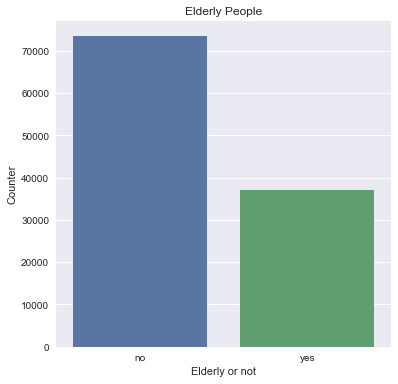


```python
data.elderly.value_counts()
```


    no     73490
    yes    37036
    Name: elderly, dtype: int64


```python
data.Infants.value_counts()
```


    no     98795
    yes    11731
    Name: Infants, dtype: int64


```python
table_count = data['Infants'].value_counts()
type_index = table_count.index
type_values = table_count.values

fig,ax = plt.subplots(figsize=(6,6))
sns.barplot(x = type_index,y=type_values,ax=ax)
plt.title('Infants ')
plt.xlabel('Infants or not')
plt.ylabel('Counter')
```


    <matplotlib.text.Text at 0x1a21c38fd0>


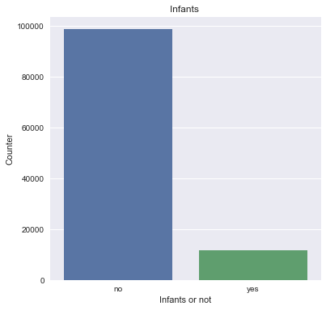


```python
#calculated the middle aged population count by subtracting elderly and Infacts from total population
count_middleaged = 110526 - (11731 + 37036 )
count_middleaged
```


    61759


It seems like people of age 6 to 49 are planning to visit a doctor more than elderly


```python
place = data.Neighbourhood.value_counts()
place
```


    JARDIM CAMBURI                 7717
    MARIA ORTIZ                    5805
    RESISTÊNCIA                    4431
    JARDIM DA PENHA                3877
    ITARARÉ                        3514
    CENTRO                         3334
    TABUAZEIRO                     3132
    SANTA MARTHA                   3131
    JESUS DE NAZARETH              2853
    BONFIM                         2773
    SANTO ANTÔNIO                  2746
    SANTO ANDRÉ                    2571
    CARATOÍRA                      2565
    JABOUR                         2509
    SÃO PEDRO                      2448
    ILHA DO PRÍNCIPE               2266
    NOVA PALESTINA                 2264
    ANDORINHAS                     2262
    DA PENHA                       2217
    ROMÃO                          2214
    GURIGICA                       2018
    SÃO JOSÉ                       1977
    BELA VISTA                     1907
    MARUÍPE                        1902
    FORTE SÃO JOÃO                 1889
    ILHA DE SANTA MARIA            1885
    SÃO CRISTÓVÃO                  1836
    REDENÇÃO                       1553
    SÃO BENEDITO                   1439
    JOANA D´ARC                    1427
                                   ... 
    SANTOS REIS                     547
    ESTRELINHA                      538
    SANTA CLARA                     506
    SOLON BORGES                    469
    PIEDADE                         452
    SANTA CECÍLIA                   448
    SANTA LÚCIA                     438
    SANTA LUÍZA                     428
    BARRO VERMELHO                  423
    DO MOSCOSO                      413
    MÁRIO CYPRESTE                  371
    BOA VISTA                       312
    COMDUSA                         310
    DE LOURDES                      305
    ARIOVALDO FAVALESSA             282
    ANTÔNIO HONÓRIO                 271
    FRADINHOS                       258
    ENSEADA DO SUÁ                  235
    SANTA HELENA                    178
    HORTO                           175
    UNIVERSITÁRIO                   152
    SEGURANÇA DO LAR                145
    NAZARETH                        135
    MORADA DE CAMBURI                96
    PONTAL DE CAMBURI                69
    ILHA DO BOI                      35
    ILHA DO FRADE                    10
    AEROPORTO                         8
    ILHAS OCEÂNICAS DE TRINDADE       2
    PARQUE INDUSTRIAL                 1
    Name: Neighbourhood, Length: 81, dtype: int64


```python
table_count = place.iloc[0:10]
type_index = table_count.index
type_values = table_count.values

fig,ax = plt.subplots(figsize=(15,15))
sns.barplot(x = type_index,y=type_values,ax=ax)
plt.title('Places people are living in')
plt.xlabel('places')
plt.ylabel('Counter')
```


    <matplotlib.text.Text at 0x1a21cdd2e8>


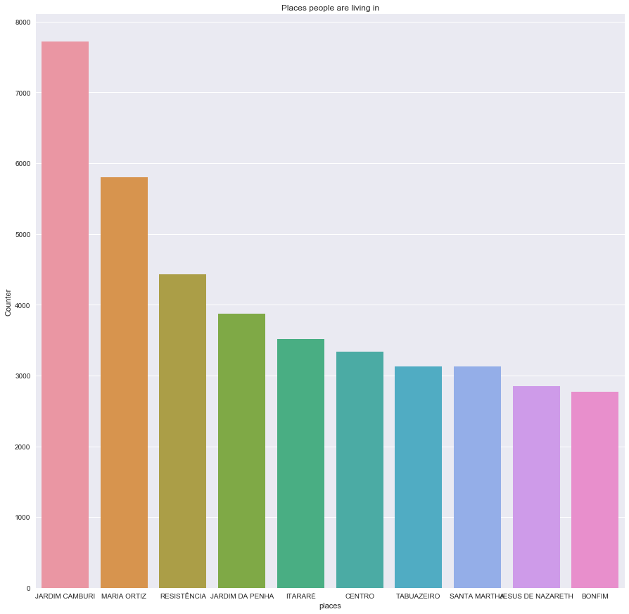


In these places people are planning to visit the doctors high 


```python
data.info()
```

    <class 'pandas.core.frame.DataFrame'>
    Int64Index: 110526 entries, 0 to 110526
    Data columns (total 24 columns):
    PatientId         110526 non-null float64
    AppointmentID     110526 non-null int64
    Gender            110526 non-null object
    ScheduledDay      110526 non-null object
    AppointmentDay    110526 non-null object
    Age               110526 non-null int64
    Neighbourhood     110526 non-null object
    Scholarship       110526 non-null int64
    Hipertension      110526 non-null int64
    Diabetes          110526 non-null int64
    Alcoholism        110526 non-null int64
    Handcap           110526 non-null int64
    SMS_received      110526 non-null int64
    No-show           110526 non-null object
    year              110526 non-null object
    month             110526 non-null object
    date              110526 non-null object
    day               110526 non-null object
    time              110526 non-null object
    hour              110526 non-null object
    minutes           110526 non-null object
    seconds           110526 non-null object
    elderly           110526 non-null object
    Infants           110526 non-null object
    dtypes: float64(1), int64(8), object(15)
    memory usage: 21.1+ MB


```python
table_count = data['Scholarship'].value_counts()
type_index = table_count.index
type_values = table_count.values

fig,ax = plt.subplots(figsize=(5,5))
sns.barplot(x = type_index,y=type_values,ax=ax)
plt.title('Scholarship')
plt.xlabel('Scholarship')
plt.ylabel('Counter')
```


    <matplotlib.text.Text at 0x1a2253b9b0>


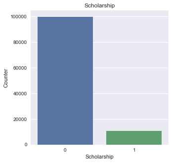


To my knowledge on this concept very little people got assistance from govt or NGO for their expenses


```python
table_count = data['Hipertension'].value_counts()
type_index = table_count.index
type_values = table_count.values

fig,ax = plt.subplots(figsize=(5,5))
sns.barplot(x = type_index,y=type_values,ax=ax)
plt.title('Hipertension')
plt.xlabel('Hipertension')
plt.ylabel('Counter')
```


    <matplotlib.text.Text at 0x1a21cd5518>


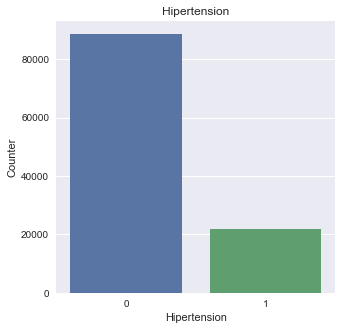


```python
table_count = data['Diabetes'].value_counts()
type_index = table_count.index
type_values = table_count.values

fig,ax = plt.subplots(figsize=(5,5))
sns.barplot(x = type_index,y=type_values,ax=ax)
plt.title('Diabetes')
plt.xlabel('Diabetes')
plt.ylabel('Counter')
```


    <matplotlib.text.Text at 0x1a248b3ba8>


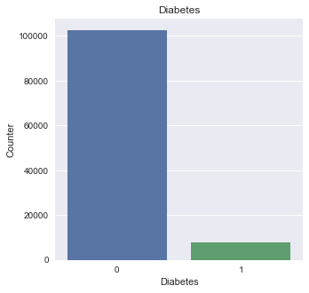


```python
table_count = data['Alcoholism'].value_counts()
type_index = table_count.index
type_values = table_count.values

fig,ax = plt.subplots(figsize=(5,5))
sns.barplot(x = type_index,y=type_values,ax=ax)
plt.title('Alcoholism')
plt.xlabel('Alcoholism')
plt.ylabel('Counter')
```


    <matplotlib.text.Text at 0x1a24931940>


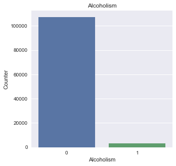


```python


type_index = table_count.index
type_values = table_count.values

fig,ax = plt.subplots(figsize=(5,5))
sns.barplot(x = type_index,y=type_values,ax=ax)
plt.title('Handcap')
plt.xlabel('Handcap')
plt.ylabel('Counter')
```


    <matplotlib.text.Text at 0x1a24a978d0>


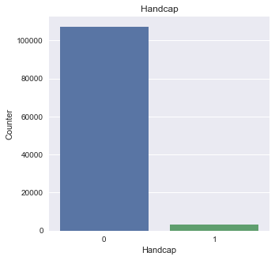


```python
table_count
```


    0    107166
    1      3360
    Name: Alcoholism, dtype: int64


```python
table_count = data['SMS_received'].value_counts()
type_index = table_count.index
type_values = table_count.values

fig,ax = plt.subplots(figsize=(5,5))
sns.barplot(x = type_index,y=type_values,ax=ax)
plt.title('SMS_received')
plt.xlabel('SMS_received')
plt.ylabel('counter')
```


    <matplotlib.text.Text at 0x1a24b1e198>


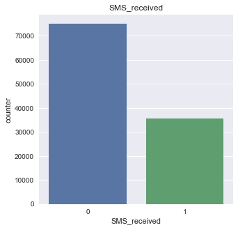


Number of people who are reminded about their appointment is less. There is a chance of forgetting about their appointment. So this has to be taken care of.


```python
#calculating the difference between the appointment made and actual appointment date
data['Appointment_year'], data['Appointment_month'], data['Appointment_date'] = zip(*data['AppointmentDay'].map(lambda x: x.split('-')))
```


```python
data['Appointment_day'], data['Appointment_time'] = zip(*data['Appointment_date'].map(lambda x: x.split('T')))
```


```python
data.info()
```

    <class 'pandas.core.frame.DataFrame'>
    Int64Index: 110526 entries, 0 to 110526
    Data columns (total 29 columns):
    PatientId            110526 non-null float64
    AppointmentID        110526 non-null int64
    Gender               110526 non-null object
    ScheduledDay         110526 non-null object
    AppointmentDay       110526 non-null object
    Age                  110526 non-null int64
    Neighbourhood        110526 non-null object
    Scholarship          110526 non-null int64
    Hipertension         110526 non-null int64
    Diabetes             110526 non-null int64
    Alcoholism           110526 non-null int64
    Handcap              110526 non-null int64
    SMS_received         110526 non-null int64
    No-show              110526 non-null object
    year                 110526 non-null object
    month                110526 non-null object
    date                 110526 non-null object
    day                  110526 non-null object
    time                 110526 non-null object
    hour                 110526 non-null object
    minutes              110526 non-null object
    seconds              110526 non-null object
    elderly              110526 non-null object
    Infants              110526 non-null object
    Appointment_year     110526 non-null object
    Appointment_month    110526 non-null object
    Appointment_date     110526 non-null object
    Appointment_day      110526 non-null object
    Appointment_time     110526 non-null object
    dtypes: float64(1), int64(8), object(20)
    memory usage: 25.3+ MB


```python
result = data.drop(['Appointment_date','date','Appointment_time'], axis=1)
```


```python
result.info()
```

    <class 'pandas.core.frame.DataFrame'>
    Int64Index: 110526 entries, 0 to 110526
    Data columns (total 26 columns):
    PatientId            110526 non-null float64
    AppointmentID        110526 non-null int64
    Gender               110526 non-null object
    ScheduledDay         110526 non-null object
    AppointmentDay       110526 non-null object
    Age                  110526 non-null int64
    Neighbourhood        110526 non-null object
    Scholarship          110526 non-null int64
    Hipertension         110526 non-null int64
    Diabetes             110526 non-null int64
    Alcoholism           110526 non-null int64
    Handcap              110526 non-null int64
    SMS_received         110526 non-null int64
    No-show              110526 non-null object
    year                 110526 non-null object
    month                110526 non-null object
    day                  110526 non-null object
    time                 110526 non-null object
    hour                 110526 non-null object
    minutes              110526 non-null object
    seconds              110526 non-null object
    elderly              110526 non-null object
    Infants              110526 non-null object
    Appointment_year     110526 non-null object
    Appointment_month    110526 non-null object
    Appointment_day      110526 non-null object
    dtypes: float64(1), int64(8), object(17)
    memory usage: 22.8+ MB


```python
result['a_date'] = result[result.columns[23:26]].apply(lambda x: '-'.join(x.dropna().astype(int).astype(str)),axis=1)
```


```python
result
```


<div>
<style>
    .dataframe thead tr:only-child th {
        text-align: right;
    }

    .dataframe thead th {
        text-align: left;
    }

    .dataframe tbody tr th {
        vertical-align: top;
    }
</style>
<table border="1" class="dataframe">
  <thead>
    <tr style="text-align: right;">
      <th></th>
      <th>PatientId</th>
      <th>AppointmentID</th>
      <th>Gender</th>
      <th>ScheduledDay</th>
      <th>AppointmentDay</th>
      <th>Age</th>
      <th>Neighbourhood</th>
      <th>Scholarship</th>
      <th>Hipertension</th>
      <th>Diabetes</th>
      <th>...</th>
      <th>time</th>
      <th>hour</th>
      <th>minutes</th>
      <th>seconds</th>
      <th>elderly</th>
      <th>Infants</th>
      <th>Appointment_year</th>
      <th>Appointment_month</th>
      <th>Appointment_day</th>
      <th>a_date</th>
    </tr>
  </thead>
  <tbody>
    <tr>
      <th>0</th>
      <td>2.987250e+13</td>
      <td>5642903</td>
      <td>F</td>
      <td>2016-04-29T18:38:08Z</td>
      <td>2016-04-29T00:00:00Z</td>
      <td>62</td>
      <td>JARDIM DA PENHA</td>
      <td>0</td>
      <td>1</td>
      <td>0</td>
      <td>...</td>
      <td>18:38:08Z</td>
      <td>18</td>
      <td>38</td>
      <td>08Z</td>
      <td>yes</td>
      <td>no</td>
      <td>2016</td>
      <td>04</td>
      <td>29</td>
      <td>2016-4-29</td>
    </tr>
    <tr>
      <th>1</th>
      <td>5.589978e+14</td>
      <td>5642503</td>
      <td>M</td>
      <td>2016-04-29T16:08:27Z</td>
      <td>2016-04-29T00:00:00Z</td>
      <td>56</td>
      <td>JARDIM DA PENHA</td>
      <td>0</td>
      <td>0</td>
      <td>0</td>
      <td>...</td>
      <td>16:08:27Z</td>
      <td>16</td>
      <td>08</td>
      <td>27Z</td>
      <td>yes</td>
      <td>no</td>
      <td>2016</td>
      <td>04</td>
      <td>29</td>
      <td>2016-4-29</td>
    </tr>
    <tr>
      <th>2</th>
      <td>4.262962e+12</td>
      <td>5642549</td>
      <td>F</td>
      <td>2016-04-29T16:19:04Z</td>
      <td>2016-04-29T00:00:00Z</td>
      <td>62</td>
      <td>MATA DA PRAIA</td>
      <td>0</td>
      <td>0</td>
      <td>0</td>
      <td>...</td>
      <td>16:19:04Z</td>
      <td>16</td>
      <td>19</td>
      <td>04Z</td>
      <td>yes</td>
      <td>no</td>
      <td>2016</td>
      <td>04</td>
      <td>29</td>
      <td>2016-4-29</td>
    </tr>
    <tr>
      <th>3</th>
      <td>8.679512e+11</td>
      <td>5642828</td>
      <td>F</td>
      <td>2016-04-29T17:29:31Z</td>
      <td>2016-04-29T00:00:00Z</td>
      <td>8</td>
      <td>PONTAL DE CAMBURI</td>
      <td>0</td>
      <td>0</td>
      <td>0</td>
      <td>...</td>
      <td>17:29:31Z</td>
      <td>17</td>
      <td>29</td>
      <td>31Z</td>
      <td>no</td>
      <td>no</td>
      <td>2016</td>
      <td>04</td>
      <td>29</td>
      <td>2016-4-29</td>
    </tr>
    <tr>
      <th>4</th>
      <td>8.841186e+12</td>
      <td>5642494</td>
      <td>F</td>
      <td>2016-04-29T16:07:23Z</td>
      <td>2016-04-29T00:00:00Z</td>
      <td>56</td>
      <td>JARDIM DA PENHA</td>
      <td>0</td>
      <td>1</td>
      <td>1</td>
      <td>...</td>
      <td>16:07:23Z</td>
      <td>16</td>
      <td>07</td>
      <td>23Z</td>
      <td>yes</td>
      <td>no</td>
      <td>2016</td>
      <td>04</td>
      <td>29</td>
      <td>2016-4-29</td>
    </tr>
    <tr>
      <th>5</th>
      <td>9.598513e+13</td>
      <td>5626772</td>
      <td>F</td>
      <td>2016-04-27T08:36:51Z</td>
      <td>2016-04-29T00:00:00Z</td>
      <td>76</td>
      <td>REPÚBLICA</td>
      <td>0</td>
      <td>1</td>
      <td>0</td>
      <td>...</td>
      <td>08:36:51Z</td>
      <td>08</td>
      <td>36</td>
      <td>51Z</td>
      <td>yes</td>
      <td>no</td>
      <td>2016</td>
      <td>04</td>
      <td>29</td>
      <td>2016-4-29</td>
    </tr>
    <tr>
      <th>6</th>
      <td>7.336882e+14</td>
      <td>5630279</td>
      <td>F</td>
      <td>2016-04-27T15:05:12Z</td>
      <td>2016-04-29T00:00:00Z</td>
      <td>23</td>
      <td>GOIABEIRAS</td>
      <td>0</td>
      <td>0</td>
      <td>0</td>
      <td>...</td>
      <td>15:05:12Z</td>
      <td>15</td>
      <td>05</td>
      <td>12Z</td>
      <td>no</td>
      <td>no</td>
      <td>2016</td>
      <td>04</td>
      <td>29</td>
      <td>2016-4-29</td>
    </tr>
    <tr>
      <th>7</th>
      <td>3.449833e+12</td>
      <td>5630575</td>
      <td>F</td>
      <td>2016-04-27T15:39:58Z</td>
      <td>2016-04-29T00:00:00Z</td>
      <td>39</td>
      <td>GOIABEIRAS</td>
      <td>0</td>
      <td>0</td>
      <td>0</td>
      <td>...</td>
      <td>15:39:58Z</td>
      <td>15</td>
      <td>39</td>
      <td>58Z</td>
      <td>no</td>
      <td>no</td>
      <td>2016</td>
      <td>04</td>
      <td>29</td>
      <td>2016-4-29</td>
    </tr>
    <tr>
      <th>8</th>
      <td>5.639473e+13</td>
      <td>5638447</td>
      <td>F</td>
      <td>2016-04-29T08:02:16Z</td>
      <td>2016-04-29T00:00:00Z</td>
      <td>21</td>
      <td>ANDORINHAS</td>
      <td>0</td>
      <td>0</td>
      <td>0</td>
      <td>...</td>
      <td>08:02:16Z</td>
      <td>08</td>
      <td>02</td>
      <td>16Z</td>
      <td>no</td>
      <td>no</td>
      <td>2016</td>
      <td>04</td>
      <td>29</td>
      <td>2016-4-29</td>
    </tr>
    <tr>
      <th>9</th>
      <td>7.812456e+13</td>
      <td>5629123</td>
      <td>F</td>
      <td>2016-04-27T12:48:25Z</td>
      <td>2016-04-29T00:00:00Z</td>
      <td>19</td>
      <td>CONQUISTA</td>
      <td>0</td>
      <td>0</td>
      <td>0</td>
      <td>...</td>
      <td>12:48:25Z</td>
      <td>12</td>
      <td>48</td>
      <td>25Z</td>
      <td>no</td>
      <td>no</td>
      <td>2016</td>
      <td>04</td>
      <td>29</td>
      <td>2016-4-29</td>
    </tr>
    <tr>
      <th>10</th>
      <td>7.345362e+14</td>
      <td>5630213</td>
      <td>F</td>
      <td>2016-04-27T14:58:11Z</td>
      <td>2016-04-29T00:00:00Z</td>
      <td>30</td>
      <td>NOVA PALESTINA</td>
      <td>0</td>
      <td>0</td>
      <td>0</td>
      <td>...</td>
      <td>14:58:11Z</td>
      <td>14</td>
      <td>58</td>
      <td>11Z</td>
      <td>no</td>
      <td>no</td>
      <td>2016</td>
      <td>04</td>
      <td>29</td>
      <td>2016-4-29</td>
    </tr>
    <tr>
      <th>11</th>
      <td>7.542951e+12</td>
      <td>5620163</td>
      <td>M</td>
      <td>2016-04-26T08:44:12Z</td>
      <td>2016-04-29T00:00:00Z</td>
      <td>29</td>
      <td>NOVA PALESTINA</td>
      <td>0</td>
      <td>0</td>
      <td>0</td>
      <td>...</td>
      <td>08:44:12Z</td>
      <td>08</td>
      <td>44</td>
      <td>12Z</td>
      <td>no</td>
      <td>no</td>
      <td>2016</td>
      <td>04</td>
      <td>29</td>
      <td>2016-4-29</td>
    </tr>
    <tr>
      <th>12</th>
      <td>5.666548e+14</td>
      <td>5634718</td>
      <td>F</td>
      <td>2016-04-28T11:33:51Z</td>
      <td>2016-04-29T00:00:00Z</td>
      <td>22</td>
      <td>NOVA PALESTINA</td>
      <td>1</td>
      <td>0</td>
      <td>0</td>
      <td>...</td>
      <td>11:33:51Z</td>
      <td>11</td>
      <td>33</td>
      <td>51Z</td>
      <td>no</td>
      <td>no</td>
      <td>2016</td>
      <td>04</td>
      <td>29</td>
      <td>2016-4-29</td>
    </tr>
    <tr>
      <th>13</th>
      <td>9.113946e+14</td>
      <td>5636249</td>
      <td>M</td>
      <td>2016-04-28T14:52:07Z</td>
      <td>2016-04-29T00:00:00Z</td>
      <td>28</td>
      <td>NOVA PALESTINA</td>
      <td>0</td>
      <td>0</td>
      <td>0</td>
      <td>...</td>
      <td>14:52:07Z</td>
      <td>14</td>
      <td>52</td>
      <td>07Z</td>
      <td>no</td>
      <td>no</td>
      <td>2016</td>
      <td>04</td>
      <td>29</td>
      <td>2016-4-29</td>
    </tr>
    <tr>
      <th>14</th>
      <td>9.988472e+13</td>
      <td>5633951</td>
      <td>F</td>
      <td>2016-04-28T10:06:24Z</td>
      <td>2016-04-29T00:00:00Z</td>
      <td>54</td>
      <td>NOVA PALESTINA</td>
      <td>0</td>
      <td>0</td>
      <td>0</td>
      <td>...</td>
      <td>10:06:24Z</td>
      <td>10</td>
      <td>06</td>
      <td>24Z</td>
      <td>yes</td>
      <td>no</td>
      <td>2016</td>
      <td>04</td>
      <td>29</td>
      <td>2016-4-29</td>
    </tr>
    <tr>
      <th>15</th>
      <td>9.994839e+10</td>
      <td>5620206</td>
      <td>F</td>
      <td>2016-04-26T08:47:27Z</td>
      <td>2016-04-29T00:00:00Z</td>
      <td>15</td>
      <td>NOVA PALESTINA</td>
      <td>0</td>
      <td>0</td>
      <td>0</td>
      <td>...</td>
      <td>08:47:27Z</td>
      <td>08</td>
      <td>47</td>
      <td>27Z</td>
      <td>no</td>
      <td>no</td>
      <td>2016</td>
      <td>04</td>
      <td>29</td>
      <td>2016-4-29</td>
    </tr>
    <tr>
      <th>16</th>
      <td>8.457439e+13</td>
      <td>5633121</td>
      <td>M</td>
      <td>2016-04-28T08:51:47Z</td>
      <td>2016-04-29T00:00:00Z</td>
      <td>50</td>
      <td>NOVA PALESTINA</td>
      <td>0</td>
      <td>0</td>
      <td>0</td>
      <td>...</td>
      <td>08:51:47Z</td>
      <td>08</td>
      <td>51</td>
      <td>47Z</td>
      <td>yes</td>
      <td>no</td>
      <td>2016</td>
      <td>04</td>
      <td>29</td>
      <td>2016-4-29</td>
    </tr>
    <tr>
      <th>17</th>
      <td>1.479497e+13</td>
      <td>5633460</td>
      <td>F</td>
      <td>2016-04-28T09:28:57Z</td>
      <td>2016-04-29T00:00:00Z</td>
      <td>40</td>
      <td>CONQUISTA</td>
      <td>1</td>
      <td>0</td>
      <td>0</td>
      <td>...</td>
      <td>09:28:57Z</td>
      <td>09</td>
      <td>28</td>
      <td>57Z</td>
      <td>no</td>
      <td>no</td>
      <td>2016</td>
      <td>04</td>
      <td>29</td>
      <td>2016-4-29</td>
    </tr>
    <tr>
      <th>18</th>
      <td>1.713538e+13</td>
      <td>5621836</td>
      <td>F</td>
      <td>2016-04-26T10:54:18Z</td>
      <td>2016-04-29T00:00:00Z</td>
      <td>30</td>
      <td>NOVA PALESTINA</td>
      <td>1</td>
      <td>0</td>
      <td>0</td>
      <td>...</td>
      <td>10:54:18Z</td>
      <td>10</td>
      <td>54</td>
      <td>18Z</td>
      <td>no</td>
      <td>no</td>
      <td>2016</td>
      <td>04</td>
      <td>29</td>
      <td>2016-4-29</td>
    </tr>
    <tr>
      <th>19</th>
      <td>7.223289e+12</td>
      <td>5640433</td>
      <td>F</td>
      <td>2016-04-29T10:43:14Z</td>
      <td>2016-04-29T00:00:00Z</td>
      <td>46</td>
      <td>DA PENHA</td>
      <td>0</td>
      <td>0</td>
      <td>0</td>
      <td>...</td>
      <td>10:43:14Z</td>
      <td>10</td>
      <td>43</td>
      <td>14Z</td>
      <td>no</td>
      <td>no</td>
      <td>2016</td>
      <td>04</td>
      <td>29</td>
      <td>2016-4-29</td>
    </tr>
    <tr>
      <th>20</th>
      <td>6.222575e+14</td>
      <td>5626083</td>
      <td>F</td>
      <td>2016-04-27T07:51:14Z</td>
      <td>2016-04-29T00:00:00Z</td>
      <td>30</td>
      <td>NOVA PALESTINA</td>
      <td>0</td>
      <td>0</td>
      <td>0</td>
      <td>...</td>
      <td>07:51:14Z</td>
      <td>07</td>
      <td>51</td>
      <td>14Z</td>
      <td>no</td>
      <td>no</td>
      <td>2016</td>
      <td>04</td>
      <td>29</td>
      <td>2016-4-29</td>
    </tr>
    <tr>
      <th>21</th>
      <td>1.215484e+13</td>
      <td>5628338</td>
      <td>F</td>
      <td>2016-04-27T10:50:45Z</td>
      <td>2016-04-29T00:00:00Z</td>
      <td>4</td>
      <td>CONQUISTA</td>
      <td>0</td>
      <td>0</td>
      <td>0</td>
      <td>...</td>
      <td>10:50:45Z</td>
      <td>10</td>
      <td>50</td>
      <td>45Z</td>
      <td>no</td>
      <td>yes</td>
      <td>2016</td>
      <td>04</td>
      <td>29</td>
      <td>2016-4-29</td>
    </tr>
    <tr>
      <th>22</th>
      <td>8.632298e+14</td>
      <td>5616091</td>
      <td>M</td>
      <td>2016-04-25T13:29:16Z</td>
      <td>2016-04-29T00:00:00Z</td>
      <td>13</td>
      <td>CONQUISTA</td>
      <td>0</td>
      <td>0</td>
      <td>0</td>
      <td>...</td>
      <td>13:29:16Z</td>
      <td>13</td>
      <td>29</td>
      <td>16Z</td>
      <td>no</td>
      <td>no</td>
      <td>2016</td>
      <td>04</td>
      <td>29</td>
      <td>2016-4-29</td>
    </tr>
    <tr>
      <th>23</th>
      <td>2.137540e+14</td>
      <td>5634142</td>
      <td>F</td>
      <td>2016-04-28T10:27:05Z</td>
      <td>2016-04-29T00:00:00Z</td>
      <td>46</td>
      <td>CONQUISTA</td>
      <td>0</td>
      <td>0</td>
      <td>0</td>
      <td>...</td>
      <td>10:27:05Z</td>
      <td>10</td>
      <td>27</td>
      <td>05Z</td>
      <td>no</td>
      <td>no</td>
      <td>2016</td>
      <td>04</td>
      <td>29</td>
      <td>2016-4-29</td>
    </tr>
    <tr>
      <th>24</th>
      <td>8.734858e+12</td>
      <td>5641780</td>
      <td>F</td>
      <td>2016-04-29T14:19:19Z</td>
      <td>2016-04-29T00:00:00Z</td>
      <td>65</td>
      <td>TABUAZEIRO</td>
      <td>0</td>
      <td>0</td>
      <td>0</td>
      <td>...</td>
      <td>14:19:19Z</td>
      <td>14</td>
      <td>19</td>
      <td>19Z</td>
      <td>yes</td>
      <td>no</td>
      <td>2016</td>
      <td>04</td>
      <td>29</td>
      <td>2016-4-29</td>
    </tr>
    <tr>
      <th>25</th>
      <td>5.819370e+12</td>
      <td>5624020</td>
      <td>M</td>
      <td>2016-04-26T15:04:17Z</td>
      <td>2016-04-29T00:00:00Z</td>
      <td>46</td>
      <td>CONQUISTA</td>
      <td>0</td>
      <td>1</td>
      <td>0</td>
      <td>...</td>
      <td>15:04:17Z</td>
      <td>15</td>
      <td>04</td>
      <td>17Z</td>
      <td>no</td>
      <td>no</td>
      <td>2016</td>
      <td>04</td>
      <td>29</td>
      <td>2016-4-29</td>
    </tr>
    <tr>
      <th>26</th>
      <td>2.578785e+10</td>
      <td>5641781</td>
      <td>F</td>
      <td>2016-04-29T14:19:42Z</td>
      <td>2016-04-29T00:00:00Z</td>
      <td>45</td>
      <td>BENTO FERREIRA</td>
      <td>0</td>
      <td>1</td>
      <td>0</td>
      <td>...</td>
      <td>14:19:42Z</td>
      <td>14</td>
      <td>19</td>
      <td>42Z</td>
      <td>no</td>
      <td>no</td>
      <td>2016</td>
      <td>04</td>
      <td>29</td>
      <td>2016-4-29</td>
    </tr>
    <tr>
      <th>27</th>
      <td>1.215484e+13</td>
      <td>5628345</td>
      <td>F</td>
      <td>2016-04-27T10:51:45Z</td>
      <td>2016-04-29T00:00:00Z</td>
      <td>4</td>
      <td>CONQUISTA</td>
      <td>0</td>
      <td>0</td>
      <td>0</td>
      <td>...</td>
      <td>10:51:45Z</td>
      <td>10</td>
      <td>51</td>
      <td>45Z</td>
      <td>no</td>
      <td>yes</td>
      <td>2016</td>
      <td>04</td>
      <td>29</td>
      <td>2016-4-29</td>
    </tr>
    <tr>
      <th>28</th>
      <td>5.926172e+12</td>
      <td>5642400</td>
      <td>M</td>
      <td>2016-04-29T15:48:02Z</td>
      <td>2016-04-29T00:00:00Z</td>
      <td>51</td>
      <td>SÃO PEDRO</td>
      <td>0</td>
      <td>0</td>
      <td>0</td>
      <td>...</td>
      <td>15:48:02Z</td>
      <td>15</td>
      <td>48</td>
      <td>02Z</td>
      <td>yes</td>
      <td>no</td>
      <td>2016</td>
      <td>04</td>
      <td>29</td>
      <td>2016-4-29</td>
    </tr>
    <tr>
      <th>29</th>
      <td>1.225776e+12</td>
      <td>5642186</td>
      <td>F</td>
      <td>2016-04-29T15:16:29Z</td>
      <td>2016-04-29T00:00:00Z</td>
      <td>32</td>
      <td>SANTA MARTHA</td>
      <td>0</td>
      <td>0</td>
      <td>0</td>
      <td>...</td>
      <td>15:16:29Z</td>
      <td>15</td>
      <td>16</td>
      <td>29Z</td>
      <td>no</td>
      <td>no</td>
      <td>2016</td>
      <td>04</td>
      <td>29</td>
      <td>2016-4-29</td>
    </tr>
    <tr>
      <th>...</th>
      <td>...</td>
      <td>...</td>
      <td>...</td>
      <td>...</td>
      <td>...</td>
      <td>...</td>
      <td>...</td>
      <td>...</td>
      <td>...</td>
      <td>...</td>
      <td>...</td>
      <td>...</td>
      <td>...</td>
      <td>...</td>
      <td>...</td>
      <td>...</td>
      <td>...</td>
      <td>...</td>
      <td>...</td>
      <td>...</td>
      <td>...</td>
    </tr>
    <tr>
      <th>110497</th>
      <td>7.935892e+14</td>
      <td>5757745</td>
      <td>M</td>
      <td>2016-06-01T09:46:33Z</td>
      <td>2016-06-01T00:00:00Z</td>
      <td>76</td>
      <td>MARIA ORTIZ</td>
      <td>0</td>
      <td>0</td>
      <td>0</td>
      <td>...</td>
      <td>09:46:33Z</td>
      <td>09</td>
      <td>46</td>
      <td>33Z</td>
      <td>yes</td>
      <td>no</td>
      <td>2016</td>
      <td>06</td>
      <td>01</td>
      <td>2016-6-1</td>
    </tr>
    <tr>
      <th>110498</th>
      <td>9.433654e+13</td>
      <td>5787655</td>
      <td>F</td>
      <td>2016-06-08T10:21:14Z</td>
      <td>2016-06-08T00:00:00Z</td>
      <td>59</td>
      <td>MARIA ORTIZ</td>
      <td>0</td>
      <td>0</td>
      <td>0</td>
      <td>...</td>
      <td>10:21:14Z</td>
      <td>10</td>
      <td>21</td>
      <td>14Z</td>
      <td>yes</td>
      <td>no</td>
      <td>2016</td>
      <td>06</td>
      <td>08</td>
      <td>2016-6-8</td>
    </tr>
    <tr>
      <th>110499</th>
      <td>8.219692e+14</td>
      <td>5757697</td>
      <td>F</td>
      <td>2016-06-01T09:42:56Z</td>
      <td>2016-06-01T00:00:00Z</td>
      <td>66</td>
      <td>MARIA ORTIZ</td>
      <td>0</td>
      <td>1</td>
      <td>1</td>
      <td>...</td>
      <td>09:42:56Z</td>
      <td>09</td>
      <td>42</td>
      <td>56Z</td>
      <td>yes</td>
      <td>no</td>
      <td>2016</td>
      <td>06</td>
      <td>01</td>
      <td>2016-6-1</td>
    </tr>
    <tr>
      <th>110500</th>
      <td>4.434384e+14</td>
      <td>5787233</td>
      <td>F</td>
      <td>2016-06-08T09:35:13Z</td>
      <td>2016-06-08T00:00:00Z</td>
      <td>59</td>
      <td>MARIA ORTIZ</td>
      <td>0</td>
      <td>0</td>
      <td>0</td>
      <td>...</td>
      <td>09:35:13Z</td>
      <td>09</td>
      <td>35</td>
      <td>13Z</td>
      <td>yes</td>
      <td>no</td>
      <td>2016</td>
      <td>06</td>
      <td>08</td>
      <td>2016-6-8</td>
    </tr>
    <tr>
      <th>110501</th>
      <td>4.544252e+11</td>
      <td>5758133</td>
      <td>M</td>
      <td>2016-06-01T10:19:12Z</td>
      <td>2016-06-01T00:00:00Z</td>
      <td>44</td>
      <td>MARIA ORTIZ</td>
      <td>0</td>
      <td>0</td>
      <td>0</td>
      <td>...</td>
      <td>10:19:12Z</td>
      <td>10</td>
      <td>19</td>
      <td>12Z</td>
      <td>no</td>
      <td>no</td>
      <td>2016</td>
      <td>06</td>
      <td>01</td>
      <td>2016-6-1</td>
    </tr>
    <tr>
      <th>110502</th>
      <td>7.316229e+14</td>
      <td>5787937</td>
      <td>F</td>
      <td>2016-06-08T10:50:42Z</td>
      <td>2016-06-08T00:00:00Z</td>
      <td>22</td>
      <td>GOIABEIRAS</td>
      <td>0</td>
      <td>0</td>
      <td>0</td>
      <td>...</td>
      <td>10:50:42Z</td>
      <td>10</td>
      <td>50</td>
      <td>42Z</td>
      <td>no</td>
      <td>no</td>
      <td>2016</td>
      <td>06</td>
      <td>08</td>
      <td>2016-6-8</td>
    </tr>
    <tr>
      <th>110503</th>
      <td>2.362182e+13</td>
      <td>5759473</td>
      <td>F</td>
      <td>2016-06-01T13:00:36Z</td>
      <td>2016-06-01T00:00:00Z</td>
      <td>64</td>
      <td>SOLON BORGES</td>
      <td>0</td>
      <td>0</td>
      <td>0</td>
      <td>...</td>
      <td>13:00:36Z</td>
      <td>13</td>
      <td>00</td>
      <td>36Z</td>
      <td>yes</td>
      <td>no</td>
      <td>2016</td>
      <td>06</td>
      <td>01</td>
      <td>2016-6-1</td>
    </tr>
    <tr>
      <th>110504</th>
      <td>9.947983e+12</td>
      <td>5788052</td>
      <td>F</td>
      <td>2016-06-08T11:06:21Z</td>
      <td>2016-06-08T00:00:00Z</td>
      <td>4</td>
      <td>MARIA ORTIZ</td>
      <td>0</td>
      <td>0</td>
      <td>0</td>
      <td>...</td>
      <td>11:06:21Z</td>
      <td>11</td>
      <td>06</td>
      <td>21Z</td>
      <td>no</td>
      <td>yes</td>
      <td>2016</td>
      <td>06</td>
      <td>08</td>
      <td>2016-6-8</td>
    </tr>
    <tr>
      <th>110505</th>
      <td>5.667344e+13</td>
      <td>5758455</td>
      <td>F</td>
      <td>2016-06-01T10:45:50Z</td>
      <td>2016-06-01T00:00:00Z</td>
      <td>55</td>
      <td>MARIA ORTIZ</td>
      <td>0</td>
      <td>0</td>
      <td>0</td>
      <td>...</td>
      <td>10:45:50Z</td>
      <td>10</td>
      <td>45</td>
      <td>50Z</td>
      <td>yes</td>
      <td>no</td>
      <td>2016</td>
      <td>06</td>
      <td>01</td>
      <td>2016-6-1</td>
    </tr>
    <tr>
      <th>110506</th>
      <td>8.973883e+11</td>
      <td>5758779</td>
      <td>M</td>
      <td>2016-06-01T11:09:20Z</td>
      <td>2016-06-01T00:00:00Z</td>
      <td>5</td>
      <td>MARIA ORTIZ</td>
      <td>0</td>
      <td>0</td>
      <td>0</td>
      <td>...</td>
      <td>11:09:20Z</td>
      <td>11</td>
      <td>09</td>
      <td>20Z</td>
      <td>no</td>
      <td>yes</td>
      <td>2016</td>
      <td>06</td>
      <td>01</td>
      <td>2016-6-1</td>
    </tr>
    <tr>
      <th>110507</th>
      <td>4.769462e+14</td>
      <td>5786918</td>
      <td>F</td>
      <td>2016-06-08T09:04:18Z</td>
      <td>2016-06-08T00:00:00Z</td>
      <td>0</td>
      <td>MARIA ORTIZ</td>
      <td>0</td>
      <td>0</td>
      <td>0</td>
      <td>...</td>
      <td>09:04:18Z</td>
      <td>09</td>
      <td>04</td>
      <td>18Z</td>
      <td>no</td>
      <td>yes</td>
      <td>2016</td>
      <td>06</td>
      <td>08</td>
      <td>2016-6-8</td>
    </tr>
    <tr>
      <th>110508</th>
      <td>9.433654e+13</td>
      <td>5757656</td>
      <td>F</td>
      <td>2016-06-01T09:41:00Z</td>
      <td>2016-06-01T00:00:00Z</td>
      <td>59</td>
      <td>MARIA ORTIZ</td>
      <td>0</td>
      <td>0</td>
      <td>0</td>
      <td>...</td>
      <td>09:41:00Z</td>
      <td>09</td>
      <td>41</td>
      <td>00Z</td>
      <td>yes</td>
      <td>no</td>
      <td>2016</td>
      <td>06</td>
      <td>01</td>
      <td>2016-6-1</td>
    </tr>
    <tr>
      <th>110509</th>
      <td>4.952968e+14</td>
      <td>5786750</td>
      <td>M</td>
      <td>2016-06-08T08:50:51Z</td>
      <td>2016-06-08T00:00:00Z</td>
      <td>33</td>
      <td>MARIA ORTIZ</td>
      <td>0</td>
      <td>0</td>
      <td>0</td>
      <td>...</td>
      <td>08:50:51Z</td>
      <td>08</td>
      <td>50</td>
      <td>51Z</td>
      <td>no</td>
      <td>no</td>
      <td>2016</td>
      <td>06</td>
      <td>08</td>
      <td>2016-6-8</td>
    </tr>
    <tr>
      <th>110510</th>
      <td>2.362182e+13</td>
      <td>5757587</td>
      <td>F</td>
      <td>2016-06-01T09:35:48Z</td>
      <td>2016-06-01T00:00:00Z</td>
      <td>64</td>
      <td>SOLON BORGES</td>
      <td>0</td>
      <td>0</td>
      <td>0</td>
      <td>...</td>
      <td>09:35:48Z</td>
      <td>09</td>
      <td>35</td>
      <td>48Z</td>
      <td>yes</td>
      <td>no</td>
      <td>2016</td>
      <td>06</td>
      <td>01</td>
      <td>2016-6-1</td>
    </tr>
    <tr>
      <th>110511</th>
      <td>8.235996e+11</td>
      <td>5786742</td>
      <td>F</td>
      <td>2016-06-08T08:50:20Z</td>
      <td>2016-06-08T00:00:00Z</td>
      <td>14</td>
      <td>MARIA ORTIZ</td>
      <td>0</td>
      <td>0</td>
      <td>0</td>
      <td>...</td>
      <td>08:50:20Z</td>
      <td>08</td>
      <td>50</td>
      <td>20Z</td>
      <td>no</td>
      <td>no</td>
      <td>2016</td>
      <td>06</td>
      <td>08</td>
      <td>2016-6-8</td>
    </tr>
    <tr>
      <th>110512</th>
      <td>9.876246e+13</td>
      <td>5786368</td>
      <td>F</td>
      <td>2016-06-08T08:20:01Z</td>
      <td>2016-06-08T00:00:00Z</td>
      <td>41</td>
      <td>MARIA ORTIZ</td>
      <td>0</td>
      <td>0</td>
      <td>0</td>
      <td>...</td>
      <td>08:20:01Z</td>
      <td>08</td>
      <td>20</td>
      <td>01Z</td>
      <td>no</td>
      <td>no</td>
      <td>2016</td>
      <td>06</td>
      <td>08</td>
      <td>2016-6-8</td>
    </tr>
    <tr>
      <th>110513</th>
      <td>8.674778e+13</td>
      <td>5785964</td>
      <td>M</td>
      <td>2016-06-08T07:52:55Z</td>
      <td>2016-06-08T00:00:00Z</td>
      <td>2</td>
      <td>ANTÔNIO HONÓRIO</td>
      <td>0</td>
      <td>0</td>
      <td>0</td>
      <td>...</td>
      <td>07:52:55Z</td>
      <td>07</td>
      <td>52</td>
      <td>55Z</td>
      <td>no</td>
      <td>yes</td>
      <td>2016</td>
      <td>06</td>
      <td>08</td>
      <td>2016-6-8</td>
    </tr>
    <tr>
      <th>110514</th>
      <td>2.695685e+12</td>
      <td>5786567</td>
      <td>F</td>
      <td>2016-06-08T08:35:31Z</td>
      <td>2016-06-08T00:00:00Z</td>
      <td>58</td>
      <td>MARIA ORTIZ</td>
      <td>0</td>
      <td>0</td>
      <td>0</td>
      <td>...</td>
      <td>08:35:31Z</td>
      <td>08</td>
      <td>35</td>
      <td>31Z</td>
      <td>yes</td>
      <td>no</td>
      <td>2016</td>
      <td>06</td>
      <td>08</td>
      <td>2016-6-8</td>
    </tr>
    <tr>
      <th>110515</th>
      <td>6.456342e+14</td>
      <td>5778621</td>
      <td>M</td>
      <td>2016-06-06T15:58:05Z</td>
      <td>2016-06-08T00:00:00Z</td>
      <td>33</td>
      <td>MARIA ORTIZ</td>
      <td>0</td>
      <td>1</td>
      <td>0</td>
      <td>...</td>
      <td>15:58:05Z</td>
      <td>15</td>
      <td>58</td>
      <td>05Z</td>
      <td>no</td>
      <td>no</td>
      <td>2016</td>
      <td>06</td>
      <td>08</td>
      <td>2016-6-8</td>
    </tr>
    <tr>
      <th>110516</th>
      <td>6.923772e+13</td>
      <td>5780205</td>
      <td>F</td>
      <td>2016-06-07T07:45:16Z</td>
      <td>2016-06-08T00:00:00Z</td>
      <td>37</td>
      <td>MARIA ORTIZ</td>
      <td>0</td>
      <td>0</td>
      <td>0</td>
      <td>...</td>
      <td>07:45:16Z</td>
      <td>07</td>
      <td>45</td>
      <td>16Z</td>
      <td>no</td>
      <td>no</td>
      <td>2016</td>
      <td>06</td>
      <td>08</td>
      <td>2016-6-8</td>
    </tr>
    <tr>
      <th>110517</th>
      <td>5.574942e+12</td>
      <td>5780122</td>
      <td>F</td>
      <td>2016-06-07T07:38:34Z</td>
      <td>2016-06-07T00:00:00Z</td>
      <td>19</td>
      <td>MARIA ORTIZ</td>
      <td>0</td>
      <td>0</td>
      <td>0</td>
      <td>...</td>
      <td>07:38:34Z</td>
      <td>07</td>
      <td>38</td>
      <td>34Z</td>
      <td>no</td>
      <td>no</td>
      <td>2016</td>
      <td>06</td>
      <td>07</td>
      <td>2016-6-7</td>
    </tr>
    <tr>
      <th>110518</th>
      <td>7.263315e+13</td>
      <td>5630375</td>
      <td>F</td>
      <td>2016-04-27T15:15:06Z</td>
      <td>2016-06-07T00:00:00Z</td>
      <td>50</td>
      <td>MARIA ORTIZ</td>
      <td>0</td>
      <td>0</td>
      <td>0</td>
      <td>...</td>
      <td>15:15:06Z</td>
      <td>15</td>
      <td>15</td>
      <td>06Z</td>
      <td>yes</td>
      <td>no</td>
      <td>2016</td>
      <td>06</td>
      <td>07</td>
      <td>2016-6-7</td>
    </tr>
    <tr>
      <th>110519</th>
      <td>6.542388e+13</td>
      <td>5630447</td>
      <td>F</td>
      <td>2016-04-27T15:23:14Z</td>
      <td>2016-06-07T00:00:00Z</td>
      <td>22</td>
      <td>MARIA ORTIZ</td>
      <td>0</td>
      <td>0</td>
      <td>0</td>
      <td>...</td>
      <td>15:23:14Z</td>
      <td>15</td>
      <td>23</td>
      <td>14Z</td>
      <td>no</td>
      <td>no</td>
      <td>2016</td>
      <td>06</td>
      <td>07</td>
      <td>2016-6-7</td>
    </tr>
    <tr>
      <th>110520</th>
      <td>9.969977e+14</td>
      <td>5650534</td>
      <td>F</td>
      <td>2016-05-03T07:51:47Z</td>
      <td>2016-06-07T00:00:00Z</td>
      <td>42</td>
      <td>MARIA ORTIZ</td>
      <td>0</td>
      <td>0</td>
      <td>0</td>
      <td>...</td>
      <td>07:51:47Z</td>
      <td>07</td>
      <td>51</td>
      <td>47Z</td>
      <td>no</td>
      <td>no</td>
      <td>2016</td>
      <td>06</td>
      <td>07</td>
      <td>2016-6-7</td>
    </tr>
    <tr>
      <th>110521</th>
      <td>3.635534e+13</td>
      <td>5651072</td>
      <td>F</td>
      <td>2016-05-03T08:23:40Z</td>
      <td>2016-06-07T00:00:00Z</td>
      <td>53</td>
      <td>MARIA ORTIZ</td>
      <td>0</td>
      <td>0</td>
      <td>0</td>
      <td>...</td>
      <td>08:23:40Z</td>
      <td>08</td>
      <td>23</td>
      <td>40Z</td>
      <td>yes</td>
      <td>no</td>
      <td>2016</td>
      <td>06</td>
      <td>07</td>
      <td>2016-6-7</td>
    </tr>
    <tr>
      <th>110522</th>
      <td>2.572134e+12</td>
      <td>5651768</td>
      <td>F</td>
      <td>2016-05-03T09:15:35Z</td>
      <td>2016-06-07T00:00:00Z</td>
      <td>56</td>
      <td>MARIA ORTIZ</td>
      <td>0</td>
      <td>0</td>
      <td>0</td>
      <td>...</td>
      <td>09:15:35Z</td>
      <td>09</td>
      <td>15</td>
      <td>35Z</td>
      <td>yes</td>
      <td>no</td>
      <td>2016</td>
      <td>06</td>
      <td>07</td>
      <td>2016-6-7</td>
    </tr>
    <tr>
      <th>110523</th>
      <td>3.596266e+12</td>
      <td>5650093</td>
      <td>F</td>
      <td>2016-05-03T07:27:33Z</td>
      <td>2016-06-07T00:00:00Z</td>
      <td>51</td>
      <td>MARIA ORTIZ</td>
      <td>0</td>
      <td>0</td>
      <td>0</td>
      <td>...</td>
      <td>07:27:33Z</td>
      <td>07</td>
      <td>27</td>
      <td>33Z</td>
      <td>yes</td>
      <td>no</td>
      <td>2016</td>
      <td>06</td>
      <td>07</td>
      <td>2016-6-7</td>
    </tr>
    <tr>
      <th>110524</th>
      <td>1.557663e+13</td>
      <td>5630692</td>
      <td>F</td>
      <td>2016-04-27T16:03:52Z</td>
      <td>2016-06-07T00:00:00Z</td>
      <td>21</td>
      <td>MARIA ORTIZ</td>
      <td>0</td>
      <td>0</td>
      <td>0</td>
      <td>...</td>
      <td>16:03:52Z</td>
      <td>16</td>
      <td>03</td>
      <td>52Z</td>
      <td>no</td>
      <td>no</td>
      <td>2016</td>
      <td>06</td>
      <td>07</td>
      <td>2016-6-7</td>
    </tr>
    <tr>
      <th>110525</th>
      <td>9.213493e+13</td>
      <td>5630323</td>
      <td>F</td>
      <td>2016-04-27T15:09:23Z</td>
      <td>2016-06-07T00:00:00Z</td>
      <td>38</td>
      <td>MARIA ORTIZ</td>
      <td>0</td>
      <td>0</td>
      <td>0</td>
      <td>...</td>
      <td>15:09:23Z</td>
      <td>15</td>
      <td>09</td>
      <td>23Z</td>
      <td>no</td>
      <td>no</td>
      <td>2016</td>
      <td>06</td>
      <td>07</td>
      <td>2016-6-7</td>
    </tr>
    <tr>
      <th>110526</th>
      <td>3.775115e+14</td>
      <td>5629448</td>
      <td>F</td>
      <td>2016-04-27T13:30:56Z</td>
      <td>2016-06-07T00:00:00Z</td>
      <td>54</td>
      <td>MARIA ORTIZ</td>
      <td>0</td>
      <td>0</td>
      <td>0</td>
      <td>...</td>
      <td>13:30:56Z</td>
      <td>13</td>
      <td>30</td>
      <td>56Z</td>
      <td>yes</td>
      <td>no</td>
      <td>2016</td>
      <td>06</td>
      <td>07</td>
      <td>2016-6-7</td>
    </tr>
  </tbody>
</table>
<p>110526 rows × 27 columns</p>
</div>


```python
result.info()
```

    <class 'pandas.core.frame.DataFrame'>
    Int64Index: 110526 entries, 0 to 110526
    Data columns (total 27 columns):
    PatientId            110526 non-null float64
    AppointmentID        110526 non-null int64
    Gender               110526 non-null object
    ScheduledDay         110526 non-null object
    AppointmentDay       110526 non-null object
    Age                  110526 non-null int64
    Neighbourhood        110526 non-null object
    Scholarship          110526 non-null int64
    Hipertension         110526 non-null int64
    Diabetes             110526 non-null int64
    Alcoholism           110526 non-null int64
    Handcap              110526 non-null int64
    SMS_received         110526 non-null int64
    No-show              110526 non-null object
    year                 110526 non-null object
    month                110526 non-null object
    day                  110526 non-null object
    time                 110526 non-null object
    hour                 110526 non-null object
    minutes              110526 non-null object
    seconds              110526 non-null object
    elderly              110526 non-null object
    Infants              110526 non-null object
    Appointment_year     110526 non-null object
    Appointment_month    110526 non-null object
    Appointment_day      110526 non-null object
    a_date               110526 non-null object
    dtypes: float64(1), int64(8), object(18)
    memory usage: 23.6+ MB


```python
result['s_date'] = result[result.columns[14:17]].apply(lambda x: '-'.join(x.dropna().astype(int).astype(str)),axis=1)
```


```python
result
```


<div>
<style>
    .dataframe thead tr:only-child th {
        text-align: right;
    }

    .dataframe thead th {
        text-align: left;
    }

    .dataframe tbody tr th {
        vertical-align: top;
    }
</style>
<table border="1" class="dataframe">
  <thead>
    <tr style="text-align: right;">
      <th></th>
      <th>PatientId</th>
      <th>AppointmentID</th>
      <th>Gender</th>
      <th>ScheduledDay</th>
      <th>AppointmentDay</th>
      <th>Age</th>
      <th>Neighbourhood</th>
      <th>Scholarship</th>
      <th>Hipertension</th>
      <th>Diabetes</th>
      <th>...</th>
      <th>hour</th>
      <th>minutes</th>
      <th>seconds</th>
      <th>elderly</th>
      <th>Infants</th>
      <th>Appointment_year</th>
      <th>Appointment_month</th>
      <th>Appointment_day</th>
      <th>a_date</th>
      <th>s_date</th>
    </tr>
  </thead>
  <tbody>
    <tr>
      <th>0</th>
      <td>2.987250e+13</td>
      <td>5642903</td>
      <td>F</td>
      <td>2016-04-29T18:38:08Z</td>
      <td>2016-04-29T00:00:00Z</td>
      <td>62</td>
      <td>JARDIM DA PENHA</td>
      <td>0</td>
      <td>1</td>
      <td>0</td>
      <td>...</td>
      <td>18</td>
      <td>38</td>
      <td>08Z</td>
      <td>yes</td>
      <td>no</td>
      <td>2016</td>
      <td>04</td>
      <td>29</td>
      <td>2016-4-29</td>
      <td>2016-4-29</td>
    </tr>
    <tr>
      <th>1</th>
      <td>5.589978e+14</td>
      <td>5642503</td>
      <td>M</td>
      <td>2016-04-29T16:08:27Z</td>
      <td>2016-04-29T00:00:00Z</td>
      <td>56</td>
      <td>JARDIM DA PENHA</td>
      <td>0</td>
      <td>0</td>
      <td>0</td>
      <td>...</td>
      <td>16</td>
      <td>08</td>
      <td>27Z</td>
      <td>yes</td>
      <td>no</td>
      <td>2016</td>
      <td>04</td>
      <td>29</td>
      <td>2016-4-29</td>
      <td>2016-4-29</td>
    </tr>
    <tr>
      <th>2</th>
      <td>4.262962e+12</td>
      <td>5642549</td>
      <td>F</td>
      <td>2016-04-29T16:19:04Z</td>
      <td>2016-04-29T00:00:00Z</td>
      <td>62</td>
      <td>MATA DA PRAIA</td>
      <td>0</td>
      <td>0</td>
      <td>0</td>
      <td>...</td>
      <td>16</td>
      <td>19</td>
      <td>04Z</td>
      <td>yes</td>
      <td>no</td>
      <td>2016</td>
      <td>04</td>
      <td>29</td>
      <td>2016-4-29</td>
      <td>2016-4-29</td>
    </tr>
    <tr>
      <th>3</th>
      <td>8.679512e+11</td>
      <td>5642828</td>
      <td>F</td>
      <td>2016-04-29T17:29:31Z</td>
      <td>2016-04-29T00:00:00Z</td>
      <td>8</td>
      <td>PONTAL DE CAMBURI</td>
      <td>0</td>
      <td>0</td>
      <td>0</td>
      <td>...</td>
      <td>17</td>
      <td>29</td>
      <td>31Z</td>
      <td>no</td>
      <td>no</td>
      <td>2016</td>
      <td>04</td>
      <td>29</td>
      <td>2016-4-29</td>
      <td>2016-4-29</td>
    </tr>
    <tr>
      <th>4</th>
      <td>8.841186e+12</td>
      <td>5642494</td>
      <td>F</td>
      <td>2016-04-29T16:07:23Z</td>
      <td>2016-04-29T00:00:00Z</td>
      <td>56</td>
      <td>JARDIM DA PENHA</td>
      <td>0</td>
      <td>1</td>
      <td>1</td>
      <td>...</td>
      <td>16</td>
      <td>07</td>
      <td>23Z</td>
      <td>yes</td>
      <td>no</td>
      <td>2016</td>
      <td>04</td>
      <td>29</td>
      <td>2016-4-29</td>
      <td>2016-4-29</td>
    </tr>
    <tr>
      <th>5</th>
      <td>9.598513e+13</td>
      <td>5626772</td>
      <td>F</td>
      <td>2016-04-27T08:36:51Z</td>
      <td>2016-04-29T00:00:00Z</td>
      <td>76</td>
      <td>REPÚBLICA</td>
      <td>0</td>
      <td>1</td>
      <td>0</td>
      <td>...</td>
      <td>08</td>
      <td>36</td>
      <td>51Z</td>
      <td>yes</td>
      <td>no</td>
      <td>2016</td>
      <td>04</td>
      <td>29</td>
      <td>2016-4-29</td>
      <td>2016-4-27</td>
    </tr>
    <tr>
      <th>6</th>
      <td>7.336882e+14</td>
      <td>5630279</td>
      <td>F</td>
      <td>2016-04-27T15:05:12Z</td>
      <td>2016-04-29T00:00:00Z</td>
      <td>23</td>
      <td>GOIABEIRAS</td>
      <td>0</td>
      <td>0</td>
      <td>0</td>
      <td>...</td>
      <td>15</td>
      <td>05</td>
      <td>12Z</td>
      <td>no</td>
      <td>no</td>
      <td>2016</td>
      <td>04</td>
      <td>29</td>
      <td>2016-4-29</td>
      <td>2016-4-27</td>
    </tr>
    <tr>
      <th>7</th>
      <td>3.449833e+12</td>
      <td>5630575</td>
      <td>F</td>
      <td>2016-04-27T15:39:58Z</td>
      <td>2016-04-29T00:00:00Z</td>
      <td>39</td>
      <td>GOIABEIRAS</td>
      <td>0</td>
      <td>0</td>
      <td>0</td>
      <td>...</td>
      <td>15</td>
      <td>39</td>
      <td>58Z</td>
      <td>no</td>
      <td>no</td>
      <td>2016</td>
      <td>04</td>
      <td>29</td>
      <td>2016-4-29</td>
      <td>2016-4-27</td>
    </tr>
    <tr>
      <th>8</th>
      <td>5.639473e+13</td>
      <td>5638447</td>
      <td>F</td>
      <td>2016-04-29T08:02:16Z</td>
      <td>2016-04-29T00:00:00Z</td>
      <td>21</td>
      <td>ANDORINHAS</td>
      <td>0</td>
      <td>0</td>
      <td>0</td>
      <td>...</td>
      <td>08</td>
      <td>02</td>
      <td>16Z</td>
      <td>no</td>
      <td>no</td>
      <td>2016</td>
      <td>04</td>
      <td>29</td>
      <td>2016-4-29</td>
      <td>2016-4-29</td>
    </tr>
    <tr>
      <th>9</th>
      <td>7.812456e+13</td>
      <td>5629123</td>
      <td>F</td>
      <td>2016-04-27T12:48:25Z</td>
      <td>2016-04-29T00:00:00Z</td>
      <td>19</td>
      <td>CONQUISTA</td>
      <td>0</td>
      <td>0</td>
      <td>0</td>
      <td>...</td>
      <td>12</td>
      <td>48</td>
      <td>25Z</td>
      <td>no</td>
      <td>no</td>
      <td>2016</td>
      <td>04</td>
      <td>29</td>
      <td>2016-4-29</td>
      <td>2016-4-27</td>
    </tr>
    <tr>
      <th>10</th>
      <td>7.345362e+14</td>
      <td>5630213</td>
      <td>F</td>
      <td>2016-04-27T14:58:11Z</td>
      <td>2016-04-29T00:00:00Z</td>
      <td>30</td>
      <td>NOVA PALESTINA</td>
      <td>0</td>
      <td>0</td>
      <td>0</td>
      <td>...</td>
      <td>14</td>
      <td>58</td>
      <td>11Z</td>
      <td>no</td>
      <td>no</td>
      <td>2016</td>
      <td>04</td>
      <td>29</td>
      <td>2016-4-29</td>
      <td>2016-4-27</td>
    </tr>
    <tr>
      <th>11</th>
      <td>7.542951e+12</td>
      <td>5620163</td>
      <td>M</td>
      <td>2016-04-26T08:44:12Z</td>
      <td>2016-04-29T00:00:00Z</td>
      <td>29</td>
      <td>NOVA PALESTINA</td>
      <td>0</td>
      <td>0</td>
      <td>0</td>
      <td>...</td>
      <td>08</td>
      <td>44</td>
      <td>12Z</td>
      <td>no</td>
      <td>no</td>
      <td>2016</td>
      <td>04</td>
      <td>29</td>
      <td>2016-4-29</td>
      <td>2016-4-26</td>
    </tr>
    <tr>
      <th>12</th>
      <td>5.666548e+14</td>
      <td>5634718</td>
      <td>F</td>
      <td>2016-04-28T11:33:51Z</td>
      <td>2016-04-29T00:00:00Z</td>
      <td>22</td>
      <td>NOVA PALESTINA</td>
      <td>1</td>
      <td>0</td>
      <td>0</td>
      <td>...</td>
      <td>11</td>
      <td>33</td>
      <td>51Z</td>
      <td>no</td>
      <td>no</td>
      <td>2016</td>
      <td>04</td>
      <td>29</td>
      <td>2016-4-29</td>
      <td>2016-4-28</td>
    </tr>
    <tr>
      <th>13</th>
      <td>9.113946e+14</td>
      <td>5636249</td>
      <td>M</td>
      <td>2016-04-28T14:52:07Z</td>
      <td>2016-04-29T00:00:00Z</td>
      <td>28</td>
      <td>NOVA PALESTINA</td>
      <td>0</td>
      <td>0</td>
      <td>0</td>
      <td>...</td>
      <td>14</td>
      <td>52</td>
      <td>07Z</td>
      <td>no</td>
      <td>no</td>
      <td>2016</td>
      <td>04</td>
      <td>29</td>
      <td>2016-4-29</td>
      <td>2016-4-28</td>
    </tr>
    <tr>
      <th>14</th>
      <td>9.988472e+13</td>
      <td>5633951</td>
      <td>F</td>
      <td>2016-04-28T10:06:24Z</td>
      <td>2016-04-29T00:00:00Z</td>
      <td>54</td>
      <td>NOVA PALESTINA</td>
      <td>0</td>
      <td>0</td>
      <td>0</td>
      <td>...</td>
      <td>10</td>
      <td>06</td>
      <td>24Z</td>
      <td>yes</td>
      <td>no</td>
      <td>2016</td>
      <td>04</td>
      <td>29</td>
      <td>2016-4-29</td>
      <td>2016-4-28</td>
    </tr>
    <tr>
      <th>15</th>
      <td>9.994839e+10</td>
      <td>5620206</td>
      <td>F</td>
      <td>2016-04-26T08:47:27Z</td>
      <td>2016-04-29T00:00:00Z</td>
      <td>15</td>
      <td>NOVA PALESTINA</td>
      <td>0</td>
      <td>0</td>
      <td>0</td>
      <td>...</td>
      <td>08</td>
      <td>47</td>
      <td>27Z</td>
      <td>no</td>
      <td>no</td>
      <td>2016</td>
      <td>04</td>
      <td>29</td>
      <td>2016-4-29</td>
      <td>2016-4-26</td>
    </tr>
    <tr>
      <th>16</th>
      <td>8.457439e+13</td>
      <td>5633121</td>
      <td>M</td>
      <td>2016-04-28T08:51:47Z</td>
      <td>2016-04-29T00:00:00Z</td>
      <td>50</td>
      <td>NOVA PALESTINA</td>
      <td>0</td>
      <td>0</td>
      <td>0</td>
      <td>...</td>
      <td>08</td>
      <td>51</td>
      <td>47Z</td>
      <td>yes</td>
      <td>no</td>
      <td>2016</td>
      <td>04</td>
      <td>29</td>
      <td>2016-4-29</td>
      <td>2016-4-28</td>
    </tr>
    <tr>
      <th>17</th>
      <td>1.479497e+13</td>
      <td>5633460</td>
      <td>F</td>
      <td>2016-04-28T09:28:57Z</td>
      <td>2016-04-29T00:00:00Z</td>
      <td>40</td>
      <td>CONQUISTA</td>
      <td>1</td>
      <td>0</td>
      <td>0</td>
      <td>...</td>
      <td>09</td>
      <td>28</td>
      <td>57Z</td>
      <td>no</td>
      <td>no</td>
      <td>2016</td>
      <td>04</td>
      <td>29</td>
      <td>2016-4-29</td>
      <td>2016-4-28</td>
    </tr>
    <tr>
      <th>18</th>
      <td>1.713538e+13</td>
      <td>5621836</td>
      <td>F</td>
      <td>2016-04-26T10:54:18Z</td>
      <td>2016-04-29T00:00:00Z</td>
      <td>30</td>
      <td>NOVA PALESTINA</td>
      <td>1</td>
      <td>0</td>
      <td>0</td>
      <td>...</td>
      <td>10</td>
      <td>54</td>
      <td>18Z</td>
      <td>no</td>
      <td>no</td>
      <td>2016</td>
      <td>04</td>
      <td>29</td>
      <td>2016-4-29</td>
      <td>2016-4-26</td>
    </tr>
    <tr>
      <th>19</th>
      <td>7.223289e+12</td>
      <td>5640433</td>
      <td>F</td>
      <td>2016-04-29T10:43:14Z</td>
      <td>2016-04-29T00:00:00Z</td>
      <td>46</td>
      <td>DA PENHA</td>
      <td>0</td>
      <td>0</td>
      <td>0</td>
      <td>...</td>
      <td>10</td>
      <td>43</td>
      <td>14Z</td>
      <td>no</td>
      <td>no</td>
      <td>2016</td>
      <td>04</td>
      <td>29</td>
      <td>2016-4-29</td>
      <td>2016-4-29</td>
    </tr>
    <tr>
      <th>20</th>
      <td>6.222575e+14</td>
      <td>5626083</td>
      <td>F</td>
      <td>2016-04-27T07:51:14Z</td>
      <td>2016-04-29T00:00:00Z</td>
      <td>30</td>
      <td>NOVA PALESTINA</td>
      <td>0</td>
      <td>0</td>
      <td>0</td>
      <td>...</td>
      <td>07</td>
      <td>51</td>
      <td>14Z</td>
      <td>no</td>
      <td>no</td>
      <td>2016</td>
      <td>04</td>
      <td>29</td>
      <td>2016-4-29</td>
      <td>2016-4-27</td>
    </tr>
    <tr>
      <th>21</th>
      <td>1.215484e+13</td>
      <td>5628338</td>
      <td>F</td>
      <td>2016-04-27T10:50:45Z</td>
      <td>2016-04-29T00:00:00Z</td>
      <td>4</td>
      <td>CONQUISTA</td>
      <td>0</td>
      <td>0</td>
      <td>0</td>
      <td>...</td>
      <td>10</td>
      <td>50</td>
      <td>45Z</td>
      <td>no</td>
      <td>yes</td>
      <td>2016</td>
      <td>04</td>
      <td>29</td>
      <td>2016-4-29</td>
      <td>2016-4-27</td>
    </tr>
    <tr>
      <th>22</th>
      <td>8.632298e+14</td>
      <td>5616091</td>
      <td>M</td>
      <td>2016-04-25T13:29:16Z</td>
      <td>2016-04-29T00:00:00Z</td>
      <td>13</td>
      <td>CONQUISTA</td>
      <td>0</td>
      <td>0</td>
      <td>0</td>
      <td>...</td>
      <td>13</td>
      <td>29</td>
      <td>16Z</td>
      <td>no</td>
      <td>no</td>
      <td>2016</td>
      <td>04</td>
      <td>29</td>
      <td>2016-4-29</td>
      <td>2016-4-25</td>
    </tr>
    <tr>
      <th>23</th>
      <td>2.137540e+14</td>
      <td>5634142</td>
      <td>F</td>
      <td>2016-04-28T10:27:05Z</td>
      <td>2016-04-29T00:00:00Z</td>
      <td>46</td>
      <td>CONQUISTA</td>
      <td>0</td>
      <td>0</td>
      <td>0</td>
      <td>...</td>
      <td>10</td>
      <td>27</td>
      <td>05Z</td>
      <td>no</td>
      <td>no</td>
      <td>2016</td>
      <td>04</td>
      <td>29</td>
      <td>2016-4-29</td>
      <td>2016-4-28</td>
    </tr>
    <tr>
      <th>24</th>
      <td>8.734858e+12</td>
      <td>5641780</td>
      <td>F</td>
      <td>2016-04-29T14:19:19Z</td>
      <td>2016-04-29T00:00:00Z</td>
      <td>65</td>
      <td>TABUAZEIRO</td>
      <td>0</td>
      <td>0</td>
      <td>0</td>
      <td>...</td>
      <td>14</td>
      <td>19</td>
      <td>19Z</td>
      <td>yes</td>
      <td>no</td>
      <td>2016</td>
      <td>04</td>
      <td>29</td>
      <td>2016-4-29</td>
      <td>2016-4-29</td>
    </tr>
    <tr>
      <th>25</th>
      <td>5.819370e+12</td>
      <td>5624020</td>
      <td>M</td>
      <td>2016-04-26T15:04:17Z</td>
      <td>2016-04-29T00:00:00Z</td>
      <td>46</td>
      <td>CONQUISTA</td>
      <td>0</td>
      <td>1</td>
      <td>0</td>
      <td>...</td>
      <td>15</td>
      <td>04</td>
      <td>17Z</td>
      <td>no</td>
      <td>no</td>
      <td>2016</td>
      <td>04</td>
      <td>29</td>
      <td>2016-4-29</td>
      <td>2016-4-26</td>
    </tr>
    <tr>
      <th>26</th>
      <td>2.578785e+10</td>
      <td>5641781</td>
      <td>F</td>
      <td>2016-04-29T14:19:42Z</td>
      <td>2016-04-29T00:00:00Z</td>
      <td>45</td>
      <td>BENTO FERREIRA</td>
      <td>0</td>
      <td>1</td>
      <td>0</td>
      <td>...</td>
      <td>14</td>
      <td>19</td>
      <td>42Z</td>
      <td>no</td>
      <td>no</td>
      <td>2016</td>
      <td>04</td>
      <td>29</td>
      <td>2016-4-29</td>
      <td>2016-4-29</td>
    </tr>
    <tr>
      <th>27</th>
      <td>1.215484e+13</td>
      <td>5628345</td>
      <td>F</td>
      <td>2016-04-27T10:51:45Z</td>
      <td>2016-04-29T00:00:00Z</td>
      <td>4</td>
      <td>CONQUISTA</td>
      <td>0</td>
      <td>0</td>
      <td>0</td>
      <td>...</td>
      <td>10</td>
      <td>51</td>
      <td>45Z</td>
      <td>no</td>
      <td>yes</td>
      <td>2016</td>
      <td>04</td>
      <td>29</td>
      <td>2016-4-29</td>
      <td>2016-4-27</td>
    </tr>
    <tr>
      <th>28</th>
      <td>5.926172e+12</td>
      <td>5642400</td>
      <td>M</td>
      <td>2016-04-29T15:48:02Z</td>
      <td>2016-04-29T00:00:00Z</td>
      <td>51</td>
      <td>SÃO PEDRO</td>
      <td>0</td>
      <td>0</td>
      <td>0</td>
      <td>...</td>
      <td>15</td>
      <td>48</td>
      <td>02Z</td>
      <td>yes</td>
      <td>no</td>
      <td>2016</td>
      <td>04</td>
      <td>29</td>
      <td>2016-4-29</td>
      <td>2016-4-29</td>
    </tr>
    <tr>
      <th>29</th>
      <td>1.225776e+12</td>
      <td>5642186</td>
      <td>F</td>
      <td>2016-04-29T15:16:29Z</td>
      <td>2016-04-29T00:00:00Z</td>
      <td>32</td>
      <td>SANTA MARTHA</td>
      <td>0</td>
      <td>0</td>
      <td>0</td>
      <td>...</td>
      <td>15</td>
      <td>16</td>
      <td>29Z</td>
      <td>no</td>
      <td>no</td>
      <td>2016</td>
      <td>04</td>
      <td>29</td>
      <td>2016-4-29</td>
      <td>2016-4-29</td>
    </tr>
    <tr>
      <th>...</th>
      <td>...</td>
      <td>...</td>
      <td>...</td>
      <td>...</td>
      <td>...</td>
      <td>...</td>
      <td>...</td>
      <td>...</td>
      <td>...</td>
      <td>...</td>
      <td>...</td>
      <td>...</td>
      <td>...</td>
      <td>...</td>
      <td>...</td>
      <td>...</td>
      <td>...</td>
      <td>...</td>
      <td>...</td>
      <td>...</td>
      <td>...</td>
    </tr>
    <tr>
      <th>110497</th>
      <td>7.935892e+14</td>
      <td>5757745</td>
      <td>M</td>
      <td>2016-06-01T09:46:33Z</td>
      <td>2016-06-01T00:00:00Z</td>
      <td>76</td>
      <td>MARIA ORTIZ</td>
      <td>0</td>
      <td>0</td>
      <td>0</td>
      <td>...</td>
      <td>09</td>
      <td>46</td>
      <td>33Z</td>
      <td>yes</td>
      <td>no</td>
      <td>2016</td>
      <td>06</td>
      <td>01</td>
      <td>2016-6-1</td>
      <td>2016-6-1</td>
    </tr>
    <tr>
      <th>110498</th>
      <td>9.433654e+13</td>
      <td>5787655</td>
      <td>F</td>
      <td>2016-06-08T10:21:14Z</td>
      <td>2016-06-08T00:00:00Z</td>
      <td>59</td>
      <td>MARIA ORTIZ</td>
      <td>0</td>
      <td>0</td>
      <td>0</td>
      <td>...</td>
      <td>10</td>
      <td>21</td>
      <td>14Z</td>
      <td>yes</td>
      <td>no</td>
      <td>2016</td>
      <td>06</td>
      <td>08</td>
      <td>2016-6-8</td>
      <td>2016-6-8</td>
    </tr>
    <tr>
      <th>110499</th>
      <td>8.219692e+14</td>
      <td>5757697</td>
      <td>F</td>
      <td>2016-06-01T09:42:56Z</td>
      <td>2016-06-01T00:00:00Z</td>
      <td>66</td>
      <td>MARIA ORTIZ</td>
      <td>0</td>
      <td>1</td>
      <td>1</td>
      <td>...</td>
      <td>09</td>
      <td>42</td>
      <td>56Z</td>
      <td>yes</td>
      <td>no</td>
      <td>2016</td>
      <td>06</td>
      <td>01</td>
      <td>2016-6-1</td>
      <td>2016-6-1</td>
    </tr>
    <tr>
      <th>110500</th>
      <td>4.434384e+14</td>
      <td>5787233</td>
      <td>F</td>
      <td>2016-06-08T09:35:13Z</td>
      <td>2016-06-08T00:00:00Z</td>
      <td>59</td>
      <td>MARIA ORTIZ</td>
      <td>0</td>
      <td>0</td>
      <td>0</td>
      <td>...</td>
      <td>09</td>
      <td>35</td>
      <td>13Z</td>
      <td>yes</td>
      <td>no</td>
      <td>2016</td>
      <td>06</td>
      <td>08</td>
      <td>2016-6-8</td>
      <td>2016-6-8</td>
    </tr>
    <tr>
      <th>110501</th>
      <td>4.544252e+11</td>
      <td>5758133</td>
      <td>M</td>
      <td>2016-06-01T10:19:12Z</td>
      <td>2016-06-01T00:00:00Z</td>
      <td>44</td>
      <td>MARIA ORTIZ</td>
      <td>0</td>
      <td>0</td>
      <td>0</td>
      <td>...</td>
      <td>10</td>
      <td>19</td>
      <td>12Z</td>
      <td>no</td>
      <td>no</td>
      <td>2016</td>
      <td>06</td>
      <td>01</td>
      <td>2016-6-1</td>
      <td>2016-6-1</td>
    </tr>
    <tr>
      <th>110502</th>
      <td>7.316229e+14</td>
      <td>5787937</td>
      <td>F</td>
      <td>2016-06-08T10:50:42Z</td>
      <td>2016-06-08T00:00:00Z</td>
      <td>22</td>
      <td>GOIABEIRAS</td>
      <td>0</td>
      <td>0</td>
      <td>0</td>
      <td>...</td>
      <td>10</td>
      <td>50</td>
      <td>42Z</td>
      <td>no</td>
      <td>no</td>
      <td>2016</td>
      <td>06</td>
      <td>08</td>
      <td>2016-6-8</td>
      <td>2016-6-8</td>
    </tr>
    <tr>
      <th>110503</th>
      <td>2.362182e+13</td>
      <td>5759473</td>
      <td>F</td>
      <td>2016-06-01T13:00:36Z</td>
      <td>2016-06-01T00:00:00Z</td>
      <td>64</td>
      <td>SOLON BORGES</td>
      <td>0</td>
      <td>0</td>
      <td>0</td>
      <td>...</td>
      <td>13</td>
      <td>00</td>
      <td>36Z</td>
      <td>yes</td>
      <td>no</td>
      <td>2016</td>
      <td>06</td>
      <td>01</td>
      <td>2016-6-1</td>
      <td>2016-6-1</td>
    </tr>
    <tr>
      <th>110504</th>
      <td>9.947983e+12</td>
      <td>5788052</td>
      <td>F</td>
      <td>2016-06-08T11:06:21Z</td>
      <td>2016-06-08T00:00:00Z</td>
      <td>4</td>
      <td>MARIA ORTIZ</td>
      <td>0</td>
      <td>0</td>
      <td>0</td>
      <td>...</td>
      <td>11</td>
      <td>06</td>
      <td>21Z</td>
      <td>no</td>
      <td>yes</td>
      <td>2016</td>
      <td>06</td>
      <td>08</td>
      <td>2016-6-8</td>
      <td>2016-6-8</td>
    </tr>
    <tr>
      <th>110505</th>
      <td>5.667344e+13</td>
      <td>5758455</td>
      <td>F</td>
      <td>2016-06-01T10:45:50Z</td>
      <td>2016-06-01T00:00:00Z</td>
      <td>55</td>
      <td>MARIA ORTIZ</td>
      <td>0</td>
      <td>0</td>
      <td>0</td>
      <td>...</td>
      <td>10</td>
      <td>45</td>
      <td>50Z</td>
      <td>yes</td>
      <td>no</td>
      <td>2016</td>
      <td>06</td>
      <td>01</td>
      <td>2016-6-1</td>
      <td>2016-6-1</td>
    </tr>
    <tr>
      <th>110506</th>
      <td>8.973883e+11</td>
      <td>5758779</td>
      <td>M</td>
      <td>2016-06-01T11:09:20Z</td>
      <td>2016-06-01T00:00:00Z</td>
      <td>5</td>
      <td>MARIA ORTIZ</td>
      <td>0</td>
      <td>0</td>
      <td>0</td>
      <td>...</td>
      <td>11</td>
      <td>09</td>
      <td>20Z</td>
      <td>no</td>
      <td>yes</td>
      <td>2016</td>
      <td>06</td>
      <td>01</td>
      <td>2016-6-1</td>
      <td>2016-6-1</td>
    </tr>
    <tr>
      <th>110507</th>
      <td>4.769462e+14</td>
      <td>5786918</td>
      <td>F</td>
      <td>2016-06-08T09:04:18Z</td>
      <td>2016-06-08T00:00:00Z</td>
      <td>0</td>
      <td>MARIA ORTIZ</td>
      <td>0</td>
      <td>0</td>
      <td>0</td>
      <td>...</td>
      <td>09</td>
      <td>04</td>
      <td>18Z</td>
      <td>no</td>
      <td>yes</td>
      <td>2016</td>
      <td>06</td>
      <td>08</td>
      <td>2016-6-8</td>
      <td>2016-6-8</td>
    </tr>
    <tr>
      <th>110508</th>
      <td>9.433654e+13</td>
      <td>5757656</td>
      <td>F</td>
      <td>2016-06-01T09:41:00Z</td>
      <td>2016-06-01T00:00:00Z</td>
      <td>59</td>
      <td>MARIA ORTIZ</td>
      <td>0</td>
      <td>0</td>
      <td>0</td>
      <td>...</td>
      <td>09</td>
      <td>41</td>
      <td>00Z</td>
      <td>yes</td>
      <td>no</td>
      <td>2016</td>
      <td>06</td>
      <td>01</td>
      <td>2016-6-1</td>
      <td>2016-6-1</td>
    </tr>
    <tr>
      <th>110509</th>
      <td>4.952968e+14</td>
      <td>5786750</td>
      <td>M</td>
      <td>2016-06-08T08:50:51Z</td>
      <td>2016-06-08T00:00:00Z</td>
      <td>33</td>
      <td>MARIA ORTIZ</td>
      <td>0</td>
      <td>0</td>
      <td>0</td>
      <td>...</td>
      <td>08</td>
      <td>50</td>
      <td>51Z</td>
      <td>no</td>
      <td>no</td>
      <td>2016</td>
      <td>06</td>
      <td>08</td>
      <td>2016-6-8</td>
      <td>2016-6-8</td>
    </tr>
    <tr>
      <th>110510</th>
      <td>2.362182e+13</td>
      <td>5757587</td>
      <td>F</td>
      <td>2016-06-01T09:35:48Z</td>
      <td>2016-06-01T00:00:00Z</td>
      <td>64</td>
      <td>SOLON BORGES</td>
      <td>0</td>
      <td>0</td>
      <td>0</td>
      <td>...</td>
      <td>09</td>
      <td>35</td>
      <td>48Z</td>
      <td>yes</td>
      <td>no</td>
      <td>2016</td>
      <td>06</td>
      <td>01</td>
      <td>2016-6-1</td>
      <td>2016-6-1</td>
    </tr>
    <tr>
      <th>110511</th>
      <td>8.235996e+11</td>
      <td>5786742</td>
      <td>F</td>
      <td>2016-06-08T08:50:20Z</td>
      <td>2016-06-08T00:00:00Z</td>
      <td>14</td>
      <td>MARIA ORTIZ</td>
      <td>0</td>
      <td>0</td>
      <td>0</td>
      <td>...</td>
      <td>08</td>
      <td>50</td>
      <td>20Z</td>
      <td>no</td>
      <td>no</td>
      <td>2016</td>
      <td>06</td>
      <td>08</td>
      <td>2016-6-8</td>
      <td>2016-6-8</td>
    </tr>
    <tr>
      <th>110512</th>
      <td>9.876246e+13</td>
      <td>5786368</td>
      <td>F</td>
      <td>2016-06-08T08:20:01Z</td>
      <td>2016-06-08T00:00:00Z</td>
      <td>41</td>
      <td>MARIA ORTIZ</td>
      <td>0</td>
      <td>0</td>
      <td>0</td>
      <td>...</td>
      <td>08</td>
      <td>20</td>
      <td>01Z</td>
      <td>no</td>
      <td>no</td>
      <td>2016</td>
      <td>06</td>
      <td>08</td>
      <td>2016-6-8</td>
      <td>2016-6-8</td>
    </tr>
    <tr>
      <th>110513</th>
      <td>8.674778e+13</td>
      <td>5785964</td>
      <td>M</td>
      <td>2016-06-08T07:52:55Z</td>
      <td>2016-06-08T00:00:00Z</td>
      <td>2</td>
      <td>ANTÔNIO HONÓRIO</td>
      <td>0</td>
      <td>0</td>
      <td>0</td>
      <td>...</td>
      <td>07</td>
      <td>52</td>
      <td>55Z</td>
      <td>no</td>
      <td>yes</td>
      <td>2016</td>
      <td>06</td>
      <td>08</td>
      <td>2016-6-8</td>
      <td>2016-6-8</td>
    </tr>
    <tr>
      <th>110514</th>
      <td>2.695685e+12</td>
      <td>5786567</td>
      <td>F</td>
      <td>2016-06-08T08:35:31Z</td>
      <td>2016-06-08T00:00:00Z</td>
      <td>58</td>
      <td>MARIA ORTIZ</td>
      <td>0</td>
      <td>0</td>
      <td>0</td>
      <td>...</td>
      <td>08</td>
      <td>35</td>
      <td>31Z</td>
      <td>yes</td>
      <td>no</td>
      <td>2016</td>
      <td>06</td>
      <td>08</td>
      <td>2016-6-8</td>
      <td>2016-6-8</td>
    </tr>
    <tr>
      <th>110515</th>
      <td>6.456342e+14</td>
      <td>5778621</td>
      <td>M</td>
      <td>2016-06-06T15:58:05Z</td>
      <td>2016-06-08T00:00:00Z</td>
      <td>33</td>
      <td>MARIA ORTIZ</td>
      <td>0</td>
      <td>1</td>
      <td>0</td>
      <td>...</td>
      <td>15</td>
      <td>58</td>
      <td>05Z</td>
      <td>no</td>
      <td>no</td>
      <td>2016</td>
      <td>06</td>
      <td>08</td>
      <td>2016-6-8</td>
      <td>2016-6-6</td>
    </tr>
    <tr>
      <th>110516</th>
      <td>6.923772e+13</td>
      <td>5780205</td>
      <td>F</td>
      <td>2016-06-07T07:45:16Z</td>
      <td>2016-06-08T00:00:00Z</td>
      <td>37</td>
      <td>MARIA ORTIZ</td>
      <td>0</td>
      <td>0</td>
      <td>0</td>
      <td>...</td>
      <td>07</td>
      <td>45</td>
      <td>16Z</td>
      <td>no</td>
      <td>no</td>
      <td>2016</td>
      <td>06</td>
      <td>08</td>
      <td>2016-6-8</td>
      <td>2016-6-7</td>
    </tr>
    <tr>
      <th>110517</th>
      <td>5.574942e+12</td>
      <td>5780122</td>
      <td>F</td>
      <td>2016-06-07T07:38:34Z</td>
      <td>2016-06-07T00:00:00Z</td>
      <td>19</td>
      <td>MARIA ORTIZ</td>
      <td>0</td>
      <td>0</td>
      <td>0</td>
      <td>...</td>
      <td>07</td>
      <td>38</td>
      <td>34Z</td>
      <td>no</td>
      <td>no</td>
      <td>2016</td>
      <td>06</td>
      <td>07</td>
      <td>2016-6-7</td>
      <td>2016-6-7</td>
    </tr>
    <tr>
      <th>110518</th>
      <td>7.263315e+13</td>
      <td>5630375</td>
      <td>F</td>
      <td>2016-04-27T15:15:06Z</td>
      <td>2016-06-07T00:00:00Z</td>
      <td>50</td>
      <td>MARIA ORTIZ</td>
      <td>0</td>
      <td>0</td>
      <td>0</td>
      <td>...</td>
      <td>15</td>
      <td>15</td>
      <td>06Z</td>
      <td>yes</td>
      <td>no</td>
      <td>2016</td>
      <td>06</td>
      <td>07</td>
      <td>2016-6-7</td>
      <td>2016-4-27</td>
    </tr>
    <tr>
      <th>110519</th>
      <td>6.542388e+13</td>
      <td>5630447</td>
      <td>F</td>
      <td>2016-04-27T15:23:14Z</td>
      <td>2016-06-07T00:00:00Z</td>
      <td>22</td>
      <td>MARIA ORTIZ</td>
      <td>0</td>
      <td>0</td>
      <td>0</td>
      <td>...</td>
      <td>15</td>
      <td>23</td>
      <td>14Z</td>
      <td>no</td>
      <td>no</td>
      <td>2016</td>
      <td>06</td>
      <td>07</td>
      <td>2016-6-7</td>
      <td>2016-4-27</td>
    </tr>
    <tr>
      <th>110520</th>
      <td>9.969977e+14</td>
      <td>5650534</td>
      <td>F</td>
      <td>2016-05-03T07:51:47Z</td>
      <td>2016-06-07T00:00:00Z</td>
      <td>42</td>
      <td>MARIA ORTIZ</td>
      <td>0</td>
      <td>0</td>
      <td>0</td>
      <td>...</td>
      <td>07</td>
      <td>51</td>
      <td>47Z</td>
      <td>no</td>
      <td>no</td>
      <td>2016</td>
      <td>06</td>
      <td>07</td>
      <td>2016-6-7</td>
      <td>2016-5-3</td>
    </tr>
    <tr>
      <th>110521</th>
      <td>3.635534e+13</td>
      <td>5651072</td>
      <td>F</td>
      <td>2016-05-03T08:23:40Z</td>
      <td>2016-06-07T00:00:00Z</td>
      <td>53</td>
      <td>MARIA ORTIZ</td>
      <td>0</td>
      <td>0</td>
      <td>0</td>
      <td>...</td>
      <td>08</td>
      <td>23</td>
      <td>40Z</td>
      <td>yes</td>
      <td>no</td>
      <td>2016</td>
      <td>06</td>
      <td>07</td>
      <td>2016-6-7</td>
      <td>2016-5-3</td>
    </tr>
    <tr>
      <th>110522</th>
      <td>2.572134e+12</td>
      <td>5651768</td>
      <td>F</td>
      <td>2016-05-03T09:15:35Z</td>
      <td>2016-06-07T00:00:00Z</td>
      <td>56</td>
      <td>MARIA ORTIZ</td>
      <td>0</td>
      <td>0</td>
      <td>0</td>
      <td>...</td>
      <td>09</td>
      <td>15</td>
      <td>35Z</td>
      <td>yes</td>
      <td>no</td>
      <td>2016</td>
      <td>06</td>
      <td>07</td>
      <td>2016-6-7</td>
      <td>2016-5-3</td>
    </tr>
    <tr>
      <th>110523</th>
      <td>3.596266e+12</td>
      <td>5650093</td>
      <td>F</td>
      <td>2016-05-03T07:27:33Z</td>
      <td>2016-06-07T00:00:00Z</td>
      <td>51</td>
      <td>MARIA ORTIZ</td>
      <td>0</td>
      <td>0</td>
      <td>0</td>
      <td>...</td>
      <td>07</td>
      <td>27</td>
      <td>33Z</td>
      <td>yes</td>
      <td>no</td>
      <td>2016</td>
      <td>06</td>
      <td>07</td>
      <td>2016-6-7</td>
      <td>2016-5-3</td>
    </tr>
    <tr>
      <th>110524</th>
      <td>1.557663e+13</td>
      <td>5630692</td>
      <td>F</td>
      <td>2016-04-27T16:03:52Z</td>
      <td>2016-06-07T00:00:00Z</td>
      <td>21</td>
      <td>MARIA ORTIZ</td>
      <td>0</td>
      <td>0</td>
      <td>0</td>
      <td>...</td>
      <td>16</td>
      <td>03</td>
      <td>52Z</td>
      <td>no</td>
      <td>no</td>
      <td>2016</td>
      <td>06</td>
      <td>07</td>
      <td>2016-6-7</td>
      <td>2016-4-27</td>
    </tr>
    <tr>
      <th>110525</th>
      <td>9.213493e+13</td>
      <td>5630323</td>
      <td>F</td>
      <td>2016-04-27T15:09:23Z</td>
      <td>2016-06-07T00:00:00Z</td>
      <td>38</td>
      <td>MARIA ORTIZ</td>
      <td>0</td>
      <td>0</td>
      <td>0</td>
      <td>...</td>
      <td>15</td>
      <td>09</td>
      <td>23Z</td>
      <td>no</td>
      <td>no</td>
      <td>2016</td>
      <td>06</td>
      <td>07</td>
      <td>2016-6-7</td>
      <td>2016-4-27</td>
    </tr>
    <tr>
      <th>110526</th>
      <td>3.775115e+14</td>
      <td>5629448</td>
      <td>F</td>
      <td>2016-04-27T13:30:56Z</td>
      <td>2016-06-07T00:00:00Z</td>
      <td>54</td>
      <td>MARIA ORTIZ</td>
      <td>0</td>
      <td>0</td>
      <td>0</td>
      <td>...</td>
      <td>13</td>
      <td>30</td>
      <td>56Z</td>
      <td>yes</td>
      <td>no</td>
      <td>2016</td>
      <td>06</td>
      <td>07</td>
      <td>2016-6-7</td>
      <td>2016-4-27</td>
    </tr>
  </tbody>
</table>
<p>110526 rows × 28 columns</p>
</div>


```python
l_date = pd.to_datetime(result['a_date'])
```


```python
f_date = pd.to_datetime(result['s_date'])
```


```python
no_days = l_date - f_date
```


```python
result['no_days'] = no_days
```


```python
result
```


<div>
<style>
    .dataframe thead tr:only-child th {
        text-align: right;
    }

    .dataframe thead th {
        text-align: left;
    }

    .dataframe tbody tr th {
        vertical-align: top;
    }
</style>
<table border="1" class="dataframe">
  <thead>
    <tr style="text-align: right;">
      <th></th>
      <th>PatientId</th>
      <th>AppointmentID</th>
      <th>Gender</th>
      <th>ScheduledDay</th>
      <th>AppointmentDay</th>
      <th>Age</th>
      <th>Neighbourhood</th>
      <th>Scholarship</th>
      <th>Hipertension</th>
      <th>Diabetes</th>
      <th>...</th>
      <th>minutes</th>
      <th>seconds</th>
      <th>elderly</th>
      <th>Infants</th>
      <th>Appointment_year</th>
      <th>Appointment_month</th>
      <th>Appointment_day</th>
      <th>a_date</th>
      <th>s_date</th>
      <th>no_days</th>
    </tr>
  </thead>
  <tbody>
    <tr>
      <th>0</th>
      <td>2.987250e+13</td>
      <td>5642903</td>
      <td>F</td>
      <td>2016-04-29T18:38:08Z</td>
      <td>2016-04-29T00:00:00Z</td>
      <td>62</td>
      <td>JARDIM DA PENHA</td>
      <td>0</td>
      <td>1</td>
      <td>0</td>
      <td>...</td>
      <td>38</td>
      <td>08Z</td>
      <td>yes</td>
      <td>no</td>
      <td>2016</td>
      <td>04</td>
      <td>29</td>
      <td>2016-4-29</td>
      <td>2016-4-29</td>
      <td>0 days</td>
    </tr>
    <tr>
      <th>1</th>
      <td>5.589978e+14</td>
      <td>5642503</td>
      <td>M</td>
      <td>2016-04-29T16:08:27Z</td>
      <td>2016-04-29T00:00:00Z</td>
      <td>56</td>
      <td>JARDIM DA PENHA</td>
      <td>0</td>
      <td>0</td>
      <td>0</td>
      <td>...</td>
      <td>08</td>
      <td>27Z</td>
      <td>yes</td>
      <td>no</td>
      <td>2016</td>
      <td>04</td>
      <td>29</td>
      <td>2016-4-29</td>
      <td>2016-4-29</td>
      <td>0 days</td>
    </tr>
    <tr>
      <th>2</th>
      <td>4.262962e+12</td>
      <td>5642549</td>
      <td>F</td>
      <td>2016-04-29T16:19:04Z</td>
      <td>2016-04-29T00:00:00Z</td>
      <td>62</td>
      <td>MATA DA PRAIA</td>
      <td>0</td>
      <td>0</td>
      <td>0</td>
      <td>...</td>
      <td>19</td>
      <td>04Z</td>
      <td>yes</td>
      <td>no</td>
      <td>2016</td>
      <td>04</td>
      <td>29</td>
      <td>2016-4-29</td>
      <td>2016-4-29</td>
      <td>0 days</td>
    </tr>
    <tr>
      <th>3</th>
      <td>8.679512e+11</td>
      <td>5642828</td>
      <td>F</td>
      <td>2016-04-29T17:29:31Z</td>
      <td>2016-04-29T00:00:00Z</td>
      <td>8</td>
      <td>PONTAL DE CAMBURI</td>
      <td>0</td>
      <td>0</td>
      <td>0</td>
      <td>...</td>
      <td>29</td>
      <td>31Z</td>
      <td>no</td>
      <td>no</td>
      <td>2016</td>
      <td>04</td>
      <td>29</td>
      <td>2016-4-29</td>
      <td>2016-4-29</td>
      <td>0 days</td>
    </tr>
    <tr>
      <th>4</th>
      <td>8.841186e+12</td>
      <td>5642494</td>
      <td>F</td>
      <td>2016-04-29T16:07:23Z</td>
      <td>2016-04-29T00:00:00Z</td>
      <td>56</td>
      <td>JARDIM DA PENHA</td>
      <td>0</td>
      <td>1</td>
      <td>1</td>
      <td>...</td>
      <td>07</td>
      <td>23Z</td>
      <td>yes</td>
      <td>no</td>
      <td>2016</td>
      <td>04</td>
      <td>29</td>
      <td>2016-4-29</td>
      <td>2016-4-29</td>
      <td>0 days</td>
    </tr>
    <tr>
      <th>5</th>
      <td>9.598513e+13</td>
      <td>5626772</td>
      <td>F</td>
      <td>2016-04-27T08:36:51Z</td>
      <td>2016-04-29T00:00:00Z</td>
      <td>76</td>
      <td>REPÚBLICA</td>
      <td>0</td>
      <td>1</td>
      <td>0</td>
      <td>...</td>
      <td>36</td>
      <td>51Z</td>
      <td>yes</td>
      <td>no</td>
      <td>2016</td>
      <td>04</td>
      <td>29</td>
      <td>2016-4-29</td>
      <td>2016-4-27</td>
      <td>2 days</td>
    </tr>
    <tr>
      <th>6</th>
      <td>7.336882e+14</td>
      <td>5630279</td>
      <td>F</td>
      <td>2016-04-27T15:05:12Z</td>
      <td>2016-04-29T00:00:00Z</td>
      <td>23</td>
      <td>GOIABEIRAS</td>
      <td>0</td>
      <td>0</td>
      <td>0</td>
      <td>...</td>
      <td>05</td>
      <td>12Z</td>
      <td>no</td>
      <td>no</td>
      <td>2016</td>
      <td>04</td>
      <td>29</td>
      <td>2016-4-29</td>
      <td>2016-4-27</td>
      <td>2 days</td>
    </tr>
    <tr>
      <th>7</th>
      <td>3.449833e+12</td>
      <td>5630575</td>
      <td>F</td>
      <td>2016-04-27T15:39:58Z</td>
      <td>2016-04-29T00:00:00Z</td>
      <td>39</td>
      <td>GOIABEIRAS</td>
      <td>0</td>
      <td>0</td>
      <td>0</td>
      <td>...</td>
      <td>39</td>
      <td>58Z</td>
      <td>no</td>
      <td>no</td>
      <td>2016</td>
      <td>04</td>
      <td>29</td>
      <td>2016-4-29</td>
      <td>2016-4-27</td>
      <td>2 days</td>
    </tr>
    <tr>
      <th>8</th>
      <td>5.639473e+13</td>
      <td>5638447</td>
      <td>F</td>
      <td>2016-04-29T08:02:16Z</td>
      <td>2016-04-29T00:00:00Z</td>
      <td>21</td>
      <td>ANDORINHAS</td>
      <td>0</td>
      <td>0</td>
      <td>0</td>
      <td>...</td>
      <td>02</td>
      <td>16Z</td>
      <td>no</td>
      <td>no</td>
      <td>2016</td>
      <td>04</td>
      <td>29</td>
      <td>2016-4-29</td>
      <td>2016-4-29</td>
      <td>0 days</td>
    </tr>
    <tr>
      <th>9</th>
      <td>7.812456e+13</td>
      <td>5629123</td>
      <td>F</td>
      <td>2016-04-27T12:48:25Z</td>
      <td>2016-04-29T00:00:00Z</td>
      <td>19</td>
      <td>CONQUISTA</td>
      <td>0</td>
      <td>0</td>
      <td>0</td>
      <td>...</td>
      <td>48</td>
      <td>25Z</td>
      <td>no</td>
      <td>no</td>
      <td>2016</td>
      <td>04</td>
      <td>29</td>
      <td>2016-4-29</td>
      <td>2016-4-27</td>
      <td>2 days</td>
    </tr>
    <tr>
      <th>10</th>
      <td>7.345362e+14</td>
      <td>5630213</td>
      <td>F</td>
      <td>2016-04-27T14:58:11Z</td>
      <td>2016-04-29T00:00:00Z</td>
      <td>30</td>
      <td>NOVA PALESTINA</td>
      <td>0</td>
      <td>0</td>
      <td>0</td>
      <td>...</td>
      <td>58</td>
      <td>11Z</td>
      <td>no</td>
      <td>no</td>
      <td>2016</td>
      <td>04</td>
      <td>29</td>
      <td>2016-4-29</td>
      <td>2016-4-27</td>
      <td>2 days</td>
    </tr>
    <tr>
      <th>11</th>
      <td>7.542951e+12</td>
      <td>5620163</td>
      <td>M</td>
      <td>2016-04-26T08:44:12Z</td>
      <td>2016-04-29T00:00:00Z</td>
      <td>29</td>
      <td>NOVA PALESTINA</td>
      <td>0</td>
      <td>0</td>
      <td>0</td>
      <td>...</td>
      <td>44</td>
      <td>12Z</td>
      <td>no</td>
      <td>no</td>
      <td>2016</td>
      <td>04</td>
      <td>29</td>
      <td>2016-4-29</td>
      <td>2016-4-26</td>
      <td>3 days</td>
    </tr>
    <tr>
      <th>12</th>
      <td>5.666548e+14</td>
      <td>5634718</td>
      <td>F</td>
      <td>2016-04-28T11:33:51Z</td>
      <td>2016-04-29T00:00:00Z</td>
      <td>22</td>
      <td>NOVA PALESTINA</td>
      <td>1</td>
      <td>0</td>
      <td>0</td>
      <td>...</td>
      <td>33</td>
      <td>51Z</td>
      <td>no</td>
      <td>no</td>
      <td>2016</td>
      <td>04</td>
      <td>29</td>
      <td>2016-4-29</td>
      <td>2016-4-28</td>
      <td>1 days</td>
    </tr>
    <tr>
      <th>13</th>
      <td>9.113946e+14</td>
      <td>5636249</td>
      <td>M</td>
      <td>2016-04-28T14:52:07Z</td>
      <td>2016-04-29T00:00:00Z</td>
      <td>28</td>
      <td>NOVA PALESTINA</td>
      <td>0</td>
      <td>0</td>
      <td>0</td>
      <td>...</td>
      <td>52</td>
      <td>07Z</td>
      <td>no</td>
      <td>no</td>
      <td>2016</td>
      <td>04</td>
      <td>29</td>
      <td>2016-4-29</td>
      <td>2016-4-28</td>
      <td>1 days</td>
    </tr>
    <tr>
      <th>14</th>
      <td>9.988472e+13</td>
      <td>5633951</td>
      <td>F</td>
      <td>2016-04-28T10:06:24Z</td>
      <td>2016-04-29T00:00:00Z</td>
      <td>54</td>
      <td>NOVA PALESTINA</td>
      <td>0</td>
      <td>0</td>
      <td>0</td>
      <td>...</td>
      <td>06</td>
      <td>24Z</td>
      <td>yes</td>
      <td>no</td>
      <td>2016</td>
      <td>04</td>
      <td>29</td>
      <td>2016-4-29</td>
      <td>2016-4-28</td>
      <td>1 days</td>
    </tr>
    <tr>
      <th>15</th>
      <td>9.994839e+10</td>
      <td>5620206</td>
      <td>F</td>
      <td>2016-04-26T08:47:27Z</td>
      <td>2016-04-29T00:00:00Z</td>
      <td>15</td>
      <td>NOVA PALESTINA</td>
      <td>0</td>
      <td>0</td>
      <td>0</td>
      <td>...</td>
      <td>47</td>
      <td>27Z</td>
      <td>no</td>
      <td>no</td>
      <td>2016</td>
      <td>04</td>
      <td>29</td>
      <td>2016-4-29</td>
      <td>2016-4-26</td>
      <td>3 days</td>
    </tr>
    <tr>
      <th>16</th>
      <td>8.457439e+13</td>
      <td>5633121</td>
      <td>M</td>
      <td>2016-04-28T08:51:47Z</td>
      <td>2016-04-29T00:00:00Z</td>
      <td>50</td>
      <td>NOVA PALESTINA</td>
      <td>0</td>
      <td>0</td>
      <td>0</td>
      <td>...</td>
      <td>51</td>
      <td>47Z</td>
      <td>yes</td>
      <td>no</td>
      <td>2016</td>
      <td>04</td>
      <td>29</td>
      <td>2016-4-29</td>
      <td>2016-4-28</td>
      <td>1 days</td>
    </tr>
    <tr>
      <th>17</th>
      <td>1.479497e+13</td>
      <td>5633460</td>
      <td>F</td>
      <td>2016-04-28T09:28:57Z</td>
      <td>2016-04-29T00:00:00Z</td>
      <td>40</td>
      <td>CONQUISTA</td>
      <td>1</td>
      <td>0</td>
      <td>0</td>
      <td>...</td>
      <td>28</td>
      <td>57Z</td>
      <td>no</td>
      <td>no</td>
      <td>2016</td>
      <td>04</td>
      <td>29</td>
      <td>2016-4-29</td>
      <td>2016-4-28</td>
      <td>1 days</td>
    </tr>
    <tr>
      <th>18</th>
      <td>1.713538e+13</td>
      <td>5621836</td>
      <td>F</td>
      <td>2016-04-26T10:54:18Z</td>
      <td>2016-04-29T00:00:00Z</td>
      <td>30</td>
      <td>NOVA PALESTINA</td>
      <td>1</td>
      <td>0</td>
      <td>0</td>
      <td>...</td>
      <td>54</td>
      <td>18Z</td>
      <td>no</td>
      <td>no</td>
      <td>2016</td>
      <td>04</td>
      <td>29</td>
      <td>2016-4-29</td>
      <td>2016-4-26</td>
      <td>3 days</td>
    </tr>
    <tr>
      <th>19</th>
      <td>7.223289e+12</td>
      <td>5640433</td>
      <td>F</td>
      <td>2016-04-29T10:43:14Z</td>
      <td>2016-04-29T00:00:00Z</td>
      <td>46</td>
      <td>DA PENHA</td>
      <td>0</td>
      <td>0</td>
      <td>0</td>
      <td>...</td>
      <td>43</td>
      <td>14Z</td>
      <td>no</td>
      <td>no</td>
      <td>2016</td>
      <td>04</td>
      <td>29</td>
      <td>2016-4-29</td>
      <td>2016-4-29</td>
      <td>0 days</td>
    </tr>
    <tr>
      <th>20</th>
      <td>6.222575e+14</td>
      <td>5626083</td>
      <td>F</td>
      <td>2016-04-27T07:51:14Z</td>
      <td>2016-04-29T00:00:00Z</td>
      <td>30</td>
      <td>NOVA PALESTINA</td>
      <td>0</td>
      <td>0</td>
      <td>0</td>
      <td>...</td>
      <td>51</td>
      <td>14Z</td>
      <td>no</td>
      <td>no</td>
      <td>2016</td>
      <td>04</td>
      <td>29</td>
      <td>2016-4-29</td>
      <td>2016-4-27</td>
      <td>2 days</td>
    </tr>
    <tr>
      <th>21</th>
      <td>1.215484e+13</td>
      <td>5628338</td>
      <td>F</td>
      <td>2016-04-27T10:50:45Z</td>
      <td>2016-04-29T00:00:00Z</td>
      <td>4</td>
      <td>CONQUISTA</td>
      <td>0</td>
      <td>0</td>
      <td>0</td>
      <td>...</td>
      <td>50</td>
      <td>45Z</td>
      <td>no</td>
      <td>yes</td>
      <td>2016</td>
      <td>04</td>
      <td>29</td>
      <td>2016-4-29</td>
      <td>2016-4-27</td>
      <td>2 days</td>
    </tr>
    <tr>
      <th>22</th>
      <td>8.632298e+14</td>
      <td>5616091</td>
      <td>M</td>
      <td>2016-04-25T13:29:16Z</td>
      <td>2016-04-29T00:00:00Z</td>
      <td>13</td>
      <td>CONQUISTA</td>
      <td>0</td>
      <td>0</td>
      <td>0</td>
      <td>...</td>
      <td>29</td>
      <td>16Z</td>
      <td>no</td>
      <td>no</td>
      <td>2016</td>
      <td>04</td>
      <td>29</td>
      <td>2016-4-29</td>
      <td>2016-4-25</td>
      <td>4 days</td>
    </tr>
    <tr>
      <th>23</th>
      <td>2.137540e+14</td>
      <td>5634142</td>
      <td>F</td>
      <td>2016-04-28T10:27:05Z</td>
      <td>2016-04-29T00:00:00Z</td>
      <td>46</td>
      <td>CONQUISTA</td>
      <td>0</td>
      <td>0</td>
      <td>0</td>
      <td>...</td>
      <td>27</td>
      <td>05Z</td>
      <td>no</td>
      <td>no</td>
      <td>2016</td>
      <td>04</td>
      <td>29</td>
      <td>2016-4-29</td>
      <td>2016-4-28</td>
      <td>1 days</td>
    </tr>
    <tr>
      <th>24</th>
      <td>8.734858e+12</td>
      <td>5641780</td>
      <td>F</td>
      <td>2016-04-29T14:19:19Z</td>
      <td>2016-04-29T00:00:00Z</td>
      <td>65</td>
      <td>TABUAZEIRO</td>
      <td>0</td>
      <td>0</td>
      <td>0</td>
      <td>...</td>
      <td>19</td>
      <td>19Z</td>
      <td>yes</td>
      <td>no</td>
      <td>2016</td>
      <td>04</td>
      <td>29</td>
      <td>2016-4-29</td>
      <td>2016-4-29</td>
      <td>0 days</td>
    </tr>
    <tr>
      <th>25</th>
      <td>5.819370e+12</td>
      <td>5624020</td>
      <td>M</td>
      <td>2016-04-26T15:04:17Z</td>
      <td>2016-04-29T00:00:00Z</td>
      <td>46</td>
      <td>CONQUISTA</td>
      <td>0</td>
      <td>1</td>
      <td>0</td>
      <td>...</td>
      <td>04</td>
      <td>17Z</td>
      <td>no</td>
      <td>no</td>
      <td>2016</td>
      <td>04</td>
      <td>29</td>
      <td>2016-4-29</td>
      <td>2016-4-26</td>
      <td>3 days</td>
    </tr>
    <tr>
      <th>26</th>
      <td>2.578785e+10</td>
      <td>5641781</td>
      <td>F</td>
      <td>2016-04-29T14:19:42Z</td>
      <td>2016-04-29T00:00:00Z</td>
      <td>45</td>
      <td>BENTO FERREIRA</td>
      <td>0</td>
      <td>1</td>
      <td>0</td>
      <td>...</td>
      <td>19</td>
      <td>42Z</td>
      <td>no</td>
      <td>no</td>
      <td>2016</td>
      <td>04</td>
      <td>29</td>
      <td>2016-4-29</td>
      <td>2016-4-29</td>
      <td>0 days</td>
    </tr>
    <tr>
      <th>27</th>
      <td>1.215484e+13</td>
      <td>5628345</td>
      <td>F</td>
      <td>2016-04-27T10:51:45Z</td>
      <td>2016-04-29T00:00:00Z</td>
      <td>4</td>
      <td>CONQUISTA</td>
      <td>0</td>
      <td>0</td>
      <td>0</td>
      <td>...</td>
      <td>51</td>
      <td>45Z</td>
      <td>no</td>
      <td>yes</td>
      <td>2016</td>
      <td>04</td>
      <td>29</td>
      <td>2016-4-29</td>
      <td>2016-4-27</td>
      <td>2 days</td>
    </tr>
    <tr>
      <th>28</th>
      <td>5.926172e+12</td>
      <td>5642400</td>
      <td>M</td>
      <td>2016-04-29T15:48:02Z</td>
      <td>2016-04-29T00:00:00Z</td>
      <td>51</td>
      <td>SÃO PEDRO</td>
      <td>0</td>
      <td>0</td>
      <td>0</td>
      <td>...</td>
      <td>48</td>
      <td>02Z</td>
      <td>yes</td>
      <td>no</td>
      <td>2016</td>
      <td>04</td>
      <td>29</td>
      <td>2016-4-29</td>
      <td>2016-4-29</td>
      <td>0 days</td>
    </tr>
    <tr>
      <th>29</th>
      <td>1.225776e+12</td>
      <td>5642186</td>
      <td>F</td>
      <td>2016-04-29T15:16:29Z</td>
      <td>2016-04-29T00:00:00Z</td>
      <td>32</td>
      <td>SANTA MARTHA</td>
      <td>0</td>
      <td>0</td>
      <td>0</td>
      <td>...</td>
      <td>16</td>
      <td>29Z</td>
      <td>no</td>
      <td>no</td>
      <td>2016</td>
      <td>04</td>
      <td>29</td>
      <td>2016-4-29</td>
      <td>2016-4-29</td>
      <td>0 days</td>
    </tr>
    <tr>
      <th>...</th>
      <td>...</td>
      <td>...</td>
      <td>...</td>
      <td>...</td>
      <td>...</td>
      <td>...</td>
      <td>...</td>
      <td>...</td>
      <td>...</td>
      <td>...</td>
      <td>...</td>
      <td>...</td>
      <td>...</td>
      <td>...</td>
      <td>...</td>
      <td>...</td>
      <td>...</td>
      <td>...</td>
      <td>...</td>
      <td>...</td>
      <td>...</td>
    </tr>
    <tr>
      <th>110497</th>
      <td>7.935892e+14</td>
      <td>5757745</td>
      <td>M</td>
      <td>2016-06-01T09:46:33Z</td>
      <td>2016-06-01T00:00:00Z</td>
      <td>76</td>
      <td>MARIA ORTIZ</td>
      <td>0</td>
      <td>0</td>
      <td>0</td>
      <td>...</td>
      <td>46</td>
      <td>33Z</td>
      <td>yes</td>
      <td>no</td>
      <td>2016</td>
      <td>06</td>
      <td>01</td>
      <td>2016-6-1</td>
      <td>2016-6-1</td>
      <td>0 days</td>
    </tr>
    <tr>
      <th>110498</th>
      <td>9.433654e+13</td>
      <td>5787655</td>
      <td>F</td>
      <td>2016-06-08T10:21:14Z</td>
      <td>2016-06-08T00:00:00Z</td>
      <td>59</td>
      <td>MARIA ORTIZ</td>
      <td>0</td>
      <td>0</td>
      <td>0</td>
      <td>...</td>
      <td>21</td>
      <td>14Z</td>
      <td>yes</td>
      <td>no</td>
      <td>2016</td>
      <td>06</td>
      <td>08</td>
      <td>2016-6-8</td>
      <td>2016-6-8</td>
      <td>0 days</td>
    </tr>
    <tr>
      <th>110499</th>
      <td>8.219692e+14</td>
      <td>5757697</td>
      <td>F</td>
      <td>2016-06-01T09:42:56Z</td>
      <td>2016-06-01T00:00:00Z</td>
      <td>66</td>
      <td>MARIA ORTIZ</td>
      <td>0</td>
      <td>1</td>
      <td>1</td>
      <td>...</td>
      <td>42</td>
      <td>56Z</td>
      <td>yes</td>
      <td>no</td>
      <td>2016</td>
      <td>06</td>
      <td>01</td>
      <td>2016-6-1</td>
      <td>2016-6-1</td>
      <td>0 days</td>
    </tr>
    <tr>
      <th>110500</th>
      <td>4.434384e+14</td>
      <td>5787233</td>
      <td>F</td>
      <td>2016-06-08T09:35:13Z</td>
      <td>2016-06-08T00:00:00Z</td>
      <td>59</td>
      <td>MARIA ORTIZ</td>
      <td>0</td>
      <td>0</td>
      <td>0</td>
      <td>...</td>
      <td>35</td>
      <td>13Z</td>
      <td>yes</td>
      <td>no</td>
      <td>2016</td>
      <td>06</td>
      <td>08</td>
      <td>2016-6-8</td>
      <td>2016-6-8</td>
      <td>0 days</td>
    </tr>
    <tr>
      <th>110501</th>
      <td>4.544252e+11</td>
      <td>5758133</td>
      <td>M</td>
      <td>2016-06-01T10:19:12Z</td>
      <td>2016-06-01T00:00:00Z</td>
      <td>44</td>
      <td>MARIA ORTIZ</td>
      <td>0</td>
      <td>0</td>
      <td>0</td>
      <td>...</td>
      <td>19</td>
      <td>12Z</td>
      <td>no</td>
      <td>no</td>
      <td>2016</td>
      <td>06</td>
      <td>01</td>
      <td>2016-6-1</td>
      <td>2016-6-1</td>
      <td>0 days</td>
    </tr>
    <tr>
      <th>110502</th>
      <td>7.316229e+14</td>
      <td>5787937</td>
      <td>F</td>
      <td>2016-06-08T10:50:42Z</td>
      <td>2016-06-08T00:00:00Z</td>
      <td>22</td>
      <td>GOIABEIRAS</td>
      <td>0</td>
      <td>0</td>
      <td>0</td>
      <td>...</td>
      <td>50</td>
      <td>42Z</td>
      <td>no</td>
      <td>no</td>
      <td>2016</td>
      <td>06</td>
      <td>08</td>
      <td>2016-6-8</td>
      <td>2016-6-8</td>
      <td>0 days</td>
    </tr>
    <tr>
      <th>110503</th>
      <td>2.362182e+13</td>
      <td>5759473</td>
      <td>F</td>
      <td>2016-06-01T13:00:36Z</td>
      <td>2016-06-01T00:00:00Z</td>
      <td>64</td>
      <td>SOLON BORGES</td>
      <td>0</td>
      <td>0</td>
      <td>0</td>
      <td>...</td>
      <td>00</td>
      <td>36Z</td>
      <td>yes</td>
      <td>no</td>
      <td>2016</td>
      <td>06</td>
      <td>01</td>
      <td>2016-6-1</td>
      <td>2016-6-1</td>
      <td>0 days</td>
    </tr>
    <tr>
      <th>110504</th>
      <td>9.947983e+12</td>
      <td>5788052</td>
      <td>F</td>
      <td>2016-06-08T11:06:21Z</td>
      <td>2016-06-08T00:00:00Z</td>
      <td>4</td>
      <td>MARIA ORTIZ</td>
      <td>0</td>
      <td>0</td>
      <td>0</td>
      <td>...</td>
      <td>06</td>
      <td>21Z</td>
      <td>no</td>
      <td>yes</td>
      <td>2016</td>
      <td>06</td>
      <td>08</td>
      <td>2016-6-8</td>
      <td>2016-6-8</td>
      <td>0 days</td>
    </tr>
    <tr>
      <th>110505</th>
      <td>5.667344e+13</td>
      <td>5758455</td>
      <td>F</td>
      <td>2016-06-01T10:45:50Z</td>
      <td>2016-06-01T00:00:00Z</td>
      <td>55</td>
      <td>MARIA ORTIZ</td>
      <td>0</td>
      <td>0</td>
      <td>0</td>
      <td>...</td>
      <td>45</td>
      <td>50Z</td>
      <td>yes</td>
      <td>no</td>
      <td>2016</td>
      <td>06</td>
      <td>01</td>
      <td>2016-6-1</td>
      <td>2016-6-1</td>
      <td>0 days</td>
    </tr>
    <tr>
      <th>110506</th>
      <td>8.973883e+11</td>
      <td>5758779</td>
      <td>M</td>
      <td>2016-06-01T11:09:20Z</td>
      <td>2016-06-01T00:00:00Z</td>
      <td>5</td>
      <td>MARIA ORTIZ</td>
      <td>0</td>
      <td>0</td>
      <td>0</td>
      <td>...</td>
      <td>09</td>
      <td>20Z</td>
      <td>no</td>
      <td>yes</td>
      <td>2016</td>
      <td>06</td>
      <td>01</td>
      <td>2016-6-1</td>
      <td>2016-6-1</td>
      <td>0 days</td>
    </tr>
    <tr>
      <th>110507</th>
      <td>4.769462e+14</td>
      <td>5786918</td>
      <td>F</td>
      <td>2016-06-08T09:04:18Z</td>
      <td>2016-06-08T00:00:00Z</td>
      <td>0</td>
      <td>MARIA ORTIZ</td>
      <td>0</td>
      <td>0</td>
      <td>0</td>
      <td>...</td>
      <td>04</td>
      <td>18Z</td>
      <td>no</td>
      <td>yes</td>
      <td>2016</td>
      <td>06</td>
      <td>08</td>
      <td>2016-6-8</td>
      <td>2016-6-8</td>
      <td>0 days</td>
    </tr>
    <tr>
      <th>110508</th>
      <td>9.433654e+13</td>
      <td>5757656</td>
      <td>F</td>
      <td>2016-06-01T09:41:00Z</td>
      <td>2016-06-01T00:00:00Z</td>
      <td>59</td>
      <td>MARIA ORTIZ</td>
      <td>0</td>
      <td>0</td>
      <td>0</td>
      <td>...</td>
      <td>41</td>
      <td>00Z</td>
      <td>yes</td>
      <td>no</td>
      <td>2016</td>
      <td>06</td>
      <td>01</td>
      <td>2016-6-1</td>
      <td>2016-6-1</td>
      <td>0 days</td>
    </tr>
    <tr>
      <th>110509</th>
      <td>4.952968e+14</td>
      <td>5786750</td>
      <td>M</td>
      <td>2016-06-08T08:50:51Z</td>
      <td>2016-06-08T00:00:00Z</td>
      <td>33</td>
      <td>MARIA ORTIZ</td>
      <td>0</td>
      <td>0</td>
      <td>0</td>
      <td>...</td>
      <td>50</td>
      <td>51Z</td>
      <td>no</td>
      <td>no</td>
      <td>2016</td>
      <td>06</td>
      <td>08</td>
      <td>2016-6-8</td>
      <td>2016-6-8</td>
      <td>0 days</td>
    </tr>
    <tr>
      <th>110510</th>
      <td>2.362182e+13</td>
      <td>5757587</td>
      <td>F</td>
      <td>2016-06-01T09:35:48Z</td>
      <td>2016-06-01T00:00:00Z</td>
      <td>64</td>
      <td>SOLON BORGES</td>
      <td>0</td>
      <td>0</td>
      <td>0</td>
      <td>...</td>
      <td>35</td>
      <td>48Z</td>
      <td>yes</td>
      <td>no</td>
      <td>2016</td>
      <td>06</td>
      <td>01</td>
      <td>2016-6-1</td>
      <td>2016-6-1</td>
      <td>0 days</td>
    </tr>
    <tr>
      <th>110511</th>
      <td>8.235996e+11</td>
      <td>5786742</td>
      <td>F</td>
      <td>2016-06-08T08:50:20Z</td>
      <td>2016-06-08T00:00:00Z</td>
      <td>14</td>
      <td>MARIA ORTIZ</td>
      <td>0</td>
      <td>0</td>
      <td>0</td>
      <td>...</td>
      <td>50</td>
      <td>20Z</td>
      <td>no</td>
      <td>no</td>
      <td>2016</td>
      <td>06</td>
      <td>08</td>
      <td>2016-6-8</td>
      <td>2016-6-8</td>
      <td>0 days</td>
    </tr>
    <tr>
      <th>110512</th>
      <td>9.876246e+13</td>
      <td>5786368</td>
      <td>F</td>
      <td>2016-06-08T08:20:01Z</td>
      <td>2016-06-08T00:00:00Z</td>
      <td>41</td>
      <td>MARIA ORTIZ</td>
      <td>0</td>
      <td>0</td>
      <td>0</td>
      <td>...</td>
      <td>20</td>
      <td>01Z</td>
      <td>no</td>
      <td>no</td>
      <td>2016</td>
      <td>06</td>
      <td>08</td>
      <td>2016-6-8</td>
      <td>2016-6-8</td>
      <td>0 days</td>
    </tr>
    <tr>
      <th>110513</th>
      <td>8.674778e+13</td>
      <td>5785964</td>
      <td>M</td>
      <td>2016-06-08T07:52:55Z</td>
      <td>2016-06-08T00:00:00Z</td>
      <td>2</td>
      <td>ANTÔNIO HONÓRIO</td>
      <td>0</td>
      <td>0</td>
      <td>0</td>
      <td>...</td>
      <td>52</td>
      <td>55Z</td>
      <td>no</td>
      <td>yes</td>
      <td>2016</td>
      <td>06</td>
      <td>08</td>
      <td>2016-6-8</td>
      <td>2016-6-8</td>
      <td>0 days</td>
    </tr>
    <tr>
      <th>110514</th>
      <td>2.695685e+12</td>
      <td>5786567</td>
      <td>F</td>
      <td>2016-06-08T08:35:31Z</td>
      <td>2016-06-08T00:00:00Z</td>
      <td>58</td>
      <td>MARIA ORTIZ</td>
      <td>0</td>
      <td>0</td>
      <td>0</td>
      <td>...</td>
      <td>35</td>
      <td>31Z</td>
      <td>yes</td>
      <td>no</td>
      <td>2016</td>
      <td>06</td>
      <td>08</td>
      <td>2016-6-8</td>
      <td>2016-6-8</td>
      <td>0 days</td>
    </tr>
    <tr>
      <th>110515</th>
      <td>6.456342e+14</td>
      <td>5778621</td>
      <td>M</td>
      <td>2016-06-06T15:58:05Z</td>
      <td>2016-06-08T00:00:00Z</td>
      <td>33</td>
      <td>MARIA ORTIZ</td>
      <td>0</td>
      <td>1</td>
      <td>0</td>
      <td>...</td>
      <td>58</td>
      <td>05Z</td>
      <td>no</td>
      <td>no</td>
      <td>2016</td>
      <td>06</td>
      <td>08</td>
      <td>2016-6-8</td>
      <td>2016-6-6</td>
      <td>2 days</td>
    </tr>
    <tr>
      <th>110516</th>
      <td>6.923772e+13</td>
      <td>5780205</td>
      <td>F</td>
      <td>2016-06-07T07:45:16Z</td>
      <td>2016-06-08T00:00:00Z</td>
      <td>37</td>
      <td>MARIA ORTIZ</td>
      <td>0</td>
      <td>0</td>
      <td>0</td>
      <td>...</td>
      <td>45</td>
      <td>16Z</td>
      <td>no</td>
      <td>no</td>
      <td>2016</td>
      <td>06</td>
      <td>08</td>
      <td>2016-6-8</td>
      <td>2016-6-7</td>
      <td>1 days</td>
    </tr>
    <tr>
      <th>110517</th>
      <td>5.574942e+12</td>
      <td>5780122</td>
      <td>F</td>
      <td>2016-06-07T07:38:34Z</td>
      <td>2016-06-07T00:00:00Z</td>
      <td>19</td>
      <td>MARIA ORTIZ</td>
      <td>0</td>
      <td>0</td>
      <td>0</td>
      <td>...</td>
      <td>38</td>
      <td>34Z</td>
      <td>no</td>
      <td>no</td>
      <td>2016</td>
      <td>06</td>
      <td>07</td>
      <td>2016-6-7</td>
      <td>2016-6-7</td>
      <td>0 days</td>
    </tr>
    <tr>
      <th>110518</th>
      <td>7.263315e+13</td>
      <td>5630375</td>
      <td>F</td>
      <td>2016-04-27T15:15:06Z</td>
      <td>2016-06-07T00:00:00Z</td>
      <td>50</td>
      <td>MARIA ORTIZ</td>
      <td>0</td>
      <td>0</td>
      <td>0</td>
      <td>...</td>
      <td>15</td>
      <td>06Z</td>
      <td>yes</td>
      <td>no</td>
      <td>2016</td>
      <td>06</td>
      <td>07</td>
      <td>2016-6-7</td>
      <td>2016-4-27</td>
      <td>41 days</td>
    </tr>
    <tr>
      <th>110519</th>
      <td>6.542388e+13</td>
      <td>5630447</td>
      <td>F</td>
      <td>2016-04-27T15:23:14Z</td>
      <td>2016-06-07T00:00:00Z</td>
      <td>22</td>
      <td>MARIA ORTIZ</td>
      <td>0</td>
      <td>0</td>
      <td>0</td>
      <td>...</td>
      <td>23</td>
      <td>14Z</td>
      <td>no</td>
      <td>no</td>
      <td>2016</td>
      <td>06</td>
      <td>07</td>
      <td>2016-6-7</td>
      <td>2016-4-27</td>
      <td>41 days</td>
    </tr>
    <tr>
      <th>110520</th>
      <td>9.969977e+14</td>
      <td>5650534</td>
      <td>F</td>
      <td>2016-05-03T07:51:47Z</td>
      <td>2016-06-07T00:00:00Z</td>
      <td>42</td>
      <td>MARIA ORTIZ</td>
      <td>0</td>
      <td>0</td>
      <td>0</td>
      <td>...</td>
      <td>51</td>
      <td>47Z</td>
      <td>no</td>
      <td>no</td>
      <td>2016</td>
      <td>06</td>
      <td>07</td>
      <td>2016-6-7</td>
      <td>2016-5-3</td>
      <td>35 days</td>
    </tr>
    <tr>
      <th>110521</th>
      <td>3.635534e+13</td>
      <td>5651072</td>
      <td>F</td>
      <td>2016-05-03T08:23:40Z</td>
      <td>2016-06-07T00:00:00Z</td>
      <td>53</td>
      <td>MARIA ORTIZ</td>
      <td>0</td>
      <td>0</td>
      <td>0</td>
      <td>...</td>
      <td>23</td>
      <td>40Z</td>
      <td>yes</td>
      <td>no</td>
      <td>2016</td>
      <td>06</td>
      <td>07</td>
      <td>2016-6-7</td>
      <td>2016-5-3</td>
      <td>35 days</td>
    </tr>
    <tr>
      <th>110522</th>
      <td>2.572134e+12</td>
      <td>5651768</td>
      <td>F</td>
      <td>2016-05-03T09:15:35Z</td>
      <td>2016-06-07T00:00:00Z</td>
      <td>56</td>
      <td>MARIA ORTIZ</td>
      <td>0</td>
      <td>0</td>
      <td>0</td>
      <td>...</td>
      <td>15</td>
      <td>35Z</td>
      <td>yes</td>
      <td>no</td>
      <td>2016</td>
      <td>06</td>
      <td>07</td>
      <td>2016-6-7</td>
      <td>2016-5-3</td>
      <td>35 days</td>
    </tr>
    <tr>
      <th>110523</th>
      <td>3.596266e+12</td>
      <td>5650093</td>
      <td>F</td>
      <td>2016-05-03T07:27:33Z</td>
      <td>2016-06-07T00:00:00Z</td>
      <td>51</td>
      <td>MARIA ORTIZ</td>
      <td>0</td>
      <td>0</td>
      <td>0</td>
      <td>...</td>
      <td>27</td>
      <td>33Z</td>
      <td>yes</td>
      <td>no</td>
      <td>2016</td>
      <td>06</td>
      <td>07</td>
      <td>2016-6-7</td>
      <td>2016-5-3</td>
      <td>35 days</td>
    </tr>
    <tr>
      <th>110524</th>
      <td>1.557663e+13</td>
      <td>5630692</td>
      <td>F</td>
      <td>2016-04-27T16:03:52Z</td>
      <td>2016-06-07T00:00:00Z</td>
      <td>21</td>
      <td>MARIA ORTIZ</td>
      <td>0</td>
      <td>0</td>
      <td>0</td>
      <td>...</td>
      <td>03</td>
      <td>52Z</td>
      <td>no</td>
      <td>no</td>
      <td>2016</td>
      <td>06</td>
      <td>07</td>
      <td>2016-6-7</td>
      <td>2016-4-27</td>
      <td>41 days</td>
    </tr>
    <tr>
      <th>110525</th>
      <td>9.213493e+13</td>
      <td>5630323</td>
      <td>F</td>
      <td>2016-04-27T15:09:23Z</td>
      <td>2016-06-07T00:00:00Z</td>
      <td>38</td>
      <td>MARIA ORTIZ</td>
      <td>0</td>
      <td>0</td>
      <td>0</td>
      <td>...</td>
      <td>09</td>
      <td>23Z</td>
      <td>no</td>
      <td>no</td>
      <td>2016</td>
      <td>06</td>
      <td>07</td>
      <td>2016-6-7</td>
      <td>2016-4-27</td>
      <td>41 days</td>
    </tr>
    <tr>
      <th>110526</th>
      <td>3.775115e+14</td>
      <td>5629448</td>
      <td>F</td>
      <td>2016-04-27T13:30:56Z</td>
      <td>2016-06-07T00:00:00Z</td>
      <td>54</td>
      <td>MARIA ORTIZ</td>
      <td>0</td>
      <td>0</td>
      <td>0</td>
      <td>...</td>
      <td>30</td>
      <td>56Z</td>
      <td>yes</td>
      <td>no</td>
      <td>2016</td>
      <td>06</td>
      <td>07</td>
      <td>2016-6-7</td>
      <td>2016-4-27</td>
      <td>41 days</td>
    </tr>
  </tbody>
</table>
<p>110526 rows × 29 columns</p>
</div>


```python
var_days = result['no_days'].astype('timedelta64[s]')

plt.hist(var_days)
plt.title("Difference b/w appointment and scheduled date")
plt.xlabel("Value")
plt.ylabel("Frequency")

```


    <matplotlib.text.Text at 0x1a1fb3e240>


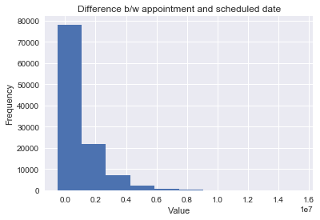


```python
#seeing how each variable varies with target variable
result['No-show'].value_counts()
```


    No     88207
    Yes    22319
    Name: No-show, dtype: int64


```python
def probStatus(dataset, group_by):
    df = pd.crosstab(index = dataset[group_by], columns = dataset['No-show']).reset_index()
    df['probShowUp'] = df['Yes'] / (df['No'] + df['Yes'])
    return df[[group_by, 'probShowUp']]
```


```python
sns.lmplot(data = probStatus(result, 'Age'), x = 'Age', y = 'probShowUp', fit_reg = True)
sns.plt.xlim(0, 100)
sns.plt.title('Probability of showing up with respect to Age')
sns.plt.show()
```


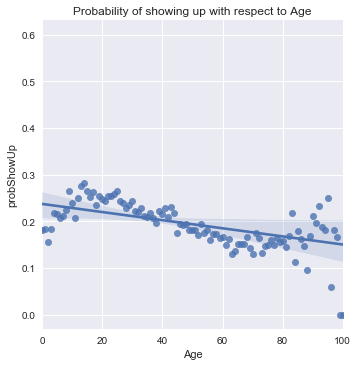


```python
result.info()
```

    <class 'pandas.core.frame.DataFrame'>
    Int64Index: 110526 entries, 0 to 110526
    Data columns (total 29 columns):
    PatientId            110526 non-null float64
    AppointmentID        110526 non-null int64
    Gender               110526 non-null object
    ScheduledDay         110526 non-null object
    AppointmentDay       110526 non-null object
    Age                  110526 non-null int64
    Neighbourhood        110526 non-null object
    Scholarship          110526 non-null int64
    Hipertension         110526 non-null int64
    Diabetes             110526 non-null int64
    Alcoholism           110526 non-null int64
    Handcap              110526 non-null int64
    SMS_received         110526 non-null int64
    No-show              110526 non-null object
    year                 110526 non-null object
    month                110526 non-null object
    day                  110526 non-null object
    time                 110526 non-null object
    hour                 110526 non-null object
    minutes              110526 non-null object
    seconds              110526 non-null object
    elderly              110526 non-null object
    Infants              110526 non-null object
    Appointment_year     110526 non-null object
    Appointment_month    110526 non-null object
    Appointment_day      110526 non-null object
    a_date               110526 non-null object
    s_date               110526 non-null object
    no_days              110526 non-null timedelta64[ns]
    dtypes: float64(1), int64(8), object(19), timedelta64[ns](1)
    memory usage: 30.3+ MB


```python
result['Gender'] = np.where(result['Gender'] == 'F', 1 , 0 )
```


```python
result
```


<div>
<style>
    .dataframe thead tr:only-child th {
        text-align: right;
    }

    .dataframe thead th {
        text-align: left;
    }

    .dataframe tbody tr th {
        vertical-align: top;
    }
</style>
<table border="1" class="dataframe">
  <thead>
    <tr style="text-align: right;">
      <th></th>
      <th>PatientId</th>
      <th>AppointmentID</th>
      <th>Gender</th>
      <th>ScheduledDay</th>
      <th>AppointmentDay</th>
      <th>Age</th>
      <th>Neighbourhood</th>
      <th>Scholarship</th>
      <th>Hipertension</th>
      <th>Diabetes</th>
      <th>...</th>
      <th>minutes</th>
      <th>seconds</th>
      <th>elderly</th>
      <th>Infants</th>
      <th>Appointment_year</th>
      <th>Appointment_month</th>
      <th>Appointment_day</th>
      <th>a_date</th>
      <th>s_date</th>
      <th>no_days</th>
    </tr>
  </thead>
  <tbody>
    <tr>
      <th>0</th>
      <td>2.987250e+13</td>
      <td>5642903</td>
      <td>1</td>
      <td>2016-04-29T18:38:08Z</td>
      <td>2016-04-29T00:00:00Z</td>
      <td>62</td>
      <td>JARDIM DA PENHA</td>
      <td>0</td>
      <td>1</td>
      <td>0</td>
      <td>...</td>
      <td>38</td>
      <td>08Z</td>
      <td>yes</td>
      <td>no</td>
      <td>2016</td>
      <td>04</td>
      <td>29</td>
      <td>2016-4-29</td>
      <td>2016-4-29</td>
      <td>0 days</td>
    </tr>
    <tr>
      <th>1</th>
      <td>5.589978e+14</td>
      <td>5642503</td>
      <td>0</td>
      <td>2016-04-29T16:08:27Z</td>
      <td>2016-04-29T00:00:00Z</td>
      <td>56</td>
      <td>JARDIM DA PENHA</td>
      <td>0</td>
      <td>0</td>
      <td>0</td>
      <td>...</td>
      <td>08</td>
      <td>27Z</td>
      <td>yes</td>
      <td>no</td>
      <td>2016</td>
      <td>04</td>
      <td>29</td>
      <td>2016-4-29</td>
      <td>2016-4-29</td>
      <td>0 days</td>
    </tr>
    <tr>
      <th>2</th>
      <td>4.262962e+12</td>
      <td>5642549</td>
      <td>1</td>
      <td>2016-04-29T16:19:04Z</td>
      <td>2016-04-29T00:00:00Z</td>
      <td>62</td>
      <td>MATA DA PRAIA</td>
      <td>0</td>
      <td>0</td>
      <td>0</td>
      <td>...</td>
      <td>19</td>
      <td>04Z</td>
      <td>yes</td>
      <td>no</td>
      <td>2016</td>
      <td>04</td>
      <td>29</td>
      <td>2016-4-29</td>
      <td>2016-4-29</td>
      <td>0 days</td>
    </tr>
    <tr>
      <th>3</th>
      <td>8.679512e+11</td>
      <td>5642828</td>
      <td>1</td>
      <td>2016-04-29T17:29:31Z</td>
      <td>2016-04-29T00:00:00Z</td>
      <td>8</td>
      <td>PONTAL DE CAMBURI</td>
      <td>0</td>
      <td>0</td>
      <td>0</td>
      <td>...</td>
      <td>29</td>
      <td>31Z</td>
      <td>no</td>
      <td>no</td>
      <td>2016</td>
      <td>04</td>
      <td>29</td>
      <td>2016-4-29</td>
      <td>2016-4-29</td>
      <td>0 days</td>
    </tr>
    <tr>
      <th>4</th>
      <td>8.841186e+12</td>
      <td>5642494</td>
      <td>1</td>
      <td>2016-04-29T16:07:23Z</td>
      <td>2016-04-29T00:00:00Z</td>
      <td>56</td>
      <td>JARDIM DA PENHA</td>
      <td>0</td>
      <td>1</td>
      <td>1</td>
      <td>...</td>
      <td>07</td>
      <td>23Z</td>
      <td>yes</td>
      <td>no</td>
      <td>2016</td>
      <td>04</td>
      <td>29</td>
      <td>2016-4-29</td>
      <td>2016-4-29</td>
      <td>0 days</td>
    </tr>
    <tr>
      <th>5</th>
      <td>9.598513e+13</td>
      <td>5626772</td>
      <td>1</td>
      <td>2016-04-27T08:36:51Z</td>
      <td>2016-04-29T00:00:00Z</td>
      <td>76</td>
      <td>REPÚBLICA</td>
      <td>0</td>
      <td>1</td>
      <td>0</td>
      <td>...</td>
      <td>36</td>
      <td>51Z</td>
      <td>yes</td>
      <td>no</td>
      <td>2016</td>
      <td>04</td>
      <td>29</td>
      <td>2016-4-29</td>
      <td>2016-4-27</td>
      <td>2 days</td>
    </tr>
    <tr>
      <th>6</th>
      <td>7.336882e+14</td>
      <td>5630279</td>
      <td>1</td>
      <td>2016-04-27T15:05:12Z</td>
      <td>2016-04-29T00:00:00Z</td>
      <td>23</td>
      <td>GOIABEIRAS</td>
      <td>0</td>
      <td>0</td>
      <td>0</td>
      <td>...</td>
      <td>05</td>
      <td>12Z</td>
      <td>no</td>
      <td>no</td>
      <td>2016</td>
      <td>04</td>
      <td>29</td>
      <td>2016-4-29</td>
      <td>2016-4-27</td>
      <td>2 days</td>
    </tr>
    <tr>
      <th>7</th>
      <td>3.449833e+12</td>
      <td>5630575</td>
      <td>1</td>
      <td>2016-04-27T15:39:58Z</td>
      <td>2016-04-29T00:00:00Z</td>
      <td>39</td>
      <td>GOIABEIRAS</td>
      <td>0</td>
      <td>0</td>
      <td>0</td>
      <td>...</td>
      <td>39</td>
      <td>58Z</td>
      <td>no</td>
      <td>no</td>
      <td>2016</td>
      <td>04</td>
      <td>29</td>
      <td>2016-4-29</td>
      <td>2016-4-27</td>
      <td>2 days</td>
    </tr>
    <tr>
      <th>8</th>
      <td>5.639473e+13</td>
      <td>5638447</td>
      <td>1</td>
      <td>2016-04-29T08:02:16Z</td>
      <td>2016-04-29T00:00:00Z</td>
      <td>21</td>
      <td>ANDORINHAS</td>
      <td>0</td>
      <td>0</td>
      <td>0</td>
      <td>...</td>
      <td>02</td>
      <td>16Z</td>
      <td>no</td>
      <td>no</td>
      <td>2016</td>
      <td>04</td>
      <td>29</td>
      <td>2016-4-29</td>
      <td>2016-4-29</td>
      <td>0 days</td>
    </tr>
    <tr>
      <th>9</th>
      <td>7.812456e+13</td>
      <td>5629123</td>
      <td>1</td>
      <td>2016-04-27T12:48:25Z</td>
      <td>2016-04-29T00:00:00Z</td>
      <td>19</td>
      <td>CONQUISTA</td>
      <td>0</td>
      <td>0</td>
      <td>0</td>
      <td>...</td>
      <td>48</td>
      <td>25Z</td>
      <td>no</td>
      <td>no</td>
      <td>2016</td>
      <td>04</td>
      <td>29</td>
      <td>2016-4-29</td>
      <td>2016-4-27</td>
      <td>2 days</td>
    </tr>
    <tr>
      <th>10</th>
      <td>7.345362e+14</td>
      <td>5630213</td>
      <td>1</td>
      <td>2016-04-27T14:58:11Z</td>
      <td>2016-04-29T00:00:00Z</td>
      <td>30</td>
      <td>NOVA PALESTINA</td>
      <td>0</td>
      <td>0</td>
      <td>0</td>
      <td>...</td>
      <td>58</td>
      <td>11Z</td>
      <td>no</td>
      <td>no</td>
      <td>2016</td>
      <td>04</td>
      <td>29</td>
      <td>2016-4-29</td>
      <td>2016-4-27</td>
      <td>2 days</td>
    </tr>
    <tr>
      <th>11</th>
      <td>7.542951e+12</td>
      <td>5620163</td>
      <td>0</td>
      <td>2016-04-26T08:44:12Z</td>
      <td>2016-04-29T00:00:00Z</td>
      <td>29</td>
      <td>NOVA PALESTINA</td>
      <td>0</td>
      <td>0</td>
      <td>0</td>
      <td>...</td>
      <td>44</td>
      <td>12Z</td>
      <td>no</td>
      <td>no</td>
      <td>2016</td>
      <td>04</td>
      <td>29</td>
      <td>2016-4-29</td>
      <td>2016-4-26</td>
      <td>3 days</td>
    </tr>
    <tr>
      <th>12</th>
      <td>5.666548e+14</td>
      <td>5634718</td>
      <td>1</td>
      <td>2016-04-28T11:33:51Z</td>
      <td>2016-04-29T00:00:00Z</td>
      <td>22</td>
      <td>NOVA PALESTINA</td>
      <td>1</td>
      <td>0</td>
      <td>0</td>
      <td>...</td>
      <td>33</td>
      <td>51Z</td>
      <td>no</td>
      <td>no</td>
      <td>2016</td>
      <td>04</td>
      <td>29</td>
      <td>2016-4-29</td>
      <td>2016-4-28</td>
      <td>1 days</td>
    </tr>
    <tr>
      <th>13</th>
      <td>9.113946e+14</td>
      <td>5636249</td>
      <td>0</td>
      <td>2016-04-28T14:52:07Z</td>
      <td>2016-04-29T00:00:00Z</td>
      <td>28</td>
      <td>NOVA PALESTINA</td>
      <td>0</td>
      <td>0</td>
      <td>0</td>
      <td>...</td>
      <td>52</td>
      <td>07Z</td>
      <td>no</td>
      <td>no</td>
      <td>2016</td>
      <td>04</td>
      <td>29</td>
      <td>2016-4-29</td>
      <td>2016-4-28</td>
      <td>1 days</td>
    </tr>
    <tr>
      <th>14</th>
      <td>9.988472e+13</td>
      <td>5633951</td>
      <td>1</td>
      <td>2016-04-28T10:06:24Z</td>
      <td>2016-04-29T00:00:00Z</td>
      <td>54</td>
      <td>NOVA PALESTINA</td>
      <td>0</td>
      <td>0</td>
      <td>0</td>
      <td>...</td>
      <td>06</td>
      <td>24Z</td>
      <td>yes</td>
      <td>no</td>
      <td>2016</td>
      <td>04</td>
      <td>29</td>
      <td>2016-4-29</td>
      <td>2016-4-28</td>
      <td>1 days</td>
    </tr>
    <tr>
      <th>15</th>
      <td>9.994839e+10</td>
      <td>5620206</td>
      <td>1</td>
      <td>2016-04-26T08:47:27Z</td>
      <td>2016-04-29T00:00:00Z</td>
      <td>15</td>
      <td>NOVA PALESTINA</td>
      <td>0</td>
      <td>0</td>
      <td>0</td>
      <td>...</td>
      <td>47</td>
      <td>27Z</td>
      <td>no</td>
      <td>no</td>
      <td>2016</td>
      <td>04</td>
      <td>29</td>
      <td>2016-4-29</td>
      <td>2016-4-26</td>
      <td>3 days</td>
    </tr>
    <tr>
      <th>16</th>
      <td>8.457439e+13</td>
      <td>5633121</td>
      <td>0</td>
      <td>2016-04-28T08:51:47Z</td>
      <td>2016-04-29T00:00:00Z</td>
      <td>50</td>
      <td>NOVA PALESTINA</td>
      <td>0</td>
      <td>0</td>
      <td>0</td>
      <td>...</td>
      <td>51</td>
      <td>47Z</td>
      <td>yes</td>
      <td>no</td>
      <td>2016</td>
      <td>04</td>
      <td>29</td>
      <td>2016-4-29</td>
      <td>2016-4-28</td>
      <td>1 days</td>
    </tr>
    <tr>
      <th>17</th>
      <td>1.479497e+13</td>
      <td>5633460</td>
      <td>1</td>
      <td>2016-04-28T09:28:57Z</td>
      <td>2016-04-29T00:00:00Z</td>
      <td>40</td>
      <td>CONQUISTA</td>
      <td>1</td>
      <td>0</td>
      <td>0</td>
      <td>...</td>
      <td>28</td>
      <td>57Z</td>
      <td>no</td>
      <td>no</td>
      <td>2016</td>
      <td>04</td>
      <td>29</td>
      <td>2016-4-29</td>
      <td>2016-4-28</td>
      <td>1 days</td>
    </tr>
    <tr>
      <th>18</th>
      <td>1.713538e+13</td>
      <td>5621836</td>
      <td>1</td>
      <td>2016-04-26T10:54:18Z</td>
      <td>2016-04-29T00:00:00Z</td>
      <td>30</td>
      <td>NOVA PALESTINA</td>
      <td>1</td>
      <td>0</td>
      <td>0</td>
      <td>...</td>
      <td>54</td>
      <td>18Z</td>
      <td>no</td>
      <td>no</td>
      <td>2016</td>
      <td>04</td>
      <td>29</td>
      <td>2016-4-29</td>
      <td>2016-4-26</td>
      <td>3 days</td>
    </tr>
    <tr>
      <th>19</th>
      <td>7.223289e+12</td>
      <td>5640433</td>
      <td>1</td>
      <td>2016-04-29T10:43:14Z</td>
      <td>2016-04-29T00:00:00Z</td>
      <td>46</td>
      <td>DA PENHA</td>
      <td>0</td>
      <td>0</td>
      <td>0</td>
      <td>...</td>
      <td>43</td>
      <td>14Z</td>
      <td>no</td>
      <td>no</td>
      <td>2016</td>
      <td>04</td>
      <td>29</td>
      <td>2016-4-29</td>
      <td>2016-4-29</td>
      <td>0 days</td>
    </tr>
    <tr>
      <th>20</th>
      <td>6.222575e+14</td>
      <td>5626083</td>
      <td>1</td>
      <td>2016-04-27T07:51:14Z</td>
      <td>2016-04-29T00:00:00Z</td>
      <td>30</td>
      <td>NOVA PALESTINA</td>
      <td>0</td>
      <td>0</td>
      <td>0</td>
      <td>...</td>
      <td>51</td>
      <td>14Z</td>
      <td>no</td>
      <td>no</td>
      <td>2016</td>
      <td>04</td>
      <td>29</td>
      <td>2016-4-29</td>
      <td>2016-4-27</td>
      <td>2 days</td>
    </tr>
    <tr>
      <th>21</th>
      <td>1.215484e+13</td>
      <td>5628338</td>
      <td>1</td>
      <td>2016-04-27T10:50:45Z</td>
      <td>2016-04-29T00:00:00Z</td>
      <td>4</td>
      <td>CONQUISTA</td>
      <td>0</td>
      <td>0</td>
      <td>0</td>
      <td>...</td>
      <td>50</td>
      <td>45Z</td>
      <td>no</td>
      <td>yes</td>
      <td>2016</td>
      <td>04</td>
      <td>29</td>
      <td>2016-4-29</td>
      <td>2016-4-27</td>
      <td>2 days</td>
    </tr>
    <tr>
      <th>22</th>
      <td>8.632298e+14</td>
      <td>5616091</td>
      <td>0</td>
      <td>2016-04-25T13:29:16Z</td>
      <td>2016-04-29T00:00:00Z</td>
      <td>13</td>
      <td>CONQUISTA</td>
      <td>0</td>
      <td>0</td>
      <td>0</td>
      <td>...</td>
      <td>29</td>
      <td>16Z</td>
      <td>no</td>
      <td>no</td>
      <td>2016</td>
      <td>04</td>
      <td>29</td>
      <td>2016-4-29</td>
      <td>2016-4-25</td>
      <td>4 days</td>
    </tr>
    <tr>
      <th>23</th>
      <td>2.137540e+14</td>
      <td>5634142</td>
      <td>1</td>
      <td>2016-04-28T10:27:05Z</td>
      <td>2016-04-29T00:00:00Z</td>
      <td>46</td>
      <td>CONQUISTA</td>
      <td>0</td>
      <td>0</td>
      <td>0</td>
      <td>...</td>
      <td>27</td>
      <td>05Z</td>
      <td>no</td>
      <td>no</td>
      <td>2016</td>
      <td>04</td>
      <td>29</td>
      <td>2016-4-29</td>
      <td>2016-4-28</td>
      <td>1 days</td>
    </tr>
    <tr>
      <th>24</th>
      <td>8.734858e+12</td>
      <td>5641780</td>
      <td>1</td>
      <td>2016-04-29T14:19:19Z</td>
      <td>2016-04-29T00:00:00Z</td>
      <td>65</td>
      <td>TABUAZEIRO</td>
      <td>0</td>
      <td>0</td>
      <td>0</td>
      <td>...</td>
      <td>19</td>
      <td>19Z</td>
      <td>yes</td>
      <td>no</td>
      <td>2016</td>
      <td>04</td>
      <td>29</td>
      <td>2016-4-29</td>
      <td>2016-4-29</td>
      <td>0 days</td>
    </tr>
    <tr>
      <th>25</th>
      <td>5.819370e+12</td>
      <td>5624020</td>
      <td>0</td>
      <td>2016-04-26T15:04:17Z</td>
      <td>2016-04-29T00:00:00Z</td>
      <td>46</td>
      <td>CONQUISTA</td>
      <td>0</td>
      <td>1</td>
      <td>0</td>
      <td>...</td>
      <td>04</td>
      <td>17Z</td>
      <td>no</td>
      <td>no</td>
      <td>2016</td>
      <td>04</td>
      <td>29</td>
      <td>2016-4-29</td>
      <td>2016-4-26</td>
      <td>3 days</td>
    </tr>
    <tr>
      <th>26</th>
      <td>2.578785e+10</td>
      <td>5641781</td>
      <td>1</td>
      <td>2016-04-29T14:19:42Z</td>
      <td>2016-04-29T00:00:00Z</td>
      <td>45</td>
      <td>BENTO FERREIRA</td>
      <td>0</td>
      <td>1</td>
      <td>0</td>
      <td>...</td>
      <td>19</td>
      <td>42Z</td>
      <td>no</td>
      <td>no</td>
      <td>2016</td>
      <td>04</td>
      <td>29</td>
      <td>2016-4-29</td>
      <td>2016-4-29</td>
      <td>0 days</td>
    </tr>
    <tr>
      <th>27</th>
      <td>1.215484e+13</td>
      <td>5628345</td>
      <td>1</td>
      <td>2016-04-27T10:51:45Z</td>
      <td>2016-04-29T00:00:00Z</td>
      <td>4</td>
      <td>CONQUISTA</td>
      <td>0</td>
      <td>0</td>
      <td>0</td>
      <td>...</td>
      <td>51</td>
      <td>45Z</td>
      <td>no</td>
      <td>yes</td>
      <td>2016</td>
      <td>04</td>
      <td>29</td>
      <td>2016-4-29</td>
      <td>2016-4-27</td>
      <td>2 days</td>
    </tr>
    <tr>
      <th>28</th>
      <td>5.926172e+12</td>
      <td>5642400</td>
      <td>0</td>
      <td>2016-04-29T15:48:02Z</td>
      <td>2016-04-29T00:00:00Z</td>
      <td>51</td>
      <td>SÃO PEDRO</td>
      <td>0</td>
      <td>0</td>
      <td>0</td>
      <td>...</td>
      <td>48</td>
      <td>02Z</td>
      <td>yes</td>
      <td>no</td>
      <td>2016</td>
      <td>04</td>
      <td>29</td>
      <td>2016-4-29</td>
      <td>2016-4-29</td>
      <td>0 days</td>
    </tr>
    <tr>
      <th>29</th>
      <td>1.225776e+12</td>
      <td>5642186</td>
      <td>1</td>
      <td>2016-04-29T15:16:29Z</td>
      <td>2016-04-29T00:00:00Z</td>
      <td>32</td>
      <td>SANTA MARTHA</td>
      <td>0</td>
      <td>0</td>
      <td>0</td>
      <td>...</td>
      <td>16</td>
      <td>29Z</td>
      <td>no</td>
      <td>no</td>
      <td>2016</td>
      <td>04</td>
      <td>29</td>
      <td>2016-4-29</td>
      <td>2016-4-29</td>
      <td>0 days</td>
    </tr>
    <tr>
      <th>...</th>
      <td>...</td>
      <td>...</td>
      <td>...</td>
      <td>...</td>
      <td>...</td>
      <td>...</td>
      <td>...</td>
      <td>...</td>
      <td>...</td>
      <td>...</td>
      <td>...</td>
      <td>...</td>
      <td>...</td>
      <td>...</td>
      <td>...</td>
      <td>...</td>
      <td>...</td>
      <td>...</td>
      <td>...</td>
      <td>...</td>
      <td>...</td>
    </tr>
    <tr>
      <th>110497</th>
      <td>7.935892e+14</td>
      <td>5757745</td>
      <td>0</td>
      <td>2016-06-01T09:46:33Z</td>
      <td>2016-06-01T00:00:00Z</td>
      <td>76</td>
      <td>MARIA ORTIZ</td>
      <td>0</td>
      <td>0</td>
      <td>0</td>
      <td>...</td>
      <td>46</td>
      <td>33Z</td>
      <td>yes</td>
      <td>no</td>
      <td>2016</td>
      <td>06</td>
      <td>01</td>
      <td>2016-6-1</td>
      <td>2016-6-1</td>
      <td>0 days</td>
    </tr>
    <tr>
      <th>110498</th>
      <td>9.433654e+13</td>
      <td>5787655</td>
      <td>1</td>
      <td>2016-06-08T10:21:14Z</td>
      <td>2016-06-08T00:00:00Z</td>
      <td>59</td>
      <td>MARIA ORTIZ</td>
      <td>0</td>
      <td>0</td>
      <td>0</td>
      <td>...</td>
      <td>21</td>
      <td>14Z</td>
      <td>yes</td>
      <td>no</td>
      <td>2016</td>
      <td>06</td>
      <td>08</td>
      <td>2016-6-8</td>
      <td>2016-6-8</td>
      <td>0 days</td>
    </tr>
    <tr>
      <th>110499</th>
      <td>8.219692e+14</td>
      <td>5757697</td>
      <td>1</td>
      <td>2016-06-01T09:42:56Z</td>
      <td>2016-06-01T00:00:00Z</td>
      <td>66</td>
      <td>MARIA ORTIZ</td>
      <td>0</td>
      <td>1</td>
      <td>1</td>
      <td>...</td>
      <td>42</td>
      <td>56Z</td>
      <td>yes</td>
      <td>no</td>
      <td>2016</td>
      <td>06</td>
      <td>01</td>
      <td>2016-6-1</td>
      <td>2016-6-1</td>
      <td>0 days</td>
    </tr>
    <tr>
      <th>110500</th>
      <td>4.434384e+14</td>
      <td>5787233</td>
      <td>1</td>
      <td>2016-06-08T09:35:13Z</td>
      <td>2016-06-08T00:00:00Z</td>
      <td>59</td>
      <td>MARIA ORTIZ</td>
      <td>0</td>
      <td>0</td>
      <td>0</td>
      <td>...</td>
      <td>35</td>
      <td>13Z</td>
      <td>yes</td>
      <td>no</td>
      <td>2016</td>
      <td>06</td>
      <td>08</td>
      <td>2016-6-8</td>
      <td>2016-6-8</td>
      <td>0 days</td>
    </tr>
    <tr>
      <th>110501</th>
      <td>4.544252e+11</td>
      <td>5758133</td>
      <td>0</td>
      <td>2016-06-01T10:19:12Z</td>
      <td>2016-06-01T00:00:00Z</td>
      <td>44</td>
      <td>MARIA ORTIZ</td>
      <td>0</td>
      <td>0</td>
      <td>0</td>
      <td>...</td>
      <td>19</td>
      <td>12Z</td>
      <td>no</td>
      <td>no</td>
      <td>2016</td>
      <td>06</td>
      <td>01</td>
      <td>2016-6-1</td>
      <td>2016-6-1</td>
      <td>0 days</td>
    </tr>
    <tr>
      <th>110502</th>
      <td>7.316229e+14</td>
      <td>5787937</td>
      <td>1</td>
      <td>2016-06-08T10:50:42Z</td>
      <td>2016-06-08T00:00:00Z</td>
      <td>22</td>
      <td>GOIABEIRAS</td>
      <td>0</td>
      <td>0</td>
      <td>0</td>
      <td>...</td>
      <td>50</td>
      <td>42Z</td>
      <td>no</td>
      <td>no</td>
      <td>2016</td>
      <td>06</td>
      <td>08</td>
      <td>2016-6-8</td>
      <td>2016-6-8</td>
      <td>0 days</td>
    </tr>
    <tr>
      <th>110503</th>
      <td>2.362182e+13</td>
      <td>5759473</td>
      <td>1</td>
      <td>2016-06-01T13:00:36Z</td>
      <td>2016-06-01T00:00:00Z</td>
      <td>64</td>
      <td>SOLON BORGES</td>
      <td>0</td>
      <td>0</td>
      <td>0</td>
      <td>...</td>
      <td>00</td>
      <td>36Z</td>
      <td>yes</td>
      <td>no</td>
      <td>2016</td>
      <td>06</td>
      <td>01</td>
      <td>2016-6-1</td>
      <td>2016-6-1</td>
      <td>0 days</td>
    </tr>
    <tr>
      <th>110504</th>
      <td>9.947983e+12</td>
      <td>5788052</td>
      <td>1</td>
      <td>2016-06-08T11:06:21Z</td>
      <td>2016-06-08T00:00:00Z</td>
      <td>4</td>
      <td>MARIA ORTIZ</td>
      <td>0</td>
      <td>0</td>
      <td>0</td>
      <td>...</td>
      <td>06</td>
      <td>21Z</td>
      <td>no</td>
      <td>yes</td>
      <td>2016</td>
      <td>06</td>
      <td>08</td>
      <td>2016-6-8</td>
      <td>2016-6-8</td>
      <td>0 days</td>
    </tr>
    <tr>
      <th>110505</th>
      <td>5.667344e+13</td>
      <td>5758455</td>
      <td>1</td>
      <td>2016-06-01T10:45:50Z</td>
      <td>2016-06-01T00:00:00Z</td>
      <td>55</td>
      <td>MARIA ORTIZ</td>
      <td>0</td>
      <td>0</td>
      <td>0</td>
      <td>...</td>
      <td>45</td>
      <td>50Z</td>
      <td>yes</td>
      <td>no</td>
      <td>2016</td>
      <td>06</td>
      <td>01</td>
      <td>2016-6-1</td>
      <td>2016-6-1</td>
      <td>0 days</td>
    </tr>
    <tr>
      <th>110506</th>
      <td>8.973883e+11</td>
      <td>5758779</td>
      <td>0</td>
      <td>2016-06-01T11:09:20Z</td>
      <td>2016-06-01T00:00:00Z</td>
      <td>5</td>
      <td>MARIA ORTIZ</td>
      <td>0</td>
      <td>0</td>
      <td>0</td>
      <td>...</td>
      <td>09</td>
      <td>20Z</td>
      <td>no</td>
      <td>yes</td>
      <td>2016</td>
      <td>06</td>
      <td>01</td>
      <td>2016-6-1</td>
      <td>2016-6-1</td>
      <td>0 days</td>
    </tr>
    <tr>
      <th>110507</th>
      <td>4.769462e+14</td>
      <td>5786918</td>
      <td>1</td>
      <td>2016-06-08T09:04:18Z</td>
      <td>2016-06-08T00:00:00Z</td>
      <td>0</td>
      <td>MARIA ORTIZ</td>
      <td>0</td>
      <td>0</td>
      <td>0</td>
      <td>...</td>
      <td>04</td>
      <td>18Z</td>
      <td>no</td>
      <td>yes</td>
      <td>2016</td>
      <td>06</td>
      <td>08</td>
      <td>2016-6-8</td>
      <td>2016-6-8</td>
      <td>0 days</td>
    </tr>
    <tr>
      <th>110508</th>
      <td>9.433654e+13</td>
      <td>5757656</td>
      <td>1</td>
      <td>2016-06-01T09:41:00Z</td>
      <td>2016-06-01T00:00:00Z</td>
      <td>59</td>
      <td>MARIA ORTIZ</td>
      <td>0</td>
      <td>0</td>
      <td>0</td>
      <td>...</td>
      <td>41</td>
      <td>00Z</td>
      <td>yes</td>
      <td>no</td>
      <td>2016</td>
      <td>06</td>
      <td>01</td>
      <td>2016-6-1</td>
      <td>2016-6-1</td>
      <td>0 days</td>
    </tr>
    <tr>
      <th>110509</th>
      <td>4.952968e+14</td>
      <td>5786750</td>
      <td>0</td>
      <td>2016-06-08T08:50:51Z</td>
      <td>2016-06-08T00:00:00Z</td>
      <td>33</td>
      <td>MARIA ORTIZ</td>
      <td>0</td>
      <td>0</td>
      <td>0</td>
      <td>...</td>
      <td>50</td>
      <td>51Z</td>
      <td>no</td>
      <td>no</td>
      <td>2016</td>
      <td>06</td>
      <td>08</td>
      <td>2016-6-8</td>
      <td>2016-6-8</td>
      <td>0 days</td>
    </tr>
    <tr>
      <th>110510</th>
      <td>2.362182e+13</td>
      <td>5757587</td>
      <td>1</td>
      <td>2016-06-01T09:35:48Z</td>
      <td>2016-06-01T00:00:00Z</td>
      <td>64</td>
      <td>SOLON BORGES</td>
      <td>0</td>
      <td>0</td>
      <td>0</td>
      <td>...</td>
      <td>35</td>
      <td>48Z</td>
      <td>yes</td>
      <td>no</td>
      <td>2016</td>
      <td>06</td>
      <td>01</td>
      <td>2016-6-1</td>
      <td>2016-6-1</td>
      <td>0 days</td>
    </tr>
    <tr>
      <th>110511</th>
      <td>8.235996e+11</td>
      <td>5786742</td>
      <td>1</td>
      <td>2016-06-08T08:50:20Z</td>
      <td>2016-06-08T00:00:00Z</td>
      <td>14</td>
      <td>MARIA ORTIZ</td>
      <td>0</td>
      <td>0</td>
      <td>0</td>
      <td>...</td>
      <td>50</td>
      <td>20Z</td>
      <td>no</td>
      <td>no</td>
      <td>2016</td>
      <td>06</td>
      <td>08</td>
      <td>2016-6-8</td>
      <td>2016-6-8</td>
      <td>0 days</td>
    </tr>
    <tr>
      <th>110512</th>
      <td>9.876246e+13</td>
      <td>5786368</td>
      <td>1</td>
      <td>2016-06-08T08:20:01Z</td>
      <td>2016-06-08T00:00:00Z</td>
      <td>41</td>
      <td>MARIA ORTIZ</td>
      <td>0</td>
      <td>0</td>
      <td>0</td>
      <td>...</td>
      <td>20</td>
      <td>01Z</td>
      <td>no</td>
      <td>no</td>
      <td>2016</td>
      <td>06</td>
      <td>08</td>
      <td>2016-6-8</td>
      <td>2016-6-8</td>
      <td>0 days</td>
    </tr>
    <tr>
      <th>110513</th>
      <td>8.674778e+13</td>
      <td>5785964</td>
      <td>0</td>
      <td>2016-06-08T07:52:55Z</td>
      <td>2016-06-08T00:00:00Z</td>
      <td>2</td>
      <td>ANTÔNIO HONÓRIO</td>
      <td>0</td>
      <td>0</td>
      <td>0</td>
      <td>...</td>
      <td>52</td>
      <td>55Z</td>
      <td>no</td>
      <td>yes</td>
      <td>2016</td>
      <td>06</td>
      <td>08</td>
      <td>2016-6-8</td>
      <td>2016-6-8</td>
      <td>0 days</td>
    </tr>
    <tr>
      <th>110514</th>
      <td>2.695685e+12</td>
      <td>5786567</td>
      <td>1</td>
      <td>2016-06-08T08:35:31Z</td>
      <td>2016-06-08T00:00:00Z</td>
      <td>58</td>
      <td>MARIA ORTIZ</td>
      <td>0</td>
      <td>0</td>
      <td>0</td>
      <td>...</td>
      <td>35</td>
      <td>31Z</td>
      <td>yes</td>
      <td>no</td>
      <td>2016</td>
      <td>06</td>
      <td>08</td>
      <td>2016-6-8</td>
      <td>2016-6-8</td>
      <td>0 days</td>
    </tr>
    <tr>
      <th>110515</th>
      <td>6.456342e+14</td>
      <td>5778621</td>
      <td>0</td>
      <td>2016-06-06T15:58:05Z</td>
      <td>2016-06-08T00:00:00Z</td>
      <td>33</td>
      <td>MARIA ORTIZ</td>
      <td>0</td>
      <td>1</td>
      <td>0</td>
      <td>...</td>
      <td>58</td>
      <td>05Z</td>
      <td>no</td>
      <td>no</td>
      <td>2016</td>
      <td>06</td>
      <td>08</td>
      <td>2016-6-8</td>
      <td>2016-6-6</td>
      <td>2 days</td>
    </tr>
    <tr>
      <th>110516</th>
      <td>6.923772e+13</td>
      <td>5780205</td>
      <td>1</td>
      <td>2016-06-07T07:45:16Z</td>
      <td>2016-06-08T00:00:00Z</td>
      <td>37</td>
      <td>MARIA ORTIZ</td>
      <td>0</td>
      <td>0</td>
      <td>0</td>
      <td>...</td>
      <td>45</td>
      <td>16Z</td>
      <td>no</td>
      <td>no</td>
      <td>2016</td>
      <td>06</td>
      <td>08</td>
      <td>2016-6-8</td>
      <td>2016-6-7</td>
      <td>1 days</td>
    </tr>
    <tr>
      <th>110517</th>
      <td>5.574942e+12</td>
      <td>5780122</td>
      <td>1</td>
      <td>2016-06-07T07:38:34Z</td>
      <td>2016-06-07T00:00:00Z</td>
      <td>19</td>
      <td>MARIA ORTIZ</td>
      <td>0</td>
      <td>0</td>
      <td>0</td>
      <td>...</td>
      <td>38</td>
      <td>34Z</td>
      <td>no</td>
      <td>no</td>
      <td>2016</td>
      <td>06</td>
      <td>07</td>
      <td>2016-6-7</td>
      <td>2016-6-7</td>
      <td>0 days</td>
    </tr>
    <tr>
      <th>110518</th>
      <td>7.263315e+13</td>
      <td>5630375</td>
      <td>1</td>
      <td>2016-04-27T15:15:06Z</td>
      <td>2016-06-07T00:00:00Z</td>
      <td>50</td>
      <td>MARIA ORTIZ</td>
      <td>0</td>
      <td>0</td>
      <td>0</td>
      <td>...</td>
      <td>15</td>
      <td>06Z</td>
      <td>yes</td>
      <td>no</td>
      <td>2016</td>
      <td>06</td>
      <td>07</td>
      <td>2016-6-7</td>
      <td>2016-4-27</td>
      <td>41 days</td>
    </tr>
    <tr>
      <th>110519</th>
      <td>6.542388e+13</td>
      <td>5630447</td>
      <td>1</td>
      <td>2016-04-27T15:23:14Z</td>
      <td>2016-06-07T00:00:00Z</td>
      <td>22</td>
      <td>MARIA ORTIZ</td>
      <td>0</td>
      <td>0</td>
      <td>0</td>
      <td>...</td>
      <td>23</td>
      <td>14Z</td>
      <td>no</td>
      <td>no</td>
      <td>2016</td>
      <td>06</td>
      <td>07</td>
      <td>2016-6-7</td>
      <td>2016-4-27</td>
      <td>41 days</td>
    </tr>
    <tr>
      <th>110520</th>
      <td>9.969977e+14</td>
      <td>5650534</td>
      <td>1</td>
      <td>2016-05-03T07:51:47Z</td>
      <td>2016-06-07T00:00:00Z</td>
      <td>42</td>
      <td>MARIA ORTIZ</td>
      <td>0</td>
      <td>0</td>
      <td>0</td>
      <td>...</td>
      <td>51</td>
      <td>47Z</td>
      <td>no</td>
      <td>no</td>
      <td>2016</td>
      <td>06</td>
      <td>07</td>
      <td>2016-6-7</td>
      <td>2016-5-3</td>
      <td>35 days</td>
    </tr>
    <tr>
      <th>110521</th>
      <td>3.635534e+13</td>
      <td>5651072</td>
      <td>1</td>
      <td>2016-05-03T08:23:40Z</td>
      <td>2016-06-07T00:00:00Z</td>
      <td>53</td>
      <td>MARIA ORTIZ</td>
      <td>0</td>
      <td>0</td>
      <td>0</td>
      <td>...</td>
      <td>23</td>
      <td>40Z</td>
      <td>yes</td>
      <td>no</td>
      <td>2016</td>
      <td>06</td>
      <td>07</td>
      <td>2016-6-7</td>
      <td>2016-5-3</td>
      <td>35 days</td>
    </tr>
    <tr>
      <th>110522</th>
      <td>2.572134e+12</td>
      <td>5651768</td>
      <td>1</td>
      <td>2016-05-03T09:15:35Z</td>
      <td>2016-06-07T00:00:00Z</td>
      <td>56</td>
      <td>MARIA ORTIZ</td>
      <td>0</td>
      <td>0</td>
      <td>0</td>
      <td>...</td>
      <td>15</td>
      <td>35Z</td>
      <td>yes</td>
      <td>no</td>
      <td>2016</td>
      <td>06</td>
      <td>07</td>
      <td>2016-6-7</td>
      <td>2016-5-3</td>
      <td>35 days</td>
    </tr>
    <tr>
      <th>110523</th>
      <td>3.596266e+12</td>
      <td>5650093</td>
      <td>1</td>
      <td>2016-05-03T07:27:33Z</td>
      <td>2016-06-07T00:00:00Z</td>
      <td>51</td>
      <td>MARIA ORTIZ</td>
      <td>0</td>
      <td>0</td>
      <td>0</td>
      <td>...</td>
      <td>27</td>
      <td>33Z</td>
      <td>yes</td>
      <td>no</td>
      <td>2016</td>
      <td>06</td>
      <td>07</td>
      <td>2016-6-7</td>
      <td>2016-5-3</td>
      <td>35 days</td>
    </tr>
    <tr>
      <th>110524</th>
      <td>1.557663e+13</td>
      <td>5630692</td>
      <td>1</td>
      <td>2016-04-27T16:03:52Z</td>
      <td>2016-06-07T00:00:00Z</td>
      <td>21</td>
      <td>MARIA ORTIZ</td>
      <td>0</td>
      <td>0</td>
      <td>0</td>
      <td>...</td>
      <td>03</td>
      <td>52Z</td>
      <td>no</td>
      <td>no</td>
      <td>2016</td>
      <td>06</td>
      <td>07</td>
      <td>2016-6-7</td>
      <td>2016-4-27</td>
      <td>41 days</td>
    </tr>
    <tr>
      <th>110525</th>
      <td>9.213493e+13</td>
      <td>5630323</td>
      <td>1</td>
      <td>2016-04-27T15:09:23Z</td>
      <td>2016-06-07T00:00:00Z</td>
      <td>38</td>
      <td>MARIA ORTIZ</td>
      <td>0</td>
      <td>0</td>
      <td>0</td>
      <td>...</td>
      <td>09</td>
      <td>23Z</td>
      <td>no</td>
      <td>no</td>
      <td>2016</td>
      <td>06</td>
      <td>07</td>
      <td>2016-6-7</td>
      <td>2016-4-27</td>
      <td>41 days</td>
    </tr>
    <tr>
      <th>110526</th>
      <td>3.775115e+14</td>
      <td>5629448</td>
      <td>1</td>
      <td>2016-04-27T13:30:56Z</td>
      <td>2016-06-07T00:00:00Z</td>
      <td>54</td>
      <td>MARIA ORTIZ</td>
      <td>0</td>
      <td>0</td>
      <td>0</td>
      <td>...</td>
      <td>30</td>
      <td>56Z</td>
      <td>yes</td>
      <td>no</td>
      <td>2016</td>
      <td>06</td>
      <td>07</td>
      <td>2016-6-7</td>
      <td>2016-4-27</td>
      <td>41 days</td>
    </tr>
  </tbody>
</table>
<p>110526 rows × 29 columns</p>
</div>


```python
#normalising age
age_minmax = pd.DataFrame(result['Age'])
age_minmax = age_minmax.apply(lambda x:(x.astype(float) - min(x))/(max(x)-min(x)), axis = 0)
result['age_minmax'] = age_minmax
```


```python
s = result['no_days'].astype('timedelta64[s]')

days_minmax = pd.DataFrame(s)
days_minmax = days_minmax.apply(lambda x:(x.astype(float) - min(x))/(max(x)-min(x)), axis = 0)
result['days_minmax'] = days_minmax
```


```python
#correlation
corrmat =result.corr()
f, ax = plt.subplots(figsize=(12, 9))
sns.heatmap(corrmat, vmax=.8, square=True);
plt.show()
```


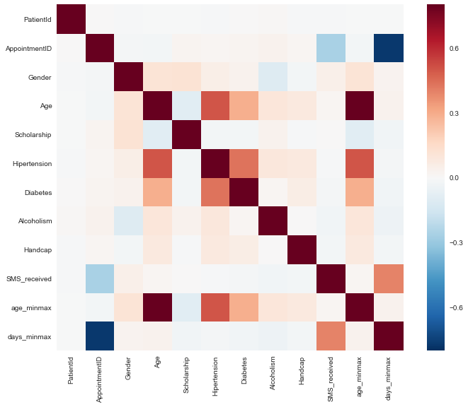


```python
#Modelling
#'Gender','age_minmax','Scholarship','Hipertension','Diabetes','Alcoholism','Handcap','SMS_received','days_minmax'
attributes = result[['days_minmax','age_minmax' ]]
result['Attack'] = result['No-show'].map({'No': 0, 'Yes': 1})
target = result['Attack']
```


```python
from sklearn.cross_validation import train_test_split
x_train, x_val, y_train, y_val = train_test_split(attributes, target,
                                                  test_size = .2,
                                                  random_state=42)

```


```python
from sklearn.metrics import recall_score
from imblearn.over_sampling import SMOTE

sm = SMOTE(random_state=42, ratio = 1.0)
x_train_res, y_train_res = sm.fit_sample(x_train, y_train)
```


```python
#Modeling
from sklearn.ensemble import RandomForestClassifier
clf_rf = RandomForestClassifier(n_estimators=25, random_state=12)
clf_rf.fit(x_train_res, y_train_res)

```


    RandomForestClassifier(bootstrap=True, class_weight=None, criterion='gini',
                max_depth=None, max_features='auto', max_leaf_nodes=None,
                min_impurity_decrease=0.0, min_impurity_split=None,
                min_samples_leaf=1, min_samples_split=2,
                min_weight_fraction_leaf=0.0, n_estimators=25, n_jobs=1,
                oob_score=False, random_state=12, verbose=0, warm_start=False)


```python
from sklearn.model_selection import cross_val_predict
from sklearn.metrics import confusion_matrix

y_train_predicted = clf_rf.predict(x_val)
conf_matrix = confusion_matrix(y_val, y_train_predicted)
conf_matrix
```


    array([[11897,  5818],
           [ 1923,  2468]])


```python
print('\nTest Results')
print('Accuracy',clf_rf.score(x_val, y_val))
```

    
    Test Results
    Accuracy 0.649823577309


```python
from sklearn.metrics import roc_curve
fpr, tpr, thresholds = roc_curve(y_val,y_train_predicted)
```


```python
def plot_roc_curve(fpr, tpr, label = None):
    plt.plot(fpr, tpr, linewidth=2, label= label)
    plt.plot([0,1],[0,1], 'k--')
    plt.axis([0,1,0,1])
    plt.xlabel('False positive Rate')
    plt.ylabel('True Postive Rate')
plot_roc_curve(fpr,tpr)
plt.show()
```


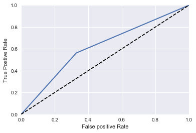


```python
from sklearn.metrics import roc_auc_score
roc_auc_score(y_val,y_train_predicted)
```


    0.61681825775440791


```python
print ("Features sorted by their score:")
print (sorted(zip(map(lambda x: round(x, 4), clf_rf.feature_importances_), attributes), 
             reverse=True))
```

    Features sorted by their score:
    [(0.76859999999999995, 'days_minmax'), (0.23139999999999999, 'age_minmax')]


```python

```
